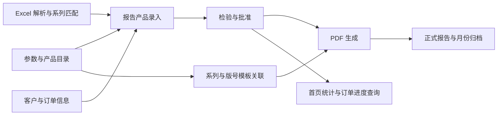

# Siargo · 矽翔质管部管理系统

Siargo 围绕矽翔质管部的日常工作，将产品资料、检验记录、设备台账和技术文件组织在同一业务平台中，支持从产品型号维护、检验任务处理到报告输出与资料查阅的工作过程。

系统以产品目录和参数为基础，以检验报告为主要业务链，关联客户、产品型号、检验人员和批准记录；设备、技术通知单、来料到货图片与计量学习资料分别按业务场景管理。员工可以在统一入口中查找资料、处理待办、查看检验进度，并追溯相关记录。

## 核心业务场景

| 业务场景 | 主要内容 |
| --- | --- |
| 产品资料与选型 | 维护产品系列、型号规则、参数和技术资料，支持选型查阅与报告录入 |
| 检验审批与报告 | 支持 Excel 预填、分环节检验、批准放行、PDF 输出及月份归档 |
| 设备管理 | 管理设备台账、检校审核、比对、维修和证书，追溯相关记录 |
| 技术通知单 | 按类别、关键字和有效状态管理文件，支持检索、更新与下载 |
| 客户、供应商与来料资料 | 维护基础资料，关联检验报告和来料到货图片，便于查询核对 |
| 专业学习与版本查阅 | 浏览注册计量师学习资料，查看系统正式版本说明 |

## 从产品资料到检验报告

产品目录、报告录入、检验审批和文件输出沿同一条业务链协作。客户关联报告公共信息，产品系列连接型号资料与报告模板，检验记录则为报告输出、进度查询和统计提供依据。



### 按产品推进检验流程

```text
精度检验 → 成品检漏（按产品配置）→ 外观检验 → 包装检验 → 批准放行
```

成品检漏由产品的检漏配置决定，需要检漏的产品在精度检验后进入该环节，其余产品进入外观检验。各环节结合角色和当前状态处理，通过人员签名、时间与驳回记录保留业务过程。

### 按系列和版号生成报告

报告模板按版号维护，并与产品系列关联。生成时根据产品的系列和版号定位有效模板，将报告信息、检验参数和签名填入 PDF，发布成功后保存正式文件地址，供产品列表查阅。

月份归档按批准时间选择本年度 1 月至上月的连续区间，重新生成归档副本并压缩为 RAR。正式报告地址继续保留，归档副本单独存放；该功能需要配置可用的 WinRAR 程序。

### 查看进度与工作量

首页看板展示检验环节分布、送检与检验数量、年度完成情况、月度趋势及分类统计，帮助了解当前待办和业务变化。

流程条数按产品记录计算，一份报告包含多条产品时会分别计数；送检数量与检验数量按各自字段汇总。首页与报告列表的统计时间范围有所区别，具体口径见[首页看板与报告统计](wiki/docs/15-首页看板与报告统计.md)。

## 业务协作与系统集成

JBolt 提供登录、用户、角色、权限、部门、字典、消息和待办等公共能力。业务页面在这些基础上组织资料维护、检验分工和审核操作，相关消息通过站内通知与 WebSocket 配合展示。

订单查询接口为其他系统提供单订单及批量订单的检验进度，包括产品型号、编号、当前环节和检验时间线。接口结合应用身份与自定义 SHA-256 Token 校验请求，调用日志记录结果、耗时和追踪标识，供后台查询与统计。

应用中心维护应用资料、凭据和启用状态，订单 API 接入应用级校验。接口级登记、授权与启停的现有覆盖范围及后续开发要求，见[对外接口、应用中心与调用日志](wiki/docs/16-对外接口应用中心与调用日志.md)。

## 技术架构

Siargo 使用 JFinal 与 JBolt 构建业务后端，Enjoy 在服务端渲染页面，结合 jQuery、Bootstrap 和 JBoltTable 完成表格、表单及弹窗交互。业务记录保存在 MySQL，附件、模板和导出文件保存在业务文件目录中，应用通过 Undertow 提供访问服务。

| 组成 | 技术 | 职责 |
| --- | --- | --- |
| 开发与构建 | JDK 25、Maven | Java 编译、依赖管理与发布产物组织 |
| 业务后端 | JFinal 5.2.7、JBolt Core 5.3.6 | 请求处理、业务逻辑、身份权限及平台公共能力 |
| 数据访问 | JFinal ActiveRecord、Druid、MySQL | 业务数据查询、事务及模型映射 |
| 页面交互 | Enjoy、JBoltTable、jQuery、Bootstrap 4.6.2 | 页面渲染、数据表格、表单和业务操作 |
| Web 服务 | JFinal Undertow 3.8、Undertow 2.2.37.Final | HTTP 服务、会话与 WebSocket 支持 |
| 缓存与任务 | Caffeine 2.9.3、Cron4j、JFinal Event | 平台缓存、定时调度与事件处理 |
| 文件处理 | Apache POI、iTextPDF | Excel 解析与 PDF 报告生成 |
| 数据转换与工具 | Fastjson、Hutool | JSON 序列化及通用工具支持 |

具体依赖以 [pom.xml](pom.xml) 为准。JBolt 核心依赖由项目内的 `lib/jbolt_core.jar` 提供，导入和构建时需要保留该文件。

## 目录结构

```text
siargo/
├── README.md                         # 项目说明
├── AGENTS.md                         # 项目协作与开发约定
├── pom.xml                           # Java 版本、依赖与构建配置
├── package.xml                       # 发布目录与归档内容配置
├── siargo-package.md                 # 正式发布流程
├── siargo.bat                        # Windows 发布目录启动脚本
├── siargo.sh                         # Linux 发布目录管理脚本
├── lib/
│   └── jbolt_core.jar                # JBolt 授权核心库
├── src/main/
│   ├── java/cn/jbolt/
│   │   ├── starter/                  # 应用启动与服务器配置
│   │   ├── index/                    # 登录、首页与平台路由
│   │   ├── _admin/                   # 用户、角色、权限等平台模块
│   │   ├── admin/siargo/             # 质量业务 Controller、Service
│   │   │   ├── prodmodel/            # 产品目录、型号与资料
│   │   │   ├── prodparam/            # 参数种类与参数值
│   │   │   ├── qarep/                # 检验报告、导入、模板与 PDF 输出
│   │   │   ├── equipment/            # 设备、检校、维修与证书
│   │   │   ├── dms/                  # 技术通知单与分类文件
│   │   │   ├── imi/                  # 来料到货图片
│   │   │   ├── customer/、supplier/  # 客户与供应商资料
│   │   │   ├── api/、apicalllog/     # 订单查询接口与调用日志
│   │   │   └── cme/、changelog/      # 学习资料与版本说明
│   │   ├── common/                   # 配置、拦截器与共享文件存储
│   │   ├── extend/                   # 平台扩展、缓存与代码生成
│   │   └── siargo/model/             # 业务 Model，base/ 为生成层
│   ├── resources/
│   │   ├── application.properties    # 环境选择与全局配置
│   │   ├── config.properties         # 开发环境主配置
│   │   ├── config-pro.properties     # 生产环境主配置
│   │   ├── undertow.properties       # 监听地址、端口与会话配置
│   │   ├── dbconfig/mysql/           # 数据库连接与模型生成配置
│   │   ├── caffeine/                 # 缓存配置
│   │   └── exceltpl/、wordtpl/        # 文档模板资源
│   └── webapp/
│       ├── _view/_admin/             # 平台页面
│       ├── _view/admin/siargo/        # 业务页面与正式更新日志
│       ├── assets/js/siargo.js        # 业务 JavaScript
│       ├── assets/css/siargo.css      # 业务样式
│       ├── assets/plugins/           # 第三方前端组件
│       ├── upload/                   # 附件、图片与报告模板
│       └── export/                   # 正式报告及归档文件
├── wiki/docs/                        # 开发指南、业务专题与配置手册
├── .codex/                           # AI 工作过程文件，不参与发布
├── logs/                             # 运行日志
└── target/                           # 编译与发布产物
```

业务代码采用 Controller → Service → Model 分层。`common/config/ProjectConfig.java` 装配路由、插件与模板能力，业务模块按子包显式扫描；`extend/config/ExtendProjectConfig.java` 提供平台扩展入口。`siargo/model/base/` 由代码生成器维护。

## 基础配置

### 环境与配置文件

配置由环境选择、业务参数、数据库连接和 Web 服务设置共同组成。`application.properties` 中的 `pdev` 决定加载开发或生产配置，当前仓库使用 `pdev=dev`。

| 配置文件 | 职责 |
| --- | --- |
| `src/main/resources/application.properties` | 环境选择、系统标识及参与环境切换的 CSS/JS 清单 |
| `src/main/resources/config.properties` | 开发环境业务参数、功能开关、缓存与文件路径 |
| `src/main/resources/config-pro.properties` | 生产环境对应配置 |
| `src/main/resources/dbconfig/mysql/config.properties` | 开发环境数据库连接及模型生成参数 |
| `src/main/resources/dbconfig/mysql/config-pro.properties` | 生产环境数据库对应配置 |
| `src/main/resources/undertow.properties` | 监听地址、端口、会话、开发模式与 HTTPS |

`pdev=pro` 对应生产主配置和生产数据库配置。部署时还需分别核对 Undertow 参数及业务文件位置；启动时读取的配置在使用者重启服务后加载。完整配置说明见[项目配置速查手册](wiki/docs/08-项目配置速查手册.md)。

### 数据库与访问入口

项目通过 MySQL 保存业务记录、用户权限和平台配置。按目标环境维护 `jdbc_url`、`db_name`、`db_schema` 及访问凭据，`is_encrypted` 与凭据的实际保存形式保持一致。开发与部署使用匹配当前业务代码的数据库结构和数据；`src/main/resources/sql/` 中的历史备份不作为自动初始化依据。

仓库当前 Web 配置如下，实际访问地址以运行环境为准：

| 项目 | 当前配置 |
| --- | --- |
| 监听地址与端口 | `0.0.0.0:80` |
| 本机后台入口 | `http://127.0.0.1/admin` |
| 会话超时 | `1800` 秒 |
| Undertow 开发模式 | `true` |
| HTTPS | 关闭，由 `undertow.ssl.enable` 配置 |

`0.0.0.0` 表示监听所有网卡，对外访问使用服务器 IP 或域名。开发机需要独立端口时，可在 IDE 的 VM options 中添加 `-Dundertow.port=8088`，对应后台入口为 `http://127.0.0.1:8088/admin`。

### 业务文件与报告资源

业务文件路径在对应环境的 `config*.properties` 中维护，均相对于 Web 根目录。开发时 Web 根通常为 `src/main/webapp/`，发布后为运行目录中的 `webapp/`。

| 配置项或资源 | 当前相对路径 | 内容 |
| --- | --- | --- |
| `siargo_imi_upload_path` | `upload/siargo/imi` | 来料到货图片 |
| `siargo_dms_upload_path` | `upload/siargo/dms` | 技术通知单附件 |
| `siargo_eqcert_upload_path` | `upload/siargo/eqcert` | 设备证书 |
| `siargo_prod_model_upload_path` | `upload/siargo/prod_model` | 产品资料与机械尺寸图 |
| `siargo_qarep_export_path` | `export/siargo/qarep` | 正式 PDF、生成任务与月份归档 |
| PDF 模板固定目录 | `upload/siargo/qarep/templates` | 按版号组织的报告模板 |
| Excel 导入临时目录 | `upload/siargo/qarep/imports` | 按任务隔离的导入临时文件 |

五个可配置的业务根使用 `/` 分隔的相对路径，各目录保持独立，不能相同或互相包含。报告生成还使用 `assets/fonts/SIMSUN.TTC` 字体，月份 RAR 归档使用 `winrar_exe_path` 指向的外部程序。

数据库保存文件关联信息，物理文件单独保存在上述目录。备份和迁移时，应同时保留数据库、附件、模板与导出文件，保持相对路径对应，并配置运行账号所需的读写权限。

### 页面与静态资源

Enjoy 模板负责页面结构和数据传递，业务 JavaScript 统一维护在 `assets/js/siargo.js`，业务样式统一维护在 `assets/css/siargo.css`。

`application.properties` 的 `project_assets.environment_files` 指定 12 项参与环境选择的本地 CSS/JS。模板通过 `ProjectAssets.url(...)` 选择文件：开发优先使用源文件，生产优先使用 `.min` 文件，首选文件缺失时使用存在的另一版本。日常维护修改源文件，正式打包时按发布流程增量压缩。

## 本地开发与启动

本地开发使用 JDK 25 和 Maven，IDE 通过根目录 `pom.xml` 导入项目。启动前准备对应的数据库和业务文件，确认 `lib/jbolt_core.jar` 存在，并完成环境与端口配置。

| 运行配置 | 设置 |
| --- | --- |
| 类型 | Java Application |
| 主类 | `cn.jbolt.starter.Starter` |
| 工作目录 | 项目根目录，例如 `D:\Workspace\siargo` |
| JDK | 25 |

在 VM options 中保留下列模块开放参数，六项作为同一组传入：

```text
--add-opens java.base/java.lang=ALL-UNNAMED
--add-opens java.base/java.lang.reflect=ALL-UNNAMED
--add-opens java.base/java.lang.invoke=ALL-UNNAMED
--add-opens java.base/java.util=ALL-UNNAMED
--add-opens java.base/java.io=ALL-UNNAMED
--add-opens java.base/sun.reflect.annotation=ALL-UNNAMED
```

由使用者运行后访问配置的后台入口。`Starter` 加载配置并创建 `ProjectServer`，后者负责服务器定制和项目版本信息。

## 发布与运行

Siargo 通过 Maven 构建 Java 应用，`package.xml` 将运行配置、依赖和 Web 资源组织为完整发布目录。正式发布按照 [siargo-package.md](siargo-package.md) 执行，依次完成版本同步、指定资源增量压缩、构建和生产配置核验。

```text
siargo/
├── config/                  # 运行配置
├── lib/
│   ├── siargo-<版本>.jar     # 业务应用
│   └── ...                  # JBolt 核心库与其他依赖
├── webapp/                  # 页面、静态资源与业务文件
├── siargo.bat               # Windows 启动脚本
└── siargo.sh                # Linux 管理脚本
```

项目版本同时维护在 `pom.xml` 与 `ProjectServer.getProjectVersion()` 中，发布时保持一致。暂存目录使用生产配置，最终归档与该目录保持一致。

Windows 环境在完整发布目录中由使用者执行 `./siargo.bat start`；Linux 使用 `siargo.sh` 前核对 JDK 25 的模块开放参数及目标环境配置。源码开发使用前述 IDE 入口，服务启动、停止和重启由使用者操作。

发布包排除 `upload/siargo/dms/` 下的技术通知单内容，由使用者另行复制，源附件保留。`.codex/` 中的辅助内容不进入发布包。应用发布与业务数据备份分别管理，升级时保留并核对现有数据库和业务文件。

## 相关文档

| 入口 | 用途 |
| --- | --- |
| [完整文档导航](wiki/docs/README.md) | 按开发维护、业务理解和配置部署选择阅读入口 |
| [平台核心架构](wiki/docs/01-JBolt平台核心架构.md) | 框架组成、代码分层、启动装配与公共能力 |
| [业务模块地图](wiki/docs/07-业务模块地图.md) | 全部业务入口、模块关系与专题索引 |
| [产品目录与参数](wiki/docs/10-产品目录与参数.md) | 系列、型号结构、选型参数及资料维护 |
| [检验报告单业务](wiki/docs/11-检验报告单业务.md) | 报告录入、流程、签名、驳回及回收站 |
| [Excel 导入与 PDF 输出](wiki/docs/12-Excel导入与PDF输出.md) | 导入预填、模板关联、报告生成与月份归档 |
| [客户、供应商与来料图片](wiki/docs/09-客户供应商与来料图片.md) | 基础资料关联与到货图片维护 |
| [技术通知单与文件管理](wiki/docs/13-技术通知单与文件管理.md) | 分类、检索、有效状态和文件更新 |
| [设备管理](wiki/docs/14-设备管理.md) | 台账、检校审核、比对、维修与证书 |
| [首页看板与报告统计](wiki/docs/15-首页看板与报告统计.md) | 指标含义、数量单位与统计时间范围 |
| [对外接口、应用中心与调用日志](wiki/docs/16-对外接口应用中心与调用日志.md) | 订单查询、应用认证、接口管理边界与调用追踪 |
| [学习资料与版本日志](wiki/docs/17-学习资料与版本日志.md) | 资料浏览、学习入口与版本说明展示 |
| [项目配置速查手册](wiki/docs/08-项目配置速查手册.md) | 环境、数据库、业务存储和发布资源配置 |
| [JBolt 原生机制](wiki/docs/jbolt-native-mechanisms.md) | 平台能力、使用方式与当前采用范围 |
| [正式发布流程](siargo-package.md) | 版本、资源、构建与发布归档要求 |
| [更新日志](src/main/webapp/_view/admin/siargo/changelog/CHANGELOG.md) | 面向使用者的正式版本说明 |
| [项目协作规则](AGENTS.md) | 开发约定、文件归属与操作边界 |

代码仓库：[hanzj0924/siargo](https://github.com/hanzj0924/siargo) · 公司官网：[矽翔](https://www.siargo.com.cn)

本项目已获得 JBolt 授权，仅限本次二次开发，使用与分发须遵循相应授权范围。

