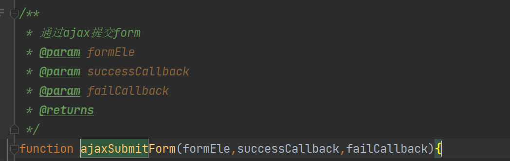

在JBolt平台里，二开自己做页面或者写JS去用AJax调用后台接口的时候，可以使用JBolt内置封装的AJax：

## 一、Ajax get

```
AJax.get(url,success,fail,sync);
```

参数 | 说明 
:-----------: | :-----------:
 url        |     接口URl地址 
success |     成功回调
fail        |    失败回调
sync      |    是否同步执行 默认异步

## 例子

```
Ajax.get("admin/user/delete/1",function(res){
    //成功删除用户的处理
},function(res){
  //删除用户失败的处理
});
```


## 二、Ajax post

```
AJax.post(url,success,fail,sync);
```

参数 | 说明 
:-----------: | :-----------:
 url        |     接口URl地址 
data     |   json数据对象 例如 {userId:1,name:"张三"}
success |     成功回调
fail        |    失败回调
sync      |    是否同步执行 默认异步


## 例子

```
Ajax.post("admin/user/save",{name:'张三',age:12},function(res){
    //成功添加用户的处理
},function(res){
  //添加用户失败的处理
});
```


## 三、表单的AjaxSubmit

jbolt的jbolt-admin.js中内置了ajax提交form的function



自己调用就是

```
 function xxx(){
    ajaxSubmitForm(formId,function(res){
    //成功回调
})
}
```
