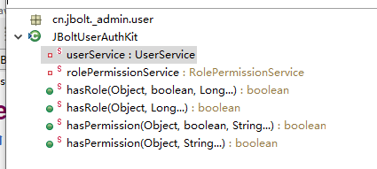
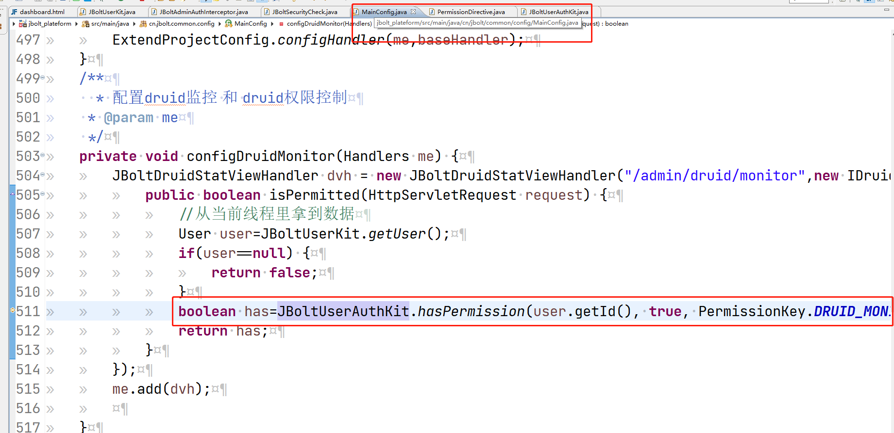
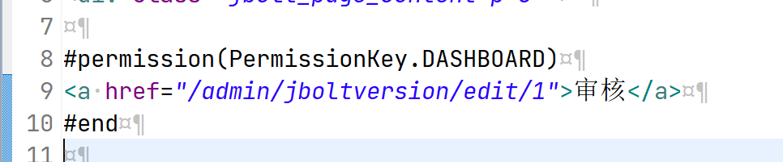
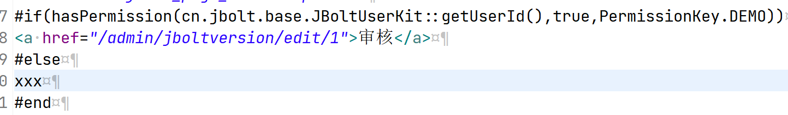

在JBolt中提供了一个工具类 JBoltUserAuthKit.java

在Java代码和enjoy模板html代码里都是可以直接使用的。

### 在Java中如何使用？
 如下图所示，直接调用传参就好了。


### 在enjoy模板引擎的html里如何使用？
有两种方式：
一种就是判断有没有权限有就直接显示出来



使用这个指令：传入PermissionKey里定义的权限声明即可。


```
#permission(PermissionKey.DASHBOARD)
<a href="/admin/jboltversion/edit/1">审核</a>
#end
```

第二种是if else判断了

具体if需不需else 自己决定自己控制

```
#if(hasPermission(cn.jbolt.base.JBoltUserKit::getUserId(),true,PermissionKey.DEMO))
<a href="/admin/jboltversion/edit/1">审核</a>
#else
xxx
#end
```
