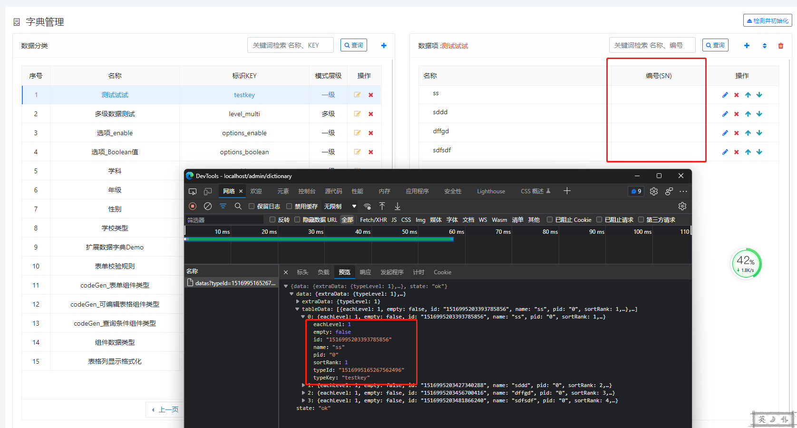
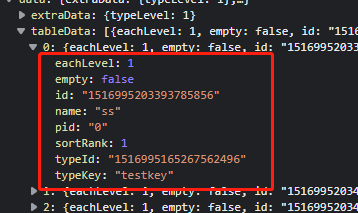
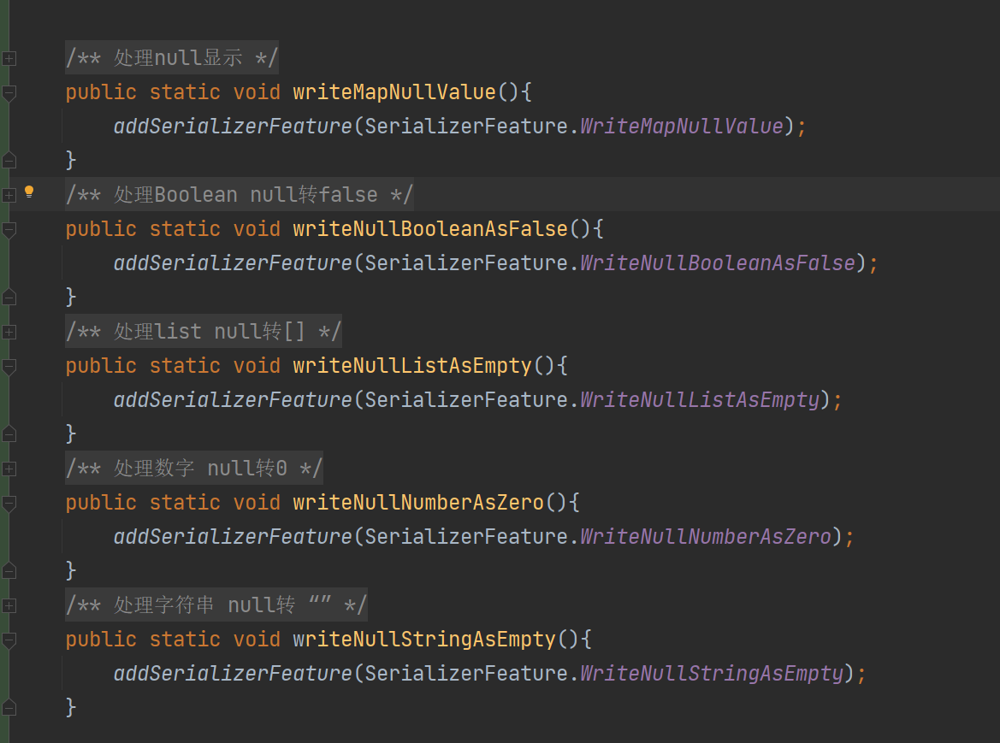
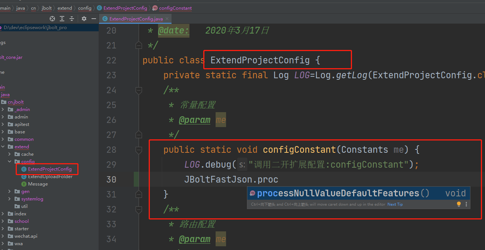
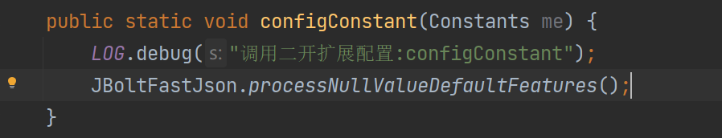
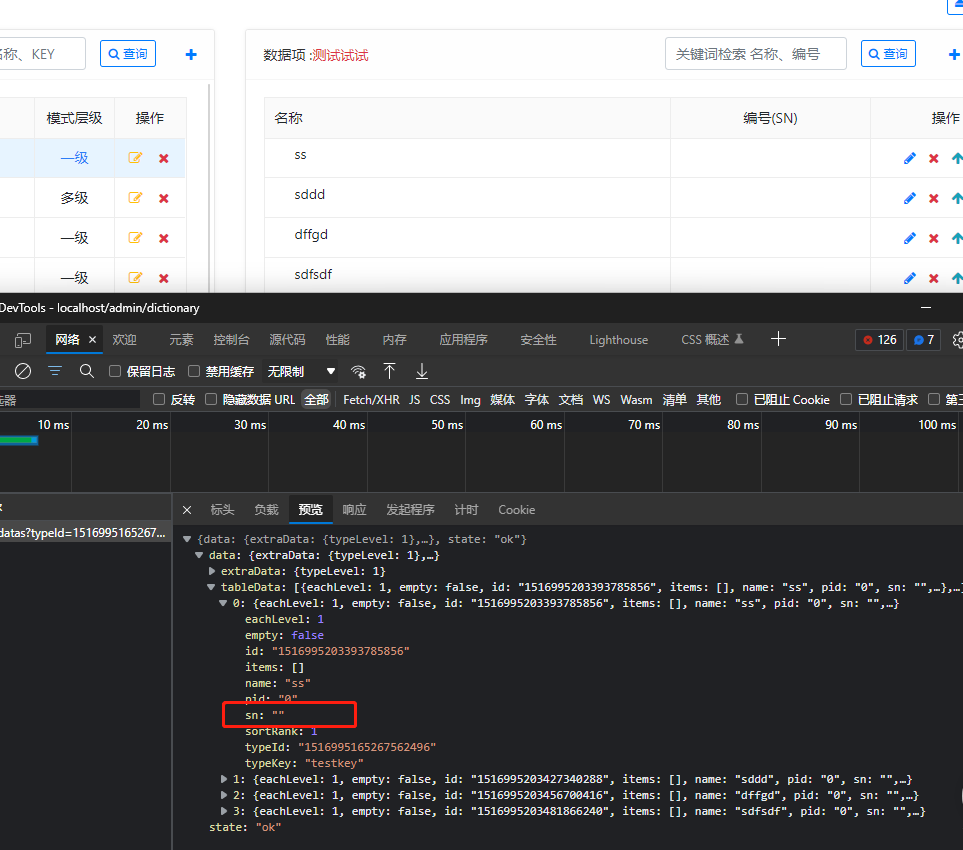
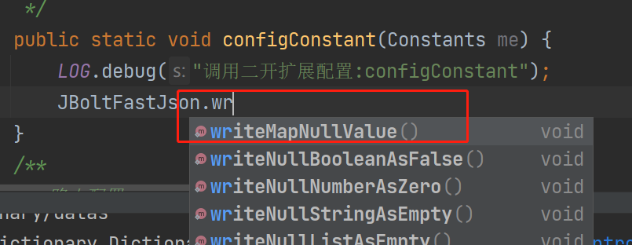
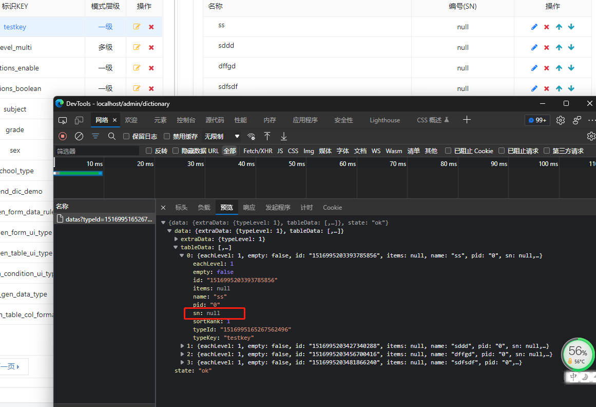

JBoltJson使用的默认是fastJson，为了节省带宽，fastJson默认会将null值忽略，不进行序列化。
这种有利于使用js接受处理数据的前端，但是针对安卓等app不使用js开发的前端来说，不太友好了。

# 举例：
系统字典管理中，数据如果没有设置sn，那么默认拿到的json是这样的：

## 我们前端如果需要拿到sn怎么办？

# 解决方法：
JBoltI提供了开关API和自定义序列化解决这个问题：

还有单独处理一个的方式

## 具体使用方式：
在JFinal的常量配置中 配置这个序列化特性即可。

## 再看效果

这里调用默认的是把null字符串改成了“

如果你就是需要保证是null的话，需要调用单独的另一个了

