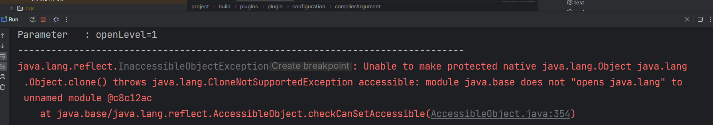
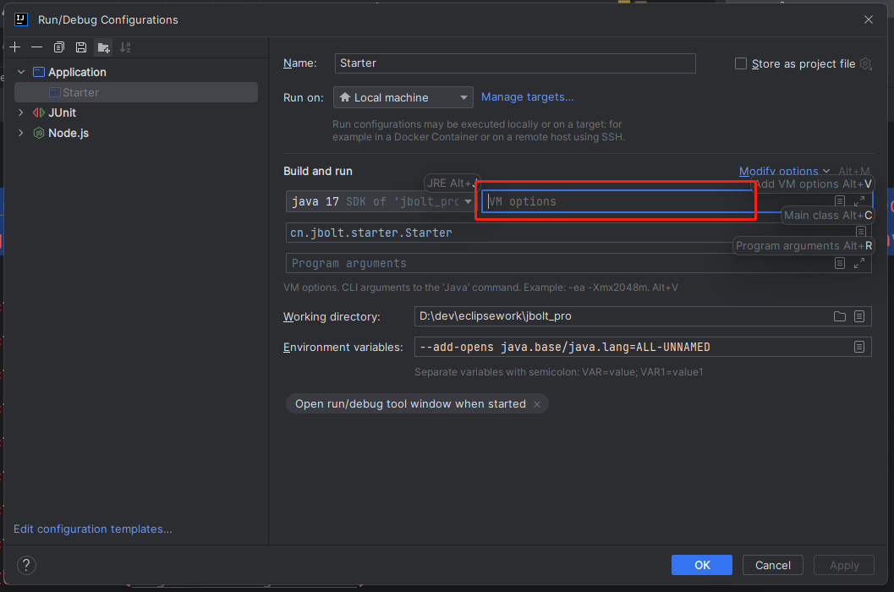
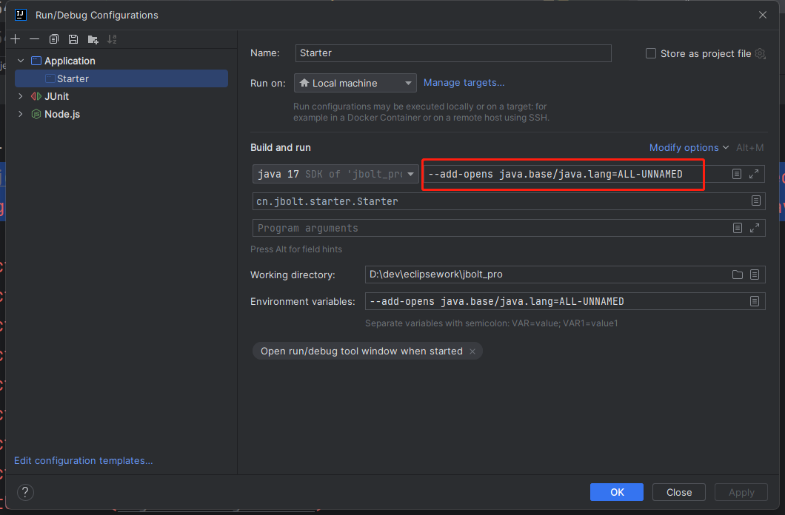
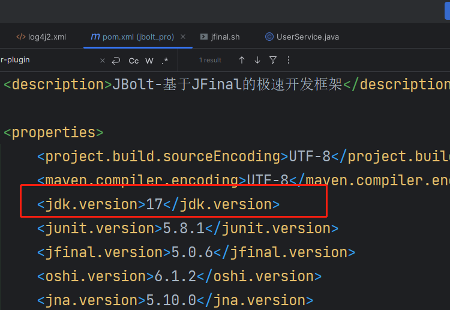
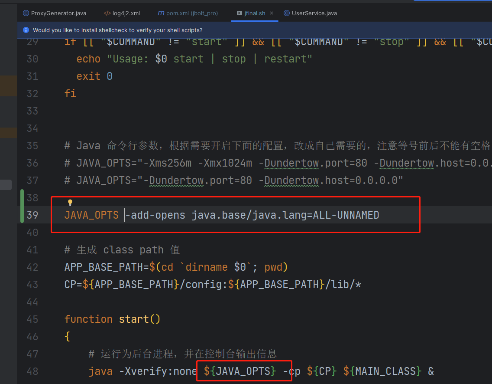

使用Java17 + 遇到这个问题：




```
java.lang.reflect.InaccessibleObjectException: 
Unable to make protected native java.lang.Object java.lang.Object.clone() 
throws java.lang.CloneNotSupportedException accessible: 
module java.base does not "opens java.lang" to unnamed module @c8c12ac
```


这个不光JFinal有这个问题，SpringBoot运行也这样，

错误的原因是因为 JVM 的模块 java.base 没有对未命名的模块开放 java.lang 这个包的深度反射 API 的调用权限。 具体来说，是没有开放 setAccessible(true) API。

这个问题在 JDK 8 以及以上的版本容易遇到。 解决的方法是在启动 Java 应用的时候， 加上参数指定开放特定的 Module/Package，使得 unnamed module 可以访问指定的 package 下面的深度反射 API。 如果有多个 Package 需要开放深度反射 API，那么可以指定多个 --add-opens 参数。

解决它：



加上JVM参数配置：

`--add-opens java.base/java.lang=ALL-UNNAMED`




这样，就可以了。

注意：相应的pom.xml 里关于jdkversion的配置 需要转为17



打包部署后，在对应的jfinal.sh 或者 jfinal.bat 脚本里也配置上jvm参数即可。

