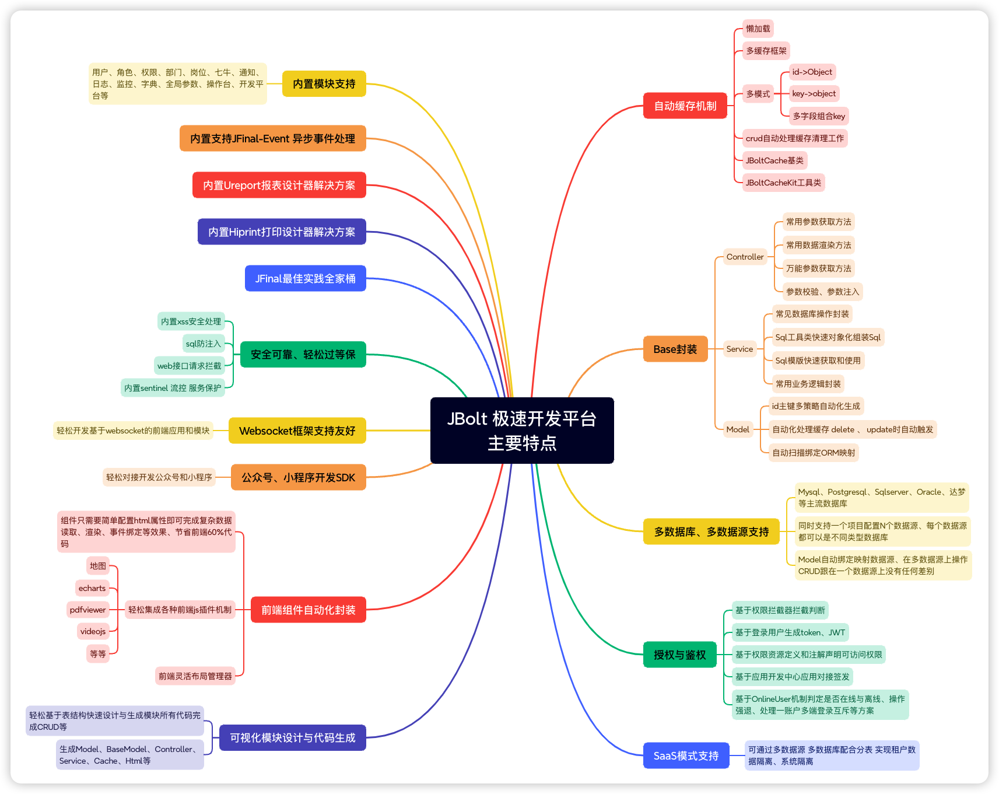

# 一、Slogan
JBolt自从诞生第一版Eclipse插件的时候，就确立了自己的slogan：
JBolt，省心、省事儿，极速开发。
让用户极低成本使用，极速效率开发，极高收益回报

# 二、体现在哪里？
1、JFinal最佳实践，少走弯路、极简设计、优雅开发
2、Controller、Service、Model、Handler、DbPro、Dialect等部分做了定制封装 比原生JFinal更易用
3、支持只修改几行外部配置文件，就可以轻松适配Mysql、Oracle、Postgresql、Sqlserver等数据库类型
4、可配置一个主数据源+同时支持配置文件配置N个数据源的每开发模式、轻松实现多数据源开发与自动切换，省心
5、每个数据源的每个表都可以独立配置主键策略，轻松应对多系统复杂集成场景主键策略，内置自增、序列、UUID、雪花ID等
6、灵活智能的前端架构，可以轻松做各种布局，所有组件做到智能自动化处理，节省至少60%前端代码编写
7、轻松集成各种第三方插件 百度地图 、 echarts 、PDFviewer、videojs等几十个外部插件已经集成
8、内置应用开发中心，可以轻松应对外部客户端、第三方系统对接、异构
9、内置公众平台开发方案、可视化配置公众号、小程序 ，支持多账号同时配置管理
10、内置HIprint可视化打印设计器和模板库 轻松做出各种需要系统为用户提供的打印功能
11、内置ureport2 轻松设计可视化报表，做报表容易
12、内置websocket全套方案，轻松玩转后端推送
13、内置jfinal-event 轻松开发 异步事件响应机制
14、自动缓存机制，启用缓存，自动触发处理，省心
15、Model与数据库表 ORM自动扫描映射 省心维护
16、内置Model、controller、service、html（crud）代码生成器，简单配置可以快速生成全套CRUD代码，小模块极速开发上线
17、内置用户、角色、权限、顶部模块导航、系统监控、日志、部门、岗位、通知、代办、七牛、在线用户监控等模块
18、完善好用的JBoltExcel、JBoltWord极速导入导出开发模式
19、集成sentinel限流熔断服务安全防护
20、轻松开发saas架构（租户分表）类系统 代表-学校题库考试类系统 一个Model可以映射N个分表
21、可视化设计器 几十秒完成一个CRUD模块的设计与生成
22、内置xss防御等安全方案、拦截web请求，处理数据库sql，轻松应对等保检测等
22、其它细节...

