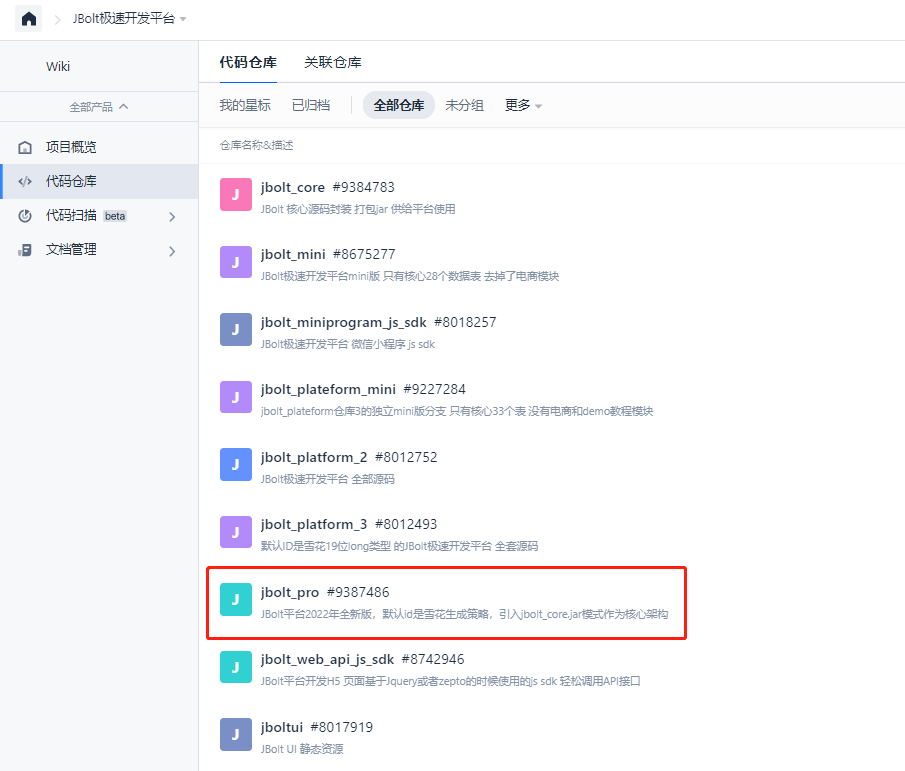
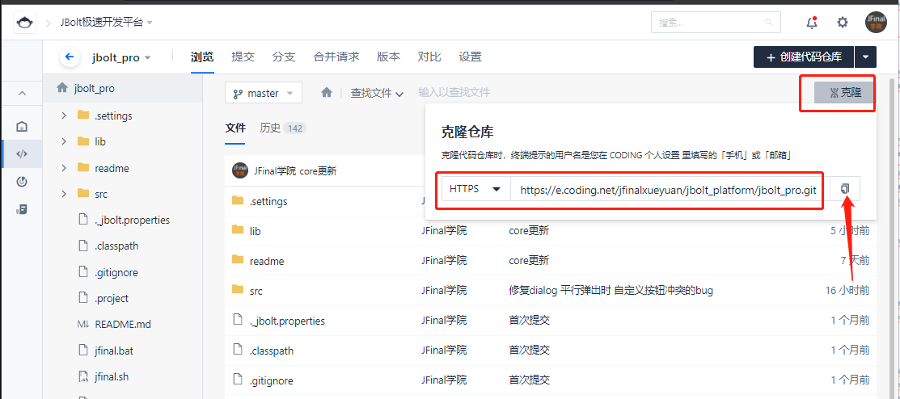
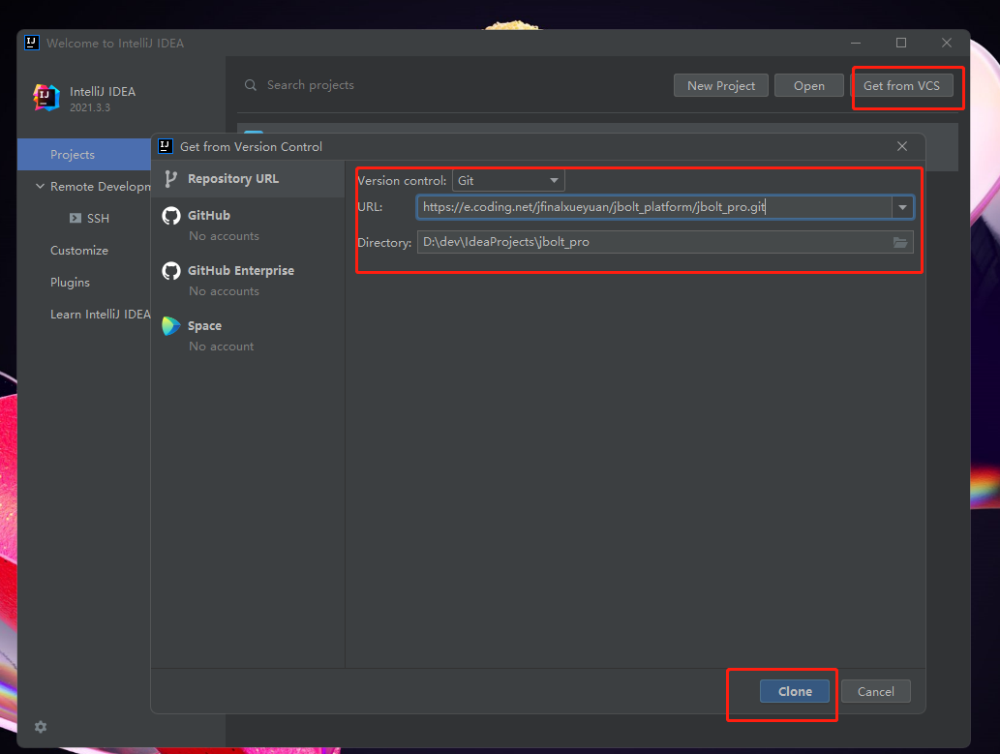
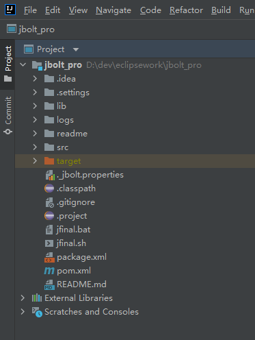

### 复制git仓库地址：
## 注意是按照maven project导入代码。

### 进入仓库：
https://jfinalxueyuan.coding.net/p/jbolt_platform/repos

### 找到jbolt_pro：选择克隆 复制地址

### idea中 使用git导入

## 导入代码后 maven reload 项目的project设置上把JDK设置好 maven配置好