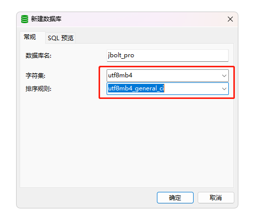
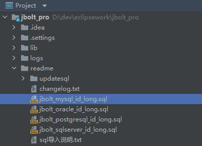
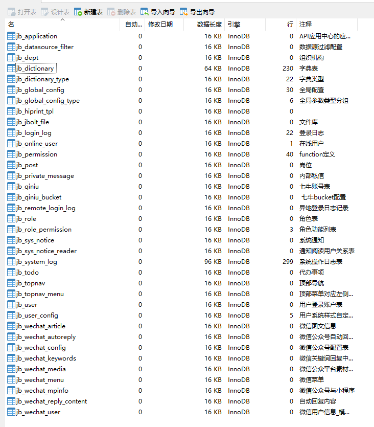
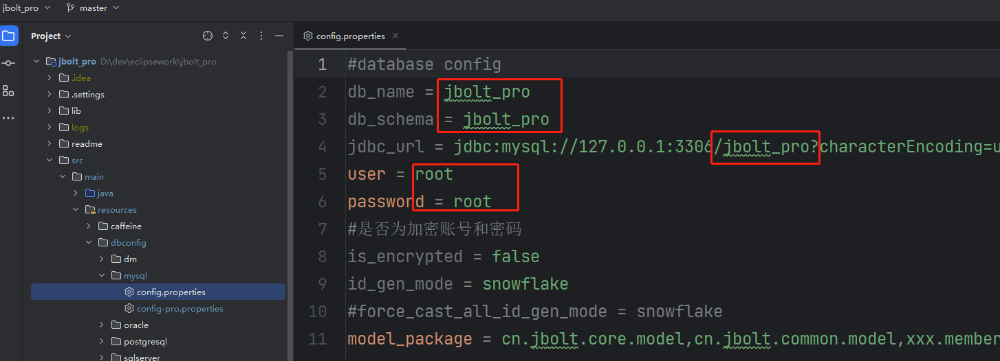
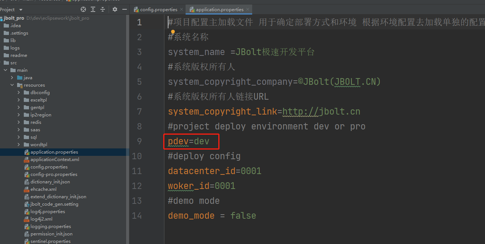
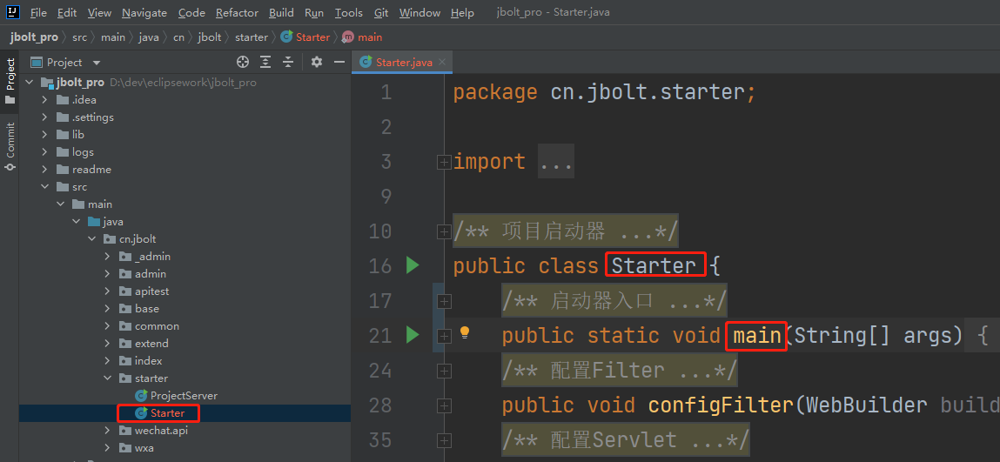
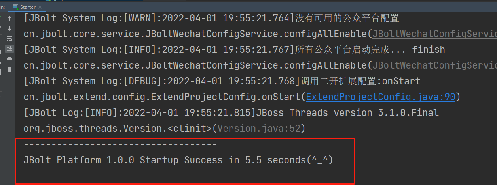
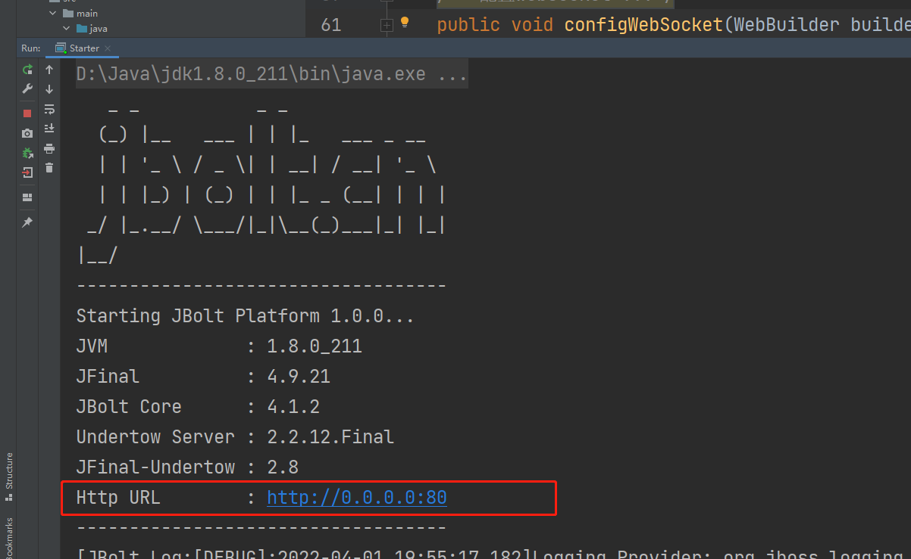
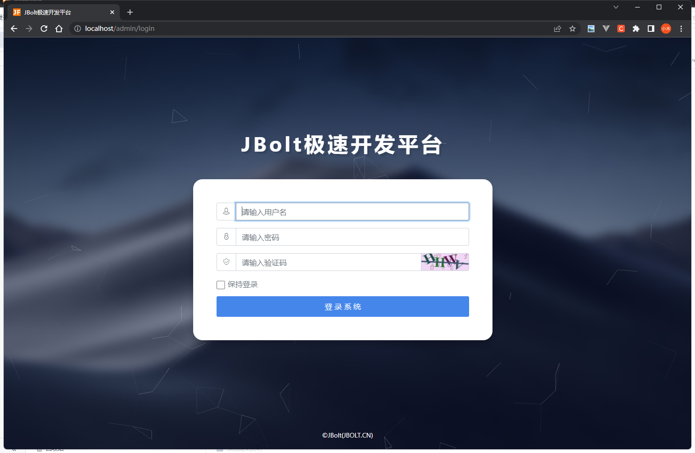

### 打开mysql客户端或者navicat
## 要求Mysql版本 8.x

### 新建数据库：
注意字符和排序规则的选择。

### ide里找到sql初始化文件
位置：项目/readme/jbolt_mysql_id_long.sql

复制内容到navicat里运行导入，创建出JBolt Pro 核心表。36个

### 配置数据源
Ide里配置一下主数据源，连接到刚才创建的数据库：

## 注意：db_name db_schema 和jdbcURL上的数据库名字 都要写对 特别是db_schema 在mysql中一般三个参数都是一致的

## 如何需要使用加密的账号和密码？
### 点击查看教程章节  第二章 3.1：

配置文件本地开发 application.properties里定义了当前模式是开发模式还是线上部署模式。

根据模式不同，加载不同的配置文件。

### 启动测试
找到cn.jbolt.starter.Starter 运行即可

看控制台输出这个信息，启动就成功了。

### 访问
这里有个视频演示：从第17分钟开始
https://www.bilibili.com/video/BV1Mu411R7pa?p=4

启动日志里有启动的ip和端口号，直接访问http://localhost即可
用户名：admin
密码：123

