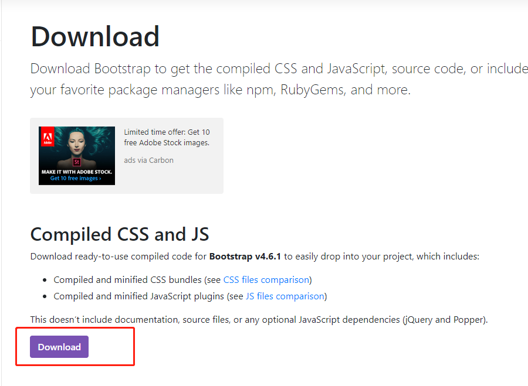

Bootstrap目前依然是业界最优秀的前端css框架，用户量和网站、系统使用量名列前茅，被广泛使用。

最新5.x的版本因为抛弃了IE的支持，就连IE11也不支持了，而且也弃用了默认使用近十年jquery依赖。

目前JBolt里还得使用4.6版本，兼容IE11，国内还是很多用户在用IE11.

5.x比4.6 差距有点大，暂时升级不了，4.6很够用了。

# 官网：

[https://getbootstrap.com/](https://getbootstrap.com/)

# 4.6版本文档：

[https://getbootstrap.com/docs/4.6/getting-started/introduction/](https://getbootstrap.com/docs/4.6/getting-started/introduction/)

# 下载地址：

[https://getbootstrap.com/docs/4.6/getting-started/download/](https://getbootstrap.com/docs/4.6/getting-started/download/)

# 下载后的代码结构：

css里和js里分别选择两个标识出来的文件 就是，Bootstrap使用的js css，导入到自己项目里就可以使用了。

JBolt里内置了，就不需要导入了。自己导入的话 js放在最下面 css放在header里导入。

4.6.1版本的bootstrap还是依赖jquery的 需要导入Jquery。

Bootstrap中除了提供常用组件封装之外，还提供了大量css工具类

我们可以使用这些工具类 轻松定制 我们想象中的UI

UI合设计 无非就是 布局 颜色 惠尺寸 背景 边框 文字 浮动 显示 越界 阴影关系额合成。

这些工具类非常好用。

