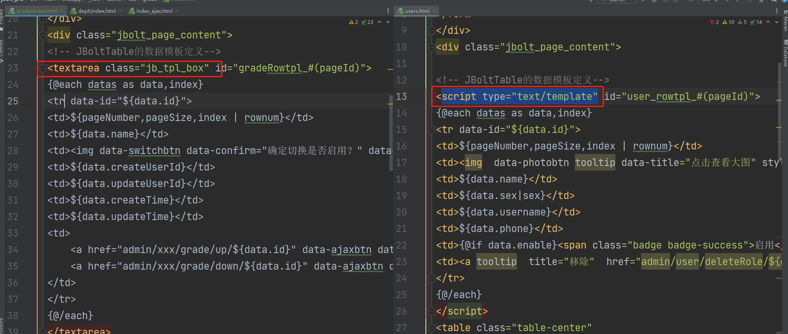
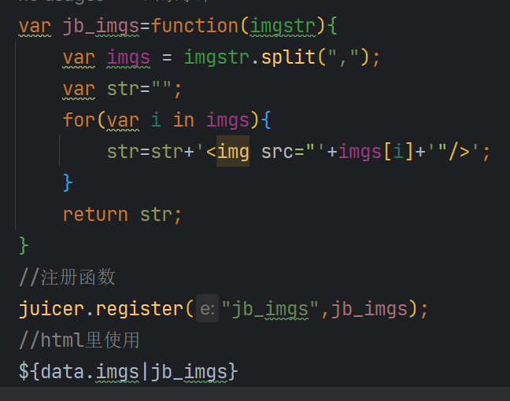

# Juicer.js（榨汁机）简介

Juicer 是一个高效、轻量的前端 JavaScript 模板引擎，使用 Juicer 可以是你的代码实现数据和视图模型的分离(MVC)。除此之外，它还可以在 Node.js 环境中运行。


**谁开发的**？

阿里

**名字由来：**

倘若我们把数据比作新鲜可口的水果，把模板看做是水，Juicer 就是把水果和水榨出我们需要的 HTML 代码片段的榨汁机。

所有使用到模板的场景，都是结果=模板+数据   UI=UI模板+数据

**网址：**

[https://github.com/PaulGuo/Juicer](https://github.com/PaulGuo/Juicer)


# JBolt里用Juicer.js做什么？

在JBolt平台中，juicer.js在智能封装的组件里基本都用到了，主要是动态通过接口获取数据，然后渲染的UI、JBoltInput、select、radio、checkbox、jbolttable、imguploader、fileuploader等，都是基于juicer.js做的模板+json数据的渲染。


# 如何使用Juicer.js?

页面直接引入即可：


```
<script type="text/JavaScript" src="juicer-min.js></script>

```

JBolt中已经不需要你引入了，默认已经集成在JBolt的前端架构里，只要是js和html里，都可以随时使用，不用关心引入问题。

# Juicer.js是如何工作的？

前面我们说过，想要果汁就得有水果和水，想要UI渲染结果，就要有模板和数据。

`var uiHtml = juicer(模板内容，数据)；`

一行代码解决问题，方便快捷。数据是JSON数据，模板是字符串模板。

预编译模板：上面带数据的返回的是数据+模板渲染后的字符串结果，如果不传数据，返回值就是将这个模板编译后的一个对象。

`var compiled_tpl = juicer(tpl);`

可以预编译模板，等需要的时候直接render即可。


```
//1、预编译
var compiled_tpl= juicer(tpl);
//2、拿到数据 执行渲染
var result = compiled_tpl.render(data);

```

## 1、模板的定义

在html中、JS里都可以定义模板内容。

**官方标准定义方式：**


```
<script type="text/template" id="dictionarytpl">
模板内容
</script>


```

这样定义 页面不会解析，可以通过**document.getElementById(模板ID).innerHTML;**的方式拿到模板内容 使用。

但是这种定义方式在Eclipse下，html编辑器无法识别，里面写的标签内容代码，无法着色高亮显示关键词以及写模板的时候没有代码提示。

但是在Idea下是没问题的：**在Eclipse下推荐改用Textarea组件定义模板内容，然后class="jb_*****tpl_box*****"即可隐藏模板定义区域。**


所以这里根据自己开发环境选择使用是script还是textarea标签包裹模板即可。

## 2、模板语法与使用

**a、变量输出**：

${变量名} 

${变量对象.变量属性}

**b、循环遍历 each**


```
{@each datas as data,index} 
${data.xxx} 
{@/each}

```

**c、条件判断 if else**


```
{@if state==1}
条件一的结果
{@else if state == 2}
条件二的结果
{@else}
其他结果
{@/if}

```

**d、代码注释**

任何语言里代码都要有注释信息的


```
{# 这里是注释内容}

```

**e、html转义**

直接用juicer模板+数据 得到的是纯字符串数据，你在html里直接输出是原样输出了html的代码 显示在网页上

此时就需要转义操作，按照富文本html渲染出来。

**${html}改为$${html}即可**

**f、辅助循环**

上面讲了普通循环，是你拿到数据后循环，这里辅助循环是：


```
{@each i in range(1, 10)} 
循环十次，每次调用输出 
{@/each}

```

**g、子模版嵌套 **

 {@include tplId, data}

可以通过此方式 在外面独立定义很多个子模版，然后主模板里像调用js方法一样调用传值，方便开发复杂逻辑UI

例如JBolt平台中权限多级字典项管理中循环遍历每个数据后判断是否存在子数据，有的话 就调用子模版 来回进行递归输出。

**h、函数注册与使用**

juicer中支持注册自定义函数和调用函数。



juicer.register("函数名",函数对象)

**使用的时候：**

${变量|函数名,参数一,参数二}

或者

${变量,参数一,参数二|函数名}





