# 一、加表创建可视化设计任务
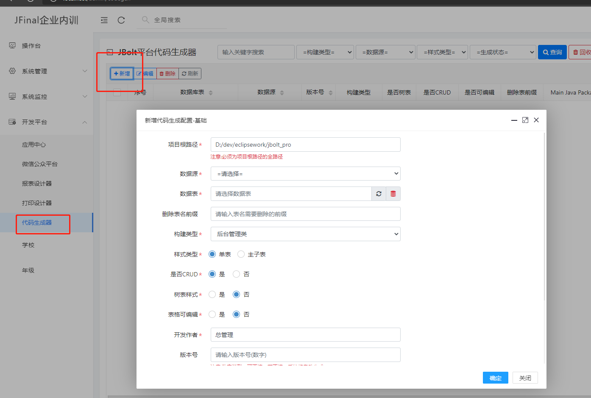
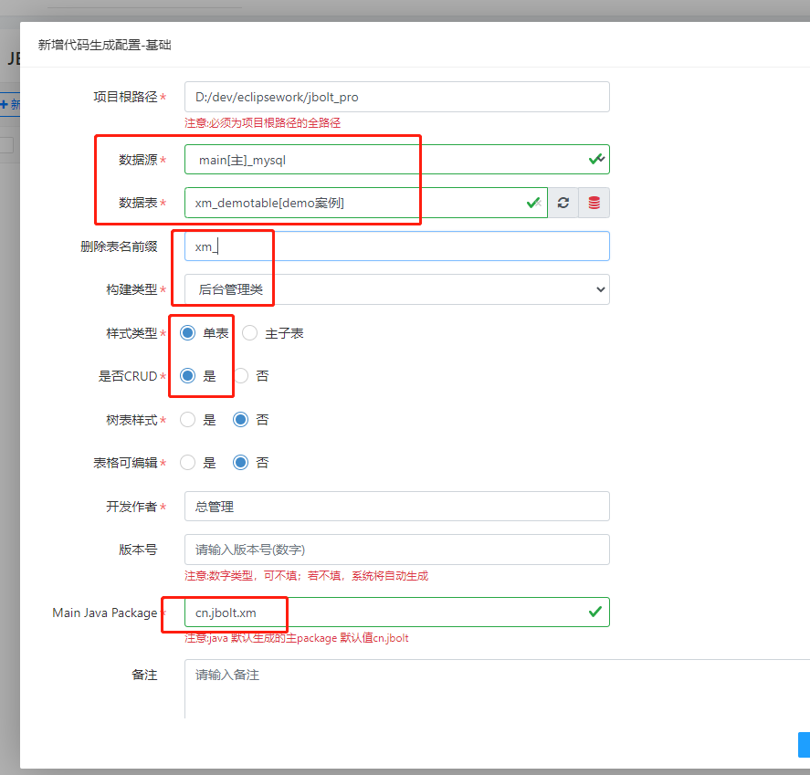

# 二、点击进入配置界面
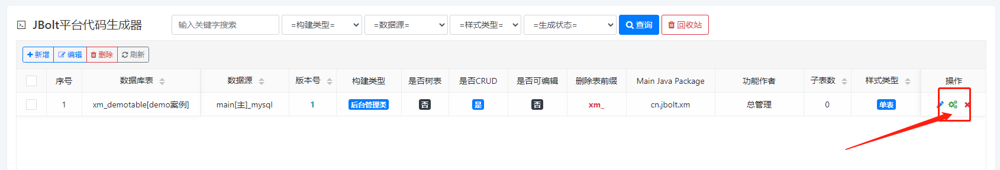

# 三、开始配置与生成
第一个选项卡基本不变 不用动
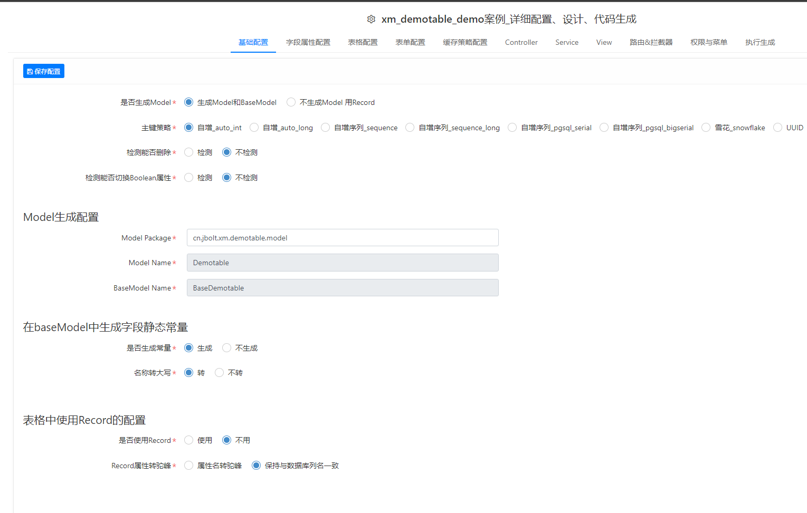

## 3.1 字段属性配置
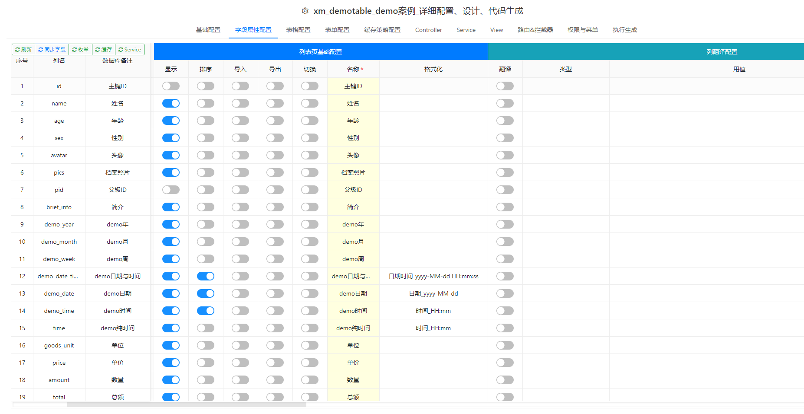
这里可以往右滚动内容很多，可以配置表格里的显示和查询条件、可以配置列翻译、可以配置表单里使用的 组件和数据源等

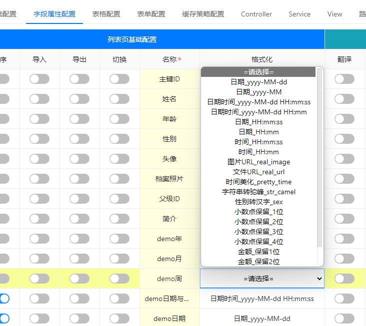

## 一个列是存的ID 但是列表显示的是name，就配置打开列翻译：

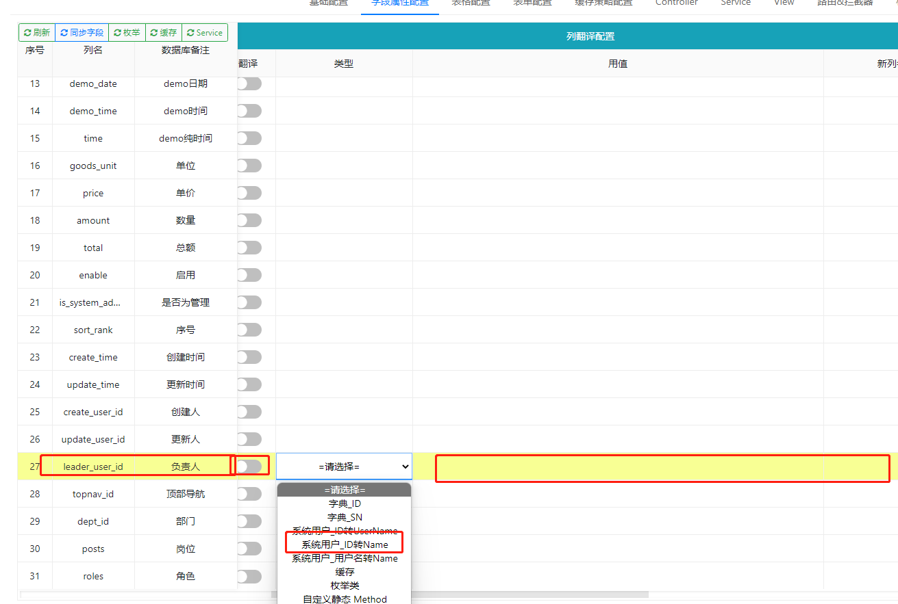

## 选择 用系统用户id转name 就可以了

## 这一列要作为查询条件 就打开按钮开关，设置使用哪个组件就可以了。

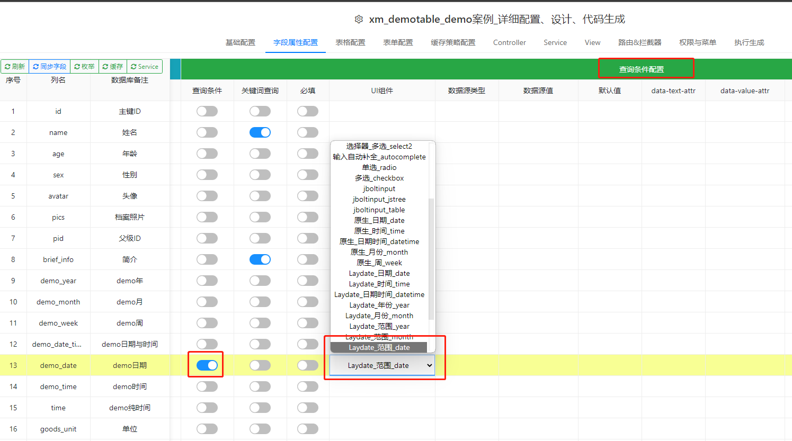

## 同样 如果在表单里显示 和操作的列 也自定义设置一下：

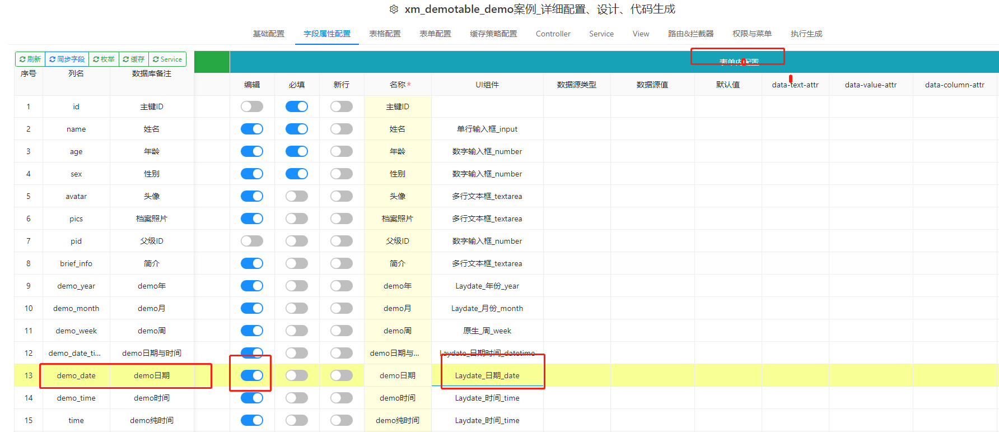

## 设置完成后 就可以在3 4 选项卡里看到实时效果：

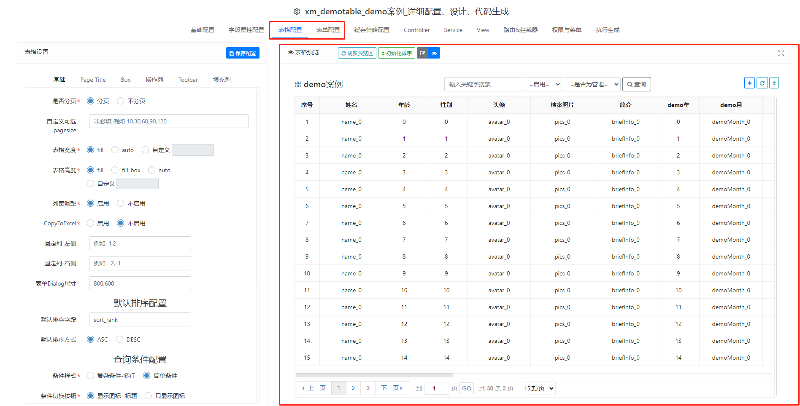

## 根据效果 自己再微调设置即可。

## 表单和表格预览 都有 编辑模式，可以设置顺序和label值等

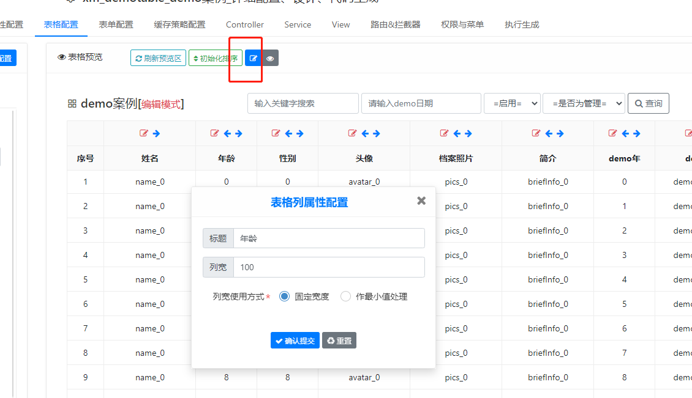

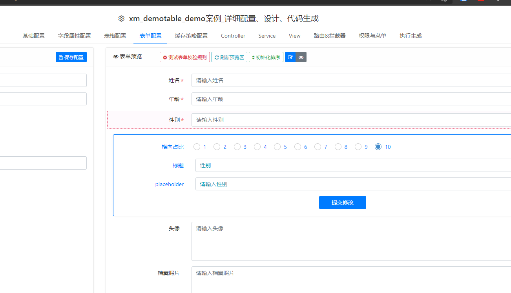

## 路由和拦截器配置
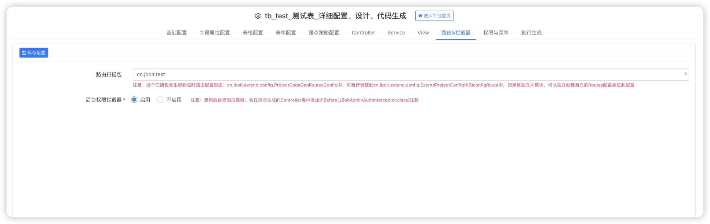
注意：这个扫描包会生成到临时路由配置里面：cn.jbolt.extend.config.ProjectCodeGenRoutesConfig中，可自行调整到cn.jbolt.extend.config.ExtendProjectConfig中的configRoute中，如果是独立大模块，可以独立创建自己的Routes配置类在此配置

 注意：启用后台权限拦截器，会在这次生成的Controller类中添加@Before(JBoltAdminAuthInterceptor.class)注解

## 点一下 设置好菜单权限：保存好

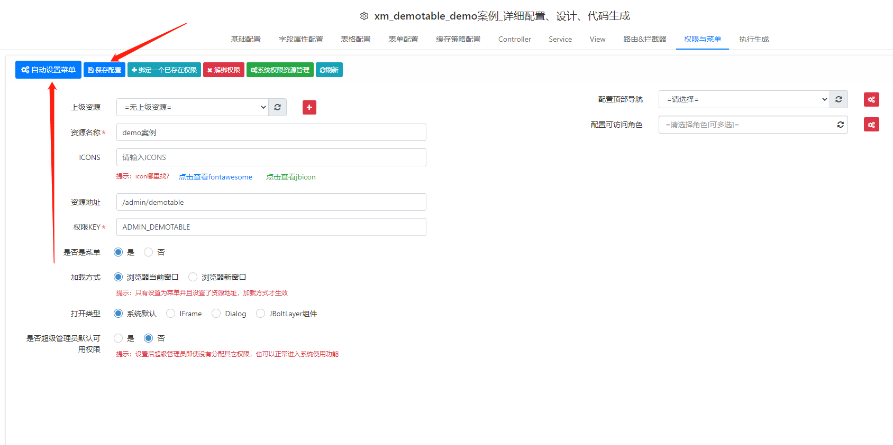

## 最后完成执行生成：

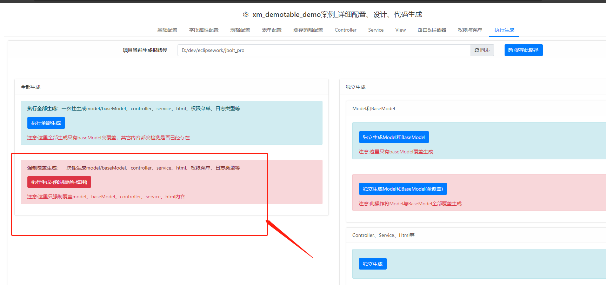

## 生成结果：

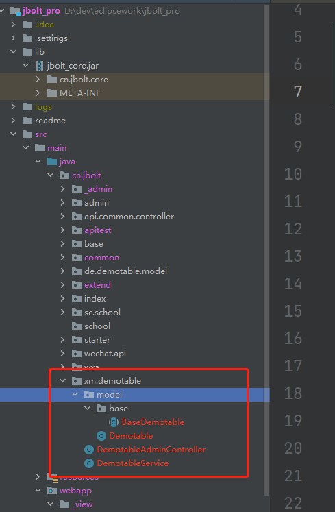

java的都生成了 model controller service
等

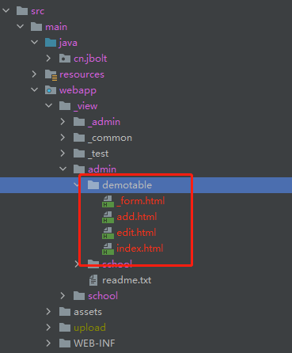

html 都可以了。
重启启动 就行了。

## 查看页面
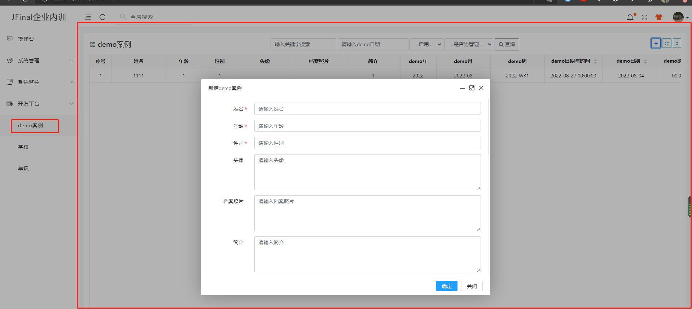

