# 一、什么是列翻译
列翻译，是将数据库中存储的一列数据 在渲染的时候进行翻译的功能。
## 举例说明：
### 1、外键翻译-系统用户
很多表中的create_user_id 转createUserName属性 需要使用jb_user中的name去翻译

在JBolt可视化中配置列翻译功能 像create_user_id这种如果需要翻译 就直接选择【系统用户ID转xxx】 如下图所示：
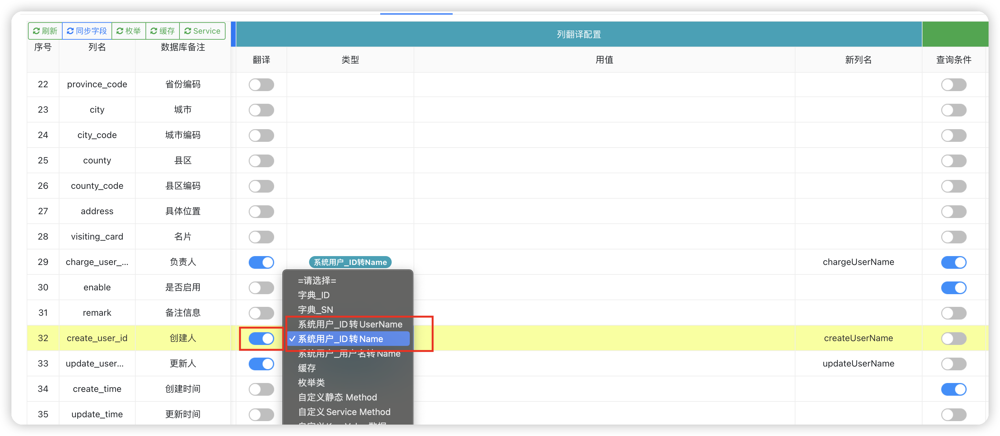

### 2、外键翻译-其他表+缓存翻译
jb_user表中的dept_id 翻译 成 jb_dept表中的name   
post_id翻译成jb_post表中的name

如下图红色区域：都是对应的外键翻译-使用缓存进行翻译
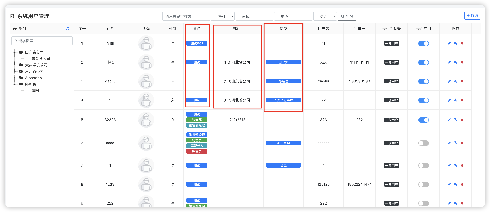

因为这些基础数据 部门、岗位、或者你自己认为是少量的可以都进入缓存的数据，进行外键关联时 可以进行翻译。

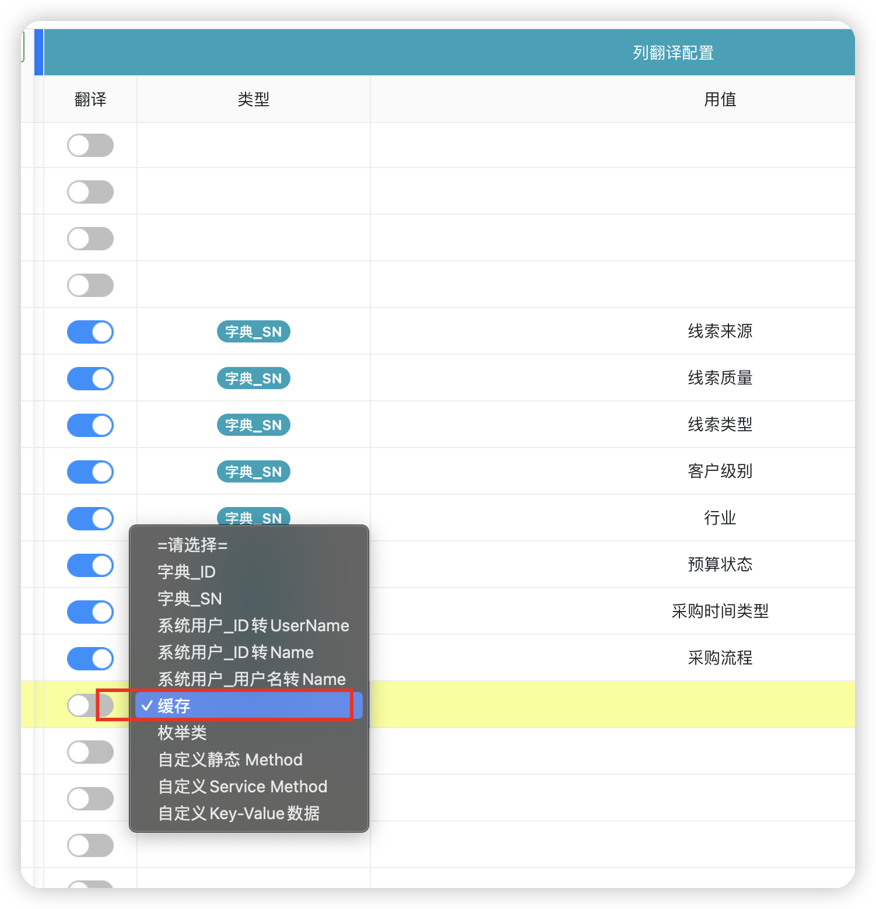

只需要翻译类型选择【缓存】，然后在下一列中选择自己需要的缓存就可以了；
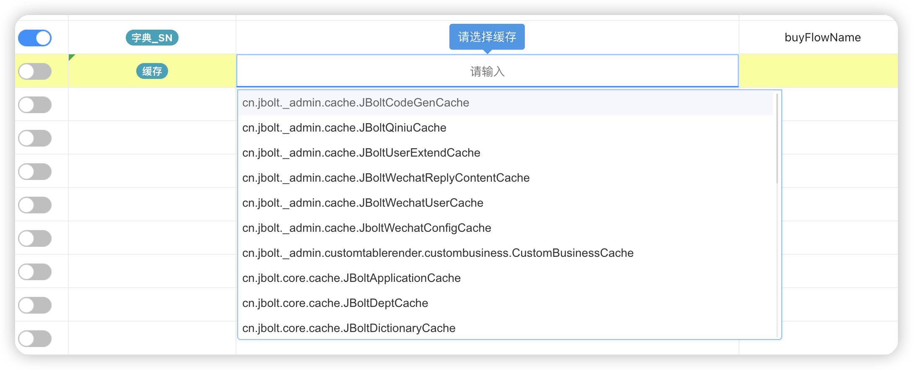

这里注意缓存不是单纯选择完就完成了，需要写完整：
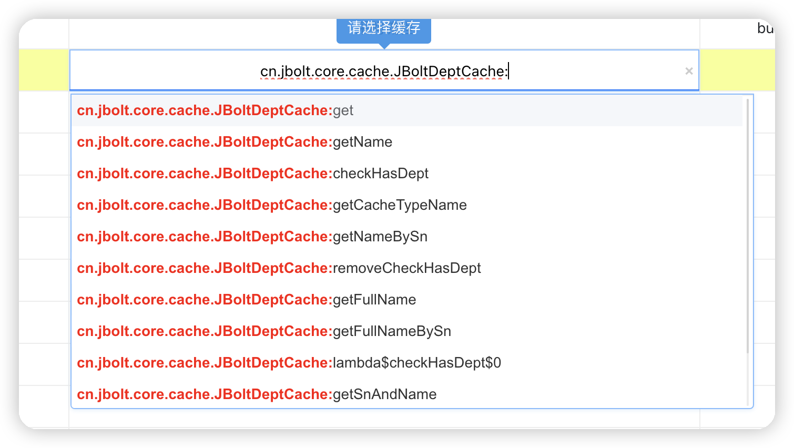
输入类名关键字找到自己需要的缓存类之后，输入冒号 :  会将缓存类中的方法名提示出来，你是需要翻译成哪个 就选择哪个，这里我们dept_id转name 就选择getName

**只有左侧打开开关，才会自动生效。**

### 2、字典翻译SN
很多表中使用了字典表中定义的字典数据的SN作为取值数据源

例如部门管理中的部门类型：
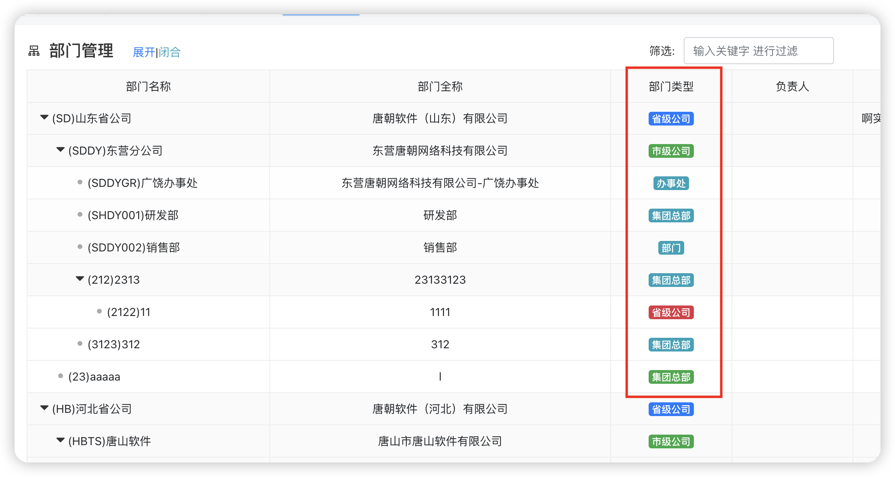
数据库中存的type字段的取值来自于字典表中【部门类型】定义的字典项目的sn字段

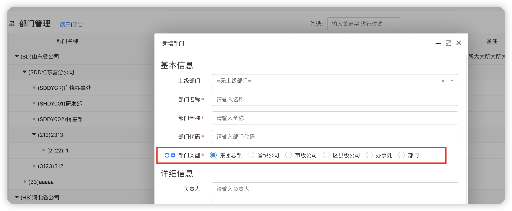

列翻译类型选择 字典 SN 就可以了，然后下一列选择对应你要用的字典类型：
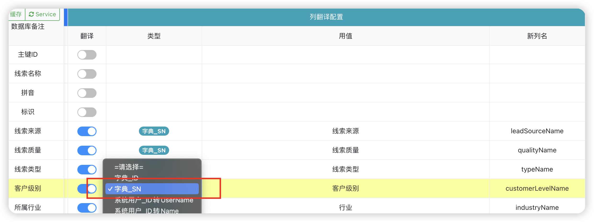

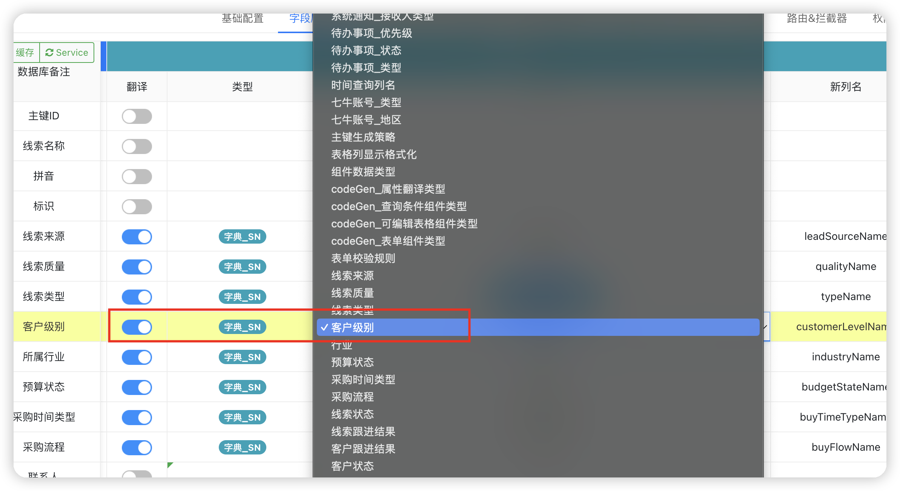
最后打开左侧开关就完成了字典翻译SN的翻译配置了。

### 3、枚举类
枚举类也是跟缓存一样

选择翻译类型【枚举】 这里必须你存在一个能用上的枚举，然后下一列选择它即可，这里不需要输入冒号选择下一级方法了。

### 4、其它
目前主要上面三种就够用了 其他的不常用：
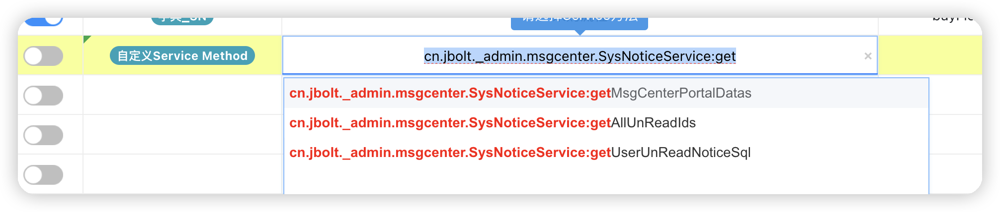

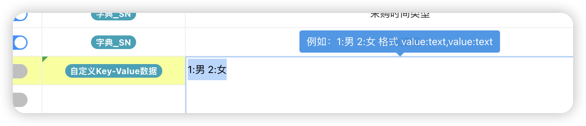

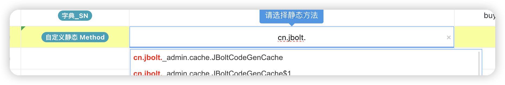
静态方法 你需要输入全路径 然后冒号提示哪个方法 就行了
