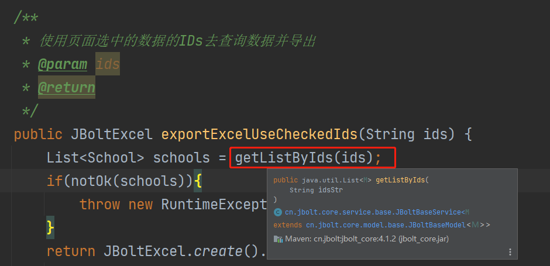

# 不要过度依赖生成器，低代码这种东西，

## 开发者要做到知其然，也要知其所以然。

这个模块主要针对业务层做一个详细实例精讲

tb_school表的CRUD 手写流程

0、表生成Model和BaseModel

1、**SchoolAdminController**  继承  **JBoltBaseController ** 配置@Path和权限 进入**index.html**

2、**SchoolService** 继承 **JBoltBaseService** 绑定一个 **Model：School**

3、指定是否需要关键日志 与 日志类型 **ProjectSystemLogTargetType**.xxx

4、**SchoolAdminController** 里注入**SchoolService**

5、首页 **index.html** 布局与数据读取 **renderJsonData**使用 Service层返回值问题

6、**add.html edit.html _form.html**编写  以及对应action跳转实现

7、**save update** 实现

8、**delete**实现

9、关联字典表实现

10、**JBoltMsg**使用 **PageSize**使用

11、常用参数获取使用

# 视频资料：

1、创建Controller、权限、路由配置、可访问index.htm、配置jboltpage的jbolt-page-title 里pageTitle和form里的查询条件等

时长(20分钟)

[http://vipstatic.jfinalxueyuan.com/jboltpro/handcrud/001.mp4](http://vipstatic.jfinalxueyuan.com/jboltpro/handcrud/001.mp4)

2、index.html完善 controller里提供数据查询接口，返回json数据

时长（14分21秒）

[http://vipstatic.jfinalxueyuan.com/jboltpro/handcrud/002.mp4](http://vipstatic.jfinalxueyuan.com/jboltpro/handcrud/002.mp4)

3、add.html edit.html form.html  新增 修改 表单 和 删除 字典翻译

时长(39分54秒)

[http://vipstatic.jfinalxueyuan.com/jboltpro/handcrud/003.mp4](http://vipstatic.jfinalxueyuan.com/jboltpro/handcrud/003.mp4)

4、toolbar版本 按钮分组 支持批量删除 支持Excel按照Form条件导出 支持导出选择的数据 选谁导出谁

时长(38分11秒)

[http://vipstatic.jfinalxueyuan.com/jboltpro/handcrud/004.mp4](http://vipstatic.jfinalxueyuan.com/jboltpro/handcrud/004.mp4)

# 错误更正：

视频里的findByIds方法 默认JFinal作为一个表多个主键场景用了，所以底层方法 我加了一个getListByIds 用来做根据多ID值查list

 