# JBoltCore核心架构图
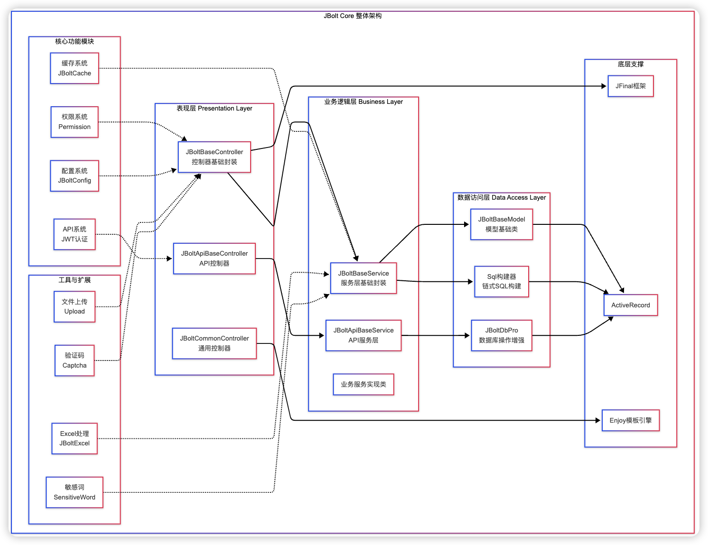
### 1、jbolt core核心库
core核心库将JBolt在JFinal基础上，java部分的核心封装代码全部汇总到cn.jbolt.core这个package下。
包含JBolt所有核心封装和能力。
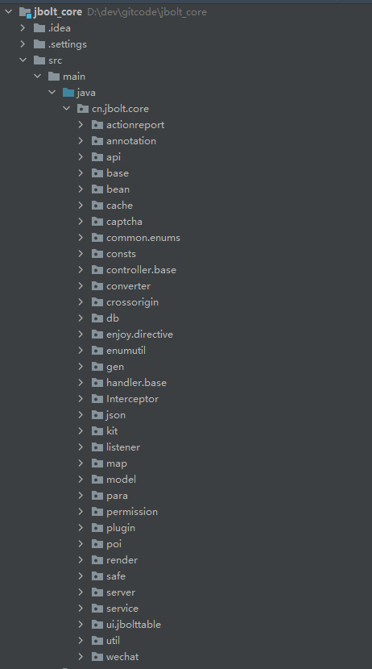

#### 1.1 cn.jbolt.core.actionreport
这里定义了两种JFinal项目action report输出位置的Writer
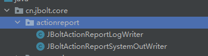

**JBoltActionReportLogWriter** 用来将JFinal的actionReport信息输出到log4j2配置的日志文件中去
**JBoltActionReportSystemOutWriter**是输出到idea和eclipse的控制台里查看

默认是输出到控制台的**JBoltActionReportSystemOutWriter**，如果需要输出到日志里，需要在全局参数配置里做相关配置：
相关配置教程请看这里
TODO

#### 1.2 cn.jbolt.core.annotation
这里定义了三个JBolt项目里常用的注解 主要用在Model上的
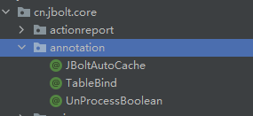
**JBoltAutoCache** 用来在Model上添加的注解，声明此表开启了自动缓存处理机制
自动缓存处理机制相关内容请移步到这里查看：
TODO

**TableBind** 用来在Model上添加的注解，声明此model与哪个表做Orm映射 以及处理数据源、ID生成策略、主键指定与序列指定
具体用法详见：
TODO

**UnProcessBoolean **用来在Model上添加的注解，声明这个Model中有哪些字段是不进行Boolean转换处理的，这里主要是JBolt中规定了char(1)类型转Java的Boolean（这也是JDBC方案）这个声明可以禁止自动将true false 转 1 0 特殊情况用到。

#### 1.3 cn.jbolt.api
这里定义了整套JBolt平台里 API开发的规则，如何在JBolt里开发一套API，用的就是这里的东西。
相关视频教程讲解：
http://jfinalxueyuan.com/jiaocheng/jbolt/
请看最后一章

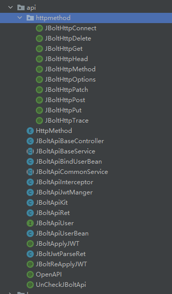

**HttpMethod**  是定义了http Request中的几个常用的method的枚举

**JBoltApiBseController**  所有写API接口的Controller都需要继承它

**JBoltApiBaseService**  一般接口的controller里可以直接引入已经写好的业务service，如果是API特殊业务使用的service就需要继承它

**JBoltApiCommonService** Api Service底层通用封装

**JBoltApiInteceptor** 基于JBoltApiBaseController写的接口都要经过这个拦截器的拦截，解析你请求来自于哪个应用中心配置的应用，来自于哪个客户端 哪个小程序 是哪个用户授权的JWT 解析JWT 处理跨域拦截等。

**JBoltApiJwtManager** 用来处理生成JWT和解析JWT的工具类

**JBoltApiKit** 封装几个ThreadLocal 配合JBoltApiInteceptor 拦截器拦截  解析jwt后的应用 用户信息的当前线程值 可以在后续java里任何位置调用拿到当前接口访问端的信息。

**JBoltApiRet** 所有JBoltApi请求 都应该使用这个包装类返回指定格式的包装数据

**JBoltApiUser** 抽象出一个接口 代指API通讯调用端用户信息

**JBoltApiUserBean** 对JBoltApiUser的一个实现javaBean

**JBoltApiBindUserBean** 对APIUser不是jb_user的用户绑定了其他表用户的信息

**JBoltApplyJWT** 用于api接口action上的注解，声明后拦截器拦截到会处理JWT授权签发的工作

**JBoltReApplyJWT** 用于api接口action上的注解，声明后拦截器拦截到会处理重新签发一个新的JWT的工作 这里注意的是 重新签发需要带着原来有效的JWT，主要用来做绑定用户绑定手机类的操作后重新签发JWT

**JBoltJwtParseRet** 携带Jwt访问API接口会被拦截器拦截和JBoltApiJwtManager进行解析的结果

**OpenAPI ** 在接口的action上使用的注解 声明此接口action是一个开放请求接口 不校验jwt是否携带 直接可以访问，但是还是i需要按照接口规则访问

**UnCheckJBoltApi**  在接口的action上使用的注解 声明接口action是一个开放不检测jwt和JBOLTAPI=true的标识

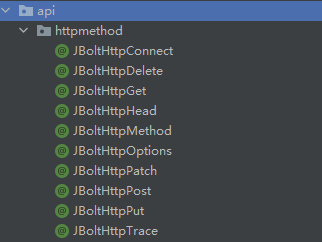

**cn.jbolt.api.httpmethod**中定义了很多注解，专们用在JBolt接口action上 用来控制当前请求必须使用的额method，强制验证用的，例如这个接口只允许get请求 就增加 @JBoltHttpGet的注解即可。

#### 1.4 cn.jbolt.core.base
这里是core中基础的一些常用类
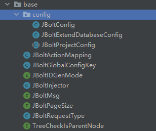
关于二开项目里使用到的几个常用基础类。

**JBoltActionMapping** JBolt定制的支持特殊路由规则的JFinal actionmapping
增加支持@path注解+@actionKey 合并为一个api接口路径方式

**JBoltGlobalConfigKey** JBolt内置核心全局配置参数的KEY定义

**JBoltIDGenMode** JBolt内置主键ID策略常量配置 在配置生成器 Model的Tablebind注解里id策略的时候用到

**JBoltInjector** JBolt Model和Bean的Injector

**JBoltMsg** JBolt内置的一些提示信息 什么参数异常 名称重复 无权登录之类的提示信息

**JBoltPageSize** JBolt内置查询条件里pageSIze的内置定义 可以快速取用

**JBoltRequestType** JBolt内置判断了每个请求的请求类型 是pjax iframe json ajax还是JBoltApi等

**TreeCheckIsParentNode** 接口用来写jstree转换时使用的判断节点是否是父节点类型的处理

cn.jbolt.base.config,包里存放了JBolt平台核心配置类 配置文件映射配置类 扩展数据源配置类
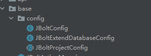

#### 1.5 cn.jbolt.core.bean
JBolt里封装的几个常用的javabean和接口
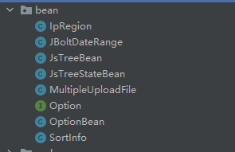

**IpRegion** 用来存IpRegion库返回值 ip和地址转换
**JBoltDateRange**  jbolt内置封装了一个对应laydate组件的range模式下的时间段 周期数据结构 带着开始时间 结束时间。
**JsTreeBean** jstree数据结构
**JsTreeStateBean** jstreeBean里的子结构 控制节点状态
**MultipleUploadFile** JBolt里多文件上传返回值使用的bean
**Option** 定义select radio checkbox这类组件使用的opton数据接口 有text和value
**OptionBean** Option接口实现
**SortInfo** 存一个查询的sort排序信息的

#### 4.6 cn.jbolt.cache
这里封装了JBolt平台所有关于缓存的工具类和接口 方案
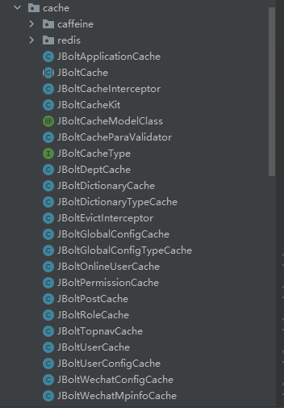

xxxCache结尾的 针对核心内置的Model 封装了很多Cache工具类
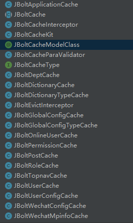
例如JBoltUserCache 就是关于jb_user表和User这个model的所有cache上的操作 都封装了
其他同理。

**JBoltCache**抽象类 定义了下面这些Cache工具类的基类 自己二开业务需要写缓存工具类 针对自己的表和model的话 需要继承**JBoltCache *具体使用方式 可以参考这里的任何一类Cache工具了的写法

**JBoltCacheInterceptor**是JFinal缓存拦截器的封装 用于在action上注解使用 给action做缓存

**JBoltCacheKit**JBolt封装的缓存操作类，get put remove等操作 整合了ehcache caffeineCache redis 根据具体配置文件里定义的cache类型 自动切换。

**JBoltCacheType** 接口里定义了几个常量 cache的类型 
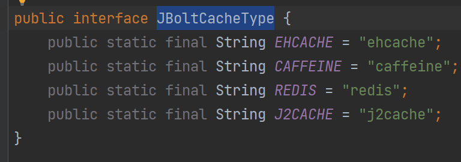

**cn.jbolt.cache.redis** **cn.jbolt.cache.caffeine** 分别定义了redis和caffeine两个cache框架的实现。
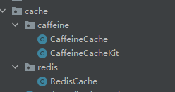

#### 1.7 cn.jbolt.core.captcha
封装了平台内置的登录验证码的类型
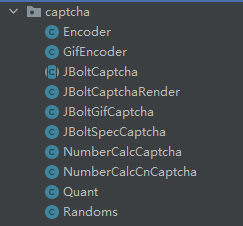
具体需要在全局参数配置模块可视化配置 需要的类型。

#### 1.8 cn.jbolt.core.common.enums
内置的枚举类
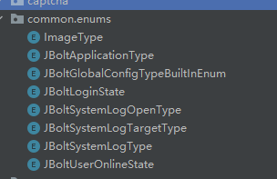

#### 1.9 cn.jbolt.core.consts 
JBolt常量定义

JBolt里常用使用的分钟常量 默认值的定义
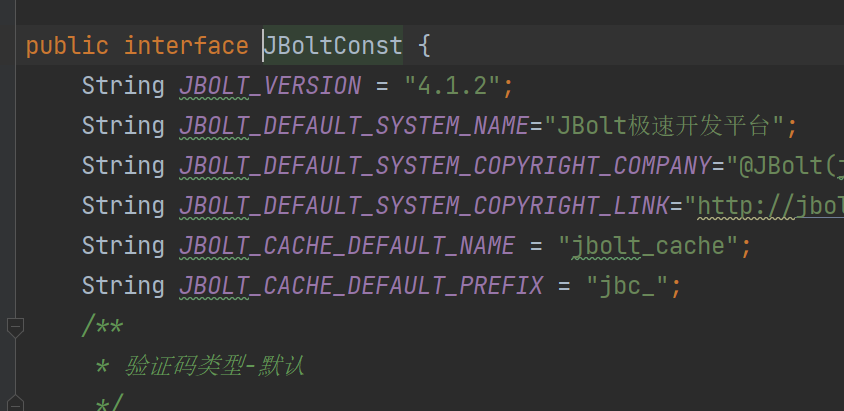

#### 1.10 cn.jbolt.core.controller.base
JBolt平台 Controller层的核心base封装 包含很多快速获取参数，快速render各种错误信息，json数据的方法，

#### 1.11 cn.jbolt.core.converter
封装内置的一些converter 目前只有一个时间戳转换

#### 1.12 cn.jbolt.core.crossorign
跨域处理的注解和拦截器

#### 1.13 cn.jbolt.core.db
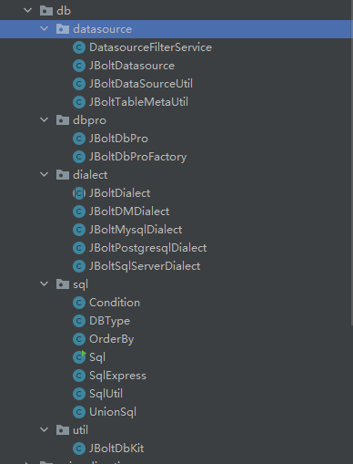
db模块下封装的东西比较多了
1.13.1 cn.jbolt.core.db.datasource
封装了数据源相关的Bean和工具类 数据表结构获取的工具类
1.13.2 cn.jbolt.core.db.dbpro
JBolt内置定制扩展的dbPro用于替代JFinal自身的DbPro完成更高级的特性，例如自动saas租户分表切换映射。
1.13.3 cn.jbolt.core.db.dialct
封装了几个数据库类型的方言，用于更好的跨数据库兼容性迁移处理。
1.13.4 cn.jbolt.core.db.sql
Sql工具类 用于链式调用快速生成Sql字符串，在java代码里避免使用直接字符串拼接方式书写，轻松跨数据源 多数据库类型兼容处理，安全处理等。
1.13.5 cn.jbolt.core.db.util
提供JBoltDbKit 数据库操作工具类 用于生成表 针对不同数据源生成表等操作 底层执行jdbc sql语句操作。

#### 1.14 cn.jbolt.core.enjoy.directive
JBolt封装了一些常用的模板页面使用的自定义指令，数据库sql文件模板里使用的指令
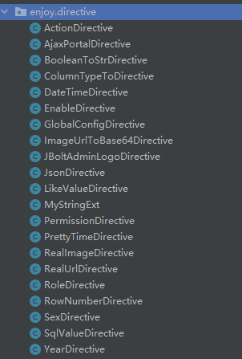

#### 1.15 cn.jbolt.core.enumutil
JBolt里写枚举类 可以都加入到枚举类管理器和工具中，这样你在任何java代码和enjoy模板里都可以轻松使用枚举类取值判断。具体可以参考jbolt_pro里任何一个jbolt内置枚举类看看用法。
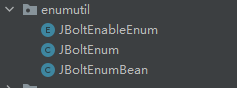

#### 1.16 cn.jbolt.core.gen
JBolt内置代码生成器使用的封装，针对model baseModel 数据库字典文件 controller service html的代码生成 都在这里做了封装，具体使用看内资代码生成器二开的视频教程即可。
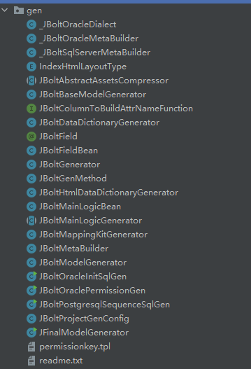
视频教程地址：https://www.bilibili.com/video/BV1Mu411R7pa?p=5

#### 1.17 cn.jbolt.core.handler.base
JBolt平台核心全局baseHandler saas架构租户解析器封装
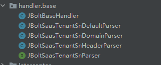

JBoltBaseHandler里处理拦截所有请求，归类请求的schema、请求的用户信息识别、请求的reuqestType类型识别等

#### 1.18 cn.jbolt.core.interceptor
全局拦截封装 权限校验check封装 全局在线用户信息拦截器封装
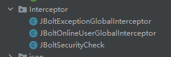

#### 1.19 cn.jbolt.core.json
定制的JBoltFastJson工厂和JBoltFastJson封装
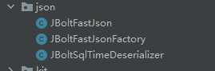

#### 1.20 cn.jbolt.core.kit
常用工具封装
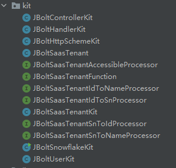
JBoltControllerKit controller层的判断类型 获取参数 render数据的封装
JBoltHandlerKit handler中使用的从来做各种拦截后跳转显示render数据的封装
JBoltHttpSchemeKit当前线程 客户端请求 是http还是https的封装
JBoltSaasTenant saas租户bean
JBoltSaasTenantKit 当前线程识别出是哪个saas租户后的工具类 可以获取租户信息也可以总部模租户调用数据
JBoltSnowflakeKit 雪花算法工具类
JBoltUserKit当前登录用户当前线程里客户端用户信息工具
JBoltSaasTenantIdToNameProcessor 这种处理器都是处理租户id转name id转sn之类用的

#### 1.21 cn.jbolt.core.listener
这里封装了常用的监听器  目前只有一个session监听器 用于配置给undertowservier后可以监听当前客户端session的创建和销毁

#### 1.22 cn.jbolt.core.map
地图封装 目前只有百度地图API
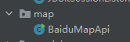

#### 1.23 cn.jbolt.core.model
jbolt核心model和baseModel都在这里了
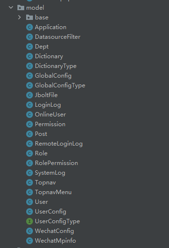
应用中心 用户 角色 权限 部门 岗位 登录日志 在线用于 全局配置 字典数据 系统日志 顶部导航 微信配置账号等。

#### 1.24  cn.jbolt.core.para
 关于controller service里常用的参数校验 万能参数获取器JBoltPara等封装
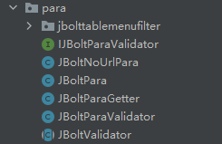

这个是针对JBoltTable的右键菜单menuFilter组件封装
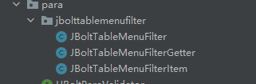

#### 1.25 cn.jbolt.core.permission
平台权限拦截注解 用于权限工具类相关封装
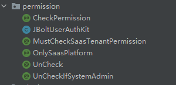
@CheckPermission 主要用来在controller和action上声明需要什么权限才能访问
@UnCheck  在controller或者action上增加此注解 权限拦截器只校验你是否为登录用户 不校验其他权限 直接通行
@UnCheckIfSystemAdmin 声明controller或者action是不需要校验permissionkey的 只要是超管就有权限直达

@OnlySaasPlatform saas模式下 这个注解可以指定controller和action只对总部放行 不允许租户访问
例如平台里的字典数据维护模块 这个是总平台管理的 租户是不可以访问的，只能留一个uncheck的数据接口访问数据 不能访问总部的后台管理功能。

@MustCheckSaasTenantPermission action上必须执行租户权限校验 即使controller上设置了OnlySaasPlatform

permissionkey是需要通过生成器生成 PermissionKey.java 里的 是将系统权限资源表jb_permission表 生成为静态常量 在java里使用。

#### 1.26 cn.jbolt.core.plugin
ActiveRecord的封装 完成自动启动扫描TableBind自动ORM映射的任务

#### 1.27 cn.jbolt.core.poi
这里封装了简单易用的Excel和Word工具类 完成excel导入导出 word导出等 具体有视频教程
http://jfinalxueyuan.com/jiaocheng/jbolt/
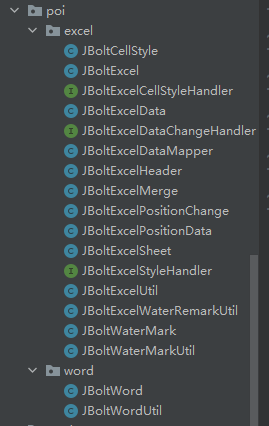

#### 1.28 cn.jbolt.core.render
byte数据的render封装 以及renderFactory的自定义扩展 errorRender的处理 用来完善全局错误信息根据请求类型动态返回不同类型
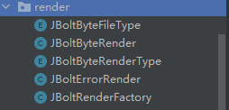

#### 1.29 cn.jbolt.core.safe
 安全模块 封装了xss攻击防御处理
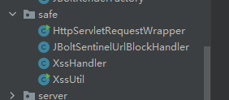

#### 1.30 cn.jbolt.core.server]
针对JFinal-Undertow Server的定制

#### 1.31 cn.jbolt.core.service
JBolt Service层的base和common封装 已经内置模块的service处理业务封装
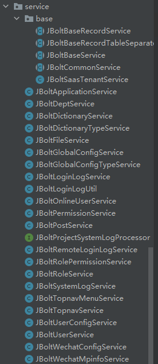

#### 1.32 cn.jbolt.core.ui.jbolttable
前端组件 JBoltTable的单个表格和多个表格提交数据的封装Bean

#### 1.33 cn.jbolt.core.util
平台内置各种工具类
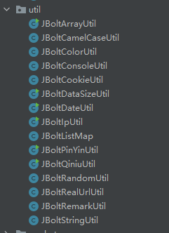

#### 1.34 cn.jbolt.core.wecaht
微信公众平台几个类型配置key的封装
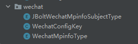