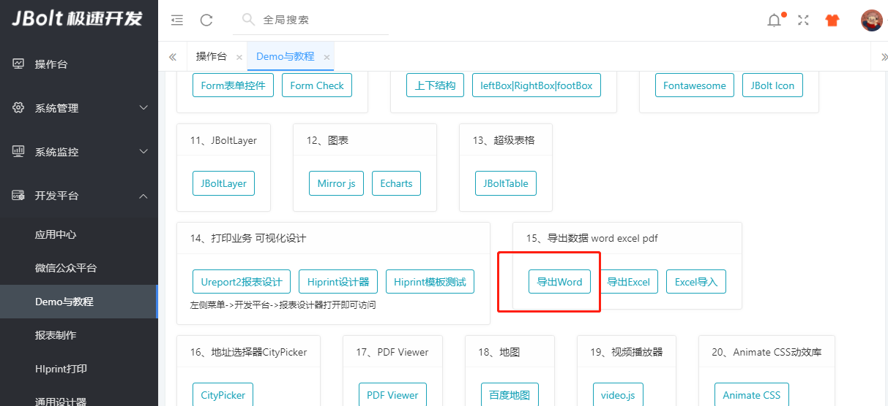
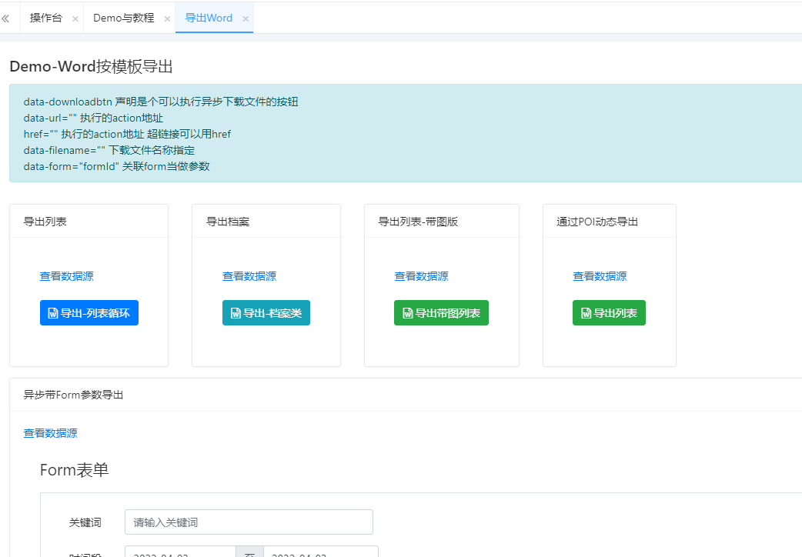
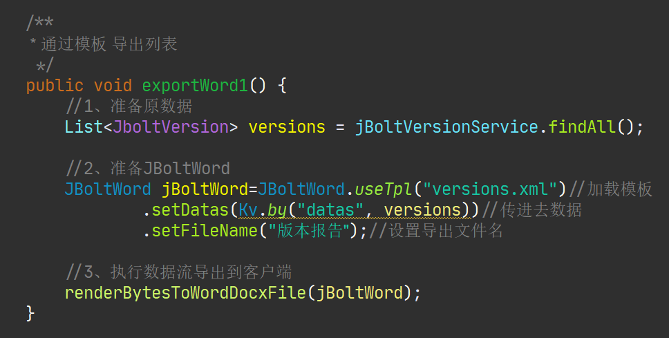
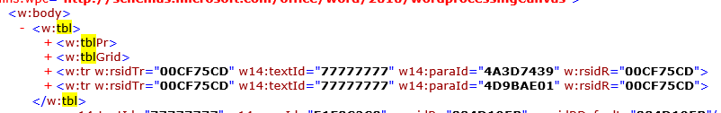
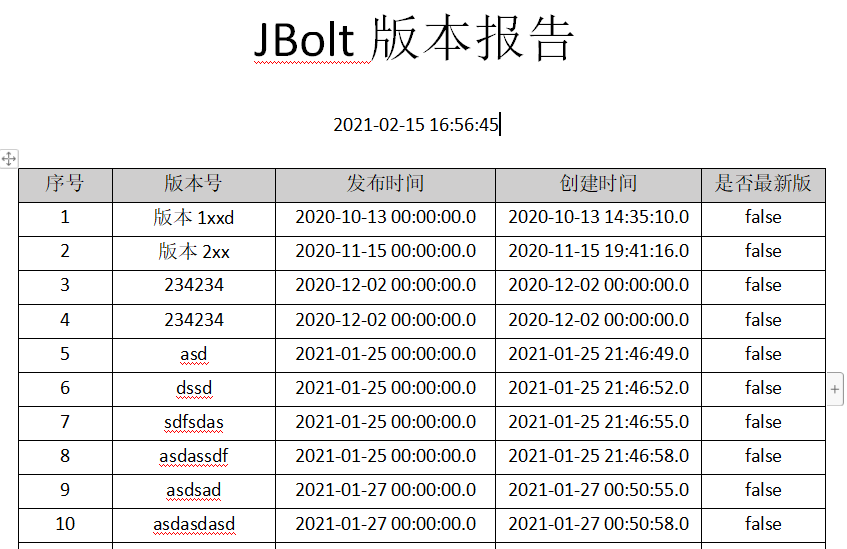
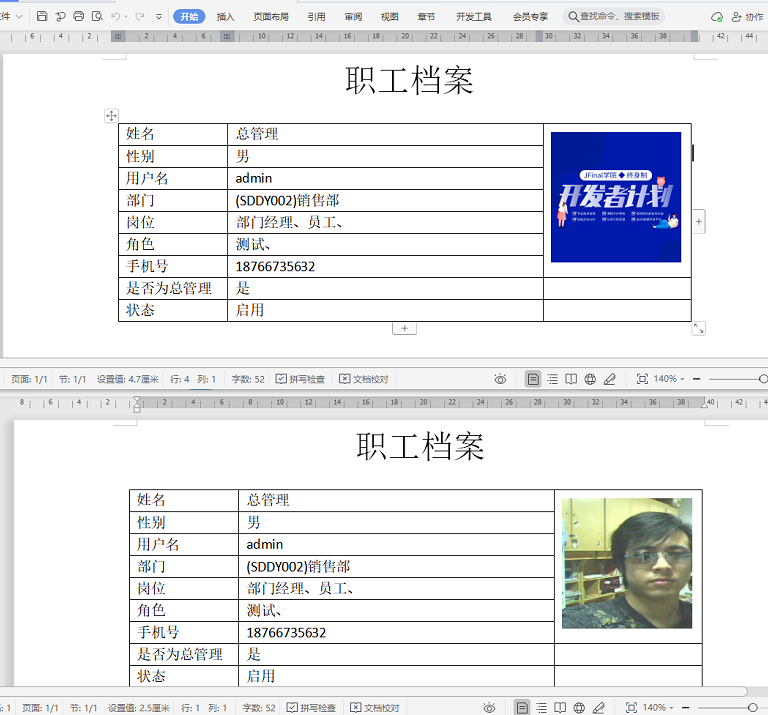
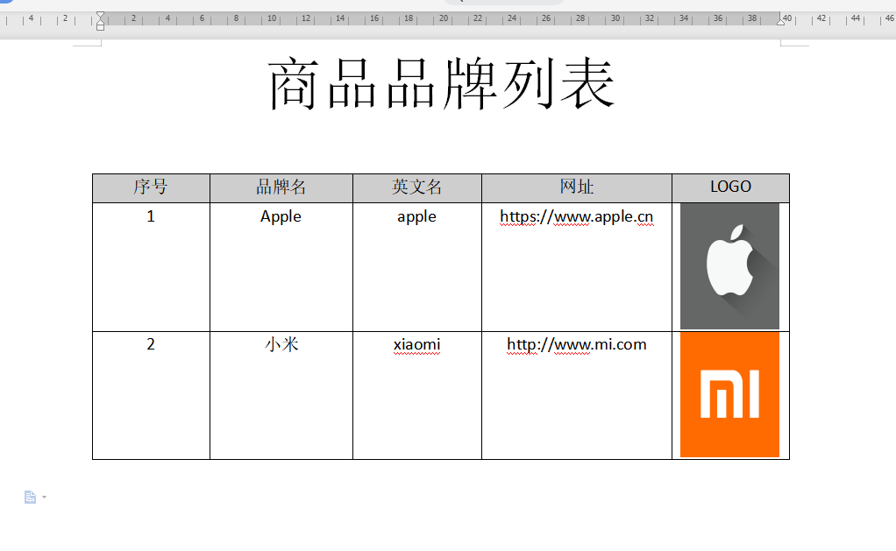

很多项目里有导出Word格式文档的需求，JBoltWord专门提供了这块的封装。
具体Demo案例都有：



### 代码位置：请下载jbolt_plateform_3仓库代码 运行查看

WordDemoController中有所有案例代码。

简单三步，导出word，但是这个word模板xml需要自己准备。
```
/**
	 * 通过模板 导出列表
	 */
	public void exportWord1() {
		//1、准备原数据
		List<JboltVersion> versions = jBoltVersionService.findAll();
		
		//2、准备JBoltWord
		JBoltWord jBoltWord=JBoltWord.useTpl("versions.xml")//加载模板
				.setDatas(Kv.by("datas", versions))//传进去数据
				.setFileName("版本报告");//设置导出文件名
		
		//3、执行数据流导出到客户端
		renderBytesToWordDocFile(jBoltWord);
	}
```


快速按照Word模板完美导出Word报告的功能，用在客户档案类数据导出上，例如HR系统里导出员工档案报告，医疗系统里导出word报告等。

大体思路：

1、使用Word制作出xml模板

2、然后使用JFinal的模板引擎渲染数据

3、拿到渲染后的xml，包装成word二进制数据 发送给前端下载保存即可



比如下面在word中循环遍历出一个列表数据，跟HTML的表格 tr td基本一样的东西 只不过是xml而已。

模板的能力就是带着数据和模板生成最终文件内容，包装成DOC导出就行了。



导出的效果也很不错！！








