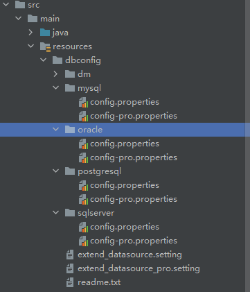

这里存放了所有支持的数据库类型 的主数据源配置文件和扩展数据源配置文件

## 一、config.peroperties
每个数据库类型下都有两个配置文件 一个开发环境 一个部署环境

```
#数据库名称
db_name = jbolt_pro
#jdbc链接地址
jdbc_url = jdbc:mysql://127.0.0.1:3306/jbolt_pro?characterEncoding=utf8&useSSL=false&rewriteBatchedStatements=true&autoReconnect=true&zeroDateTimeBehavior=convertToNull&serverTimezone=Asia/Shanghai
#用户名
user = root
#密码
password = root
#这个数据源下默认数据库ID主键策略 pro里默认雪花
id_gen_mode = snowflake
#这个数据源下绑定ORM的model位于哪些package里 多个逗号隔开 用于提升扫描准确度和速度，不配置无法完成ORM扫描映射
model_package=cn.jbolt.core.model,cn.jbolt.common.model
```

## 二、extend_datasource.setting
扩展数据源配置，扩展数据源数据库类型同样支持配置mysql sqlserver oracle postgresql

```
#此文件是本地开发环境配置的主库之外的扩展数据源
#其中configName就是这里的分组的name 一般用数据库名就可以
#enable=true 是否启用这个数据源
#db_type=mysql 数据库类型
#db_name=jbolt_pro 数据库名称
#jdbc_url =xxx 数据库链接
#user=root 数据库用户
#password=root 数据库密码
#model_package=cn.jbolt.jfinalxueyuan.model 指定自动ORM的代码包
#id_gen_mode=auto 主键生成策略 auto|snowflake|sequence
#force_cast_all_id_gen_mode 此数据源所有表强制使用一种策略 不允许不同表设计不同策略 特殊情况才用

[jfinalxueyuan]
enable = false
db_type = mysql
db_name = jfinalxueyuan
dev_mode = true
jdbc_url = jdbc:mysql://127.0.0.1:3306/jfinalxueyuan?characterEncoding=utf8&useSSL=false&autoReconnect=true&zeroDateTimeBehavior=convertToNull&serverTimezone=Asia/Shanghai
user = root
password = root
id_gen_mode = snowflake
#force_cast_all_id_gen_mode = snowflake
model_package=cn.jbolt.jfinalxueyuan.model
```
