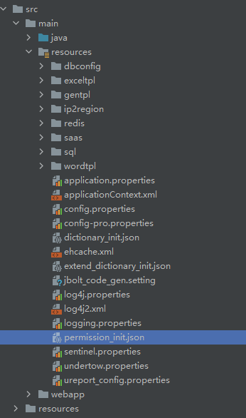

配置系统初始化的权限菜单等信息，系统初始化sql里是不带数据的，仅生成数据表结构。
1、系统首次启动链接数据库会进行自检，检测是否有超管 没有就初始化出来超管员。
2、检测是否初始化了系统权限菜单等数据jb_permission表里 如果没有就加载此配置文件，插入到数据库中。

注意的是这个没有和dictionary_init.json一样额外提供extend_dictionary_init.json去扩展，考虑到权限菜单是需要分配的 初始化平台内置基础菜单后，根据自己需要 进入系统后台添加菜单比较好一点。

或者，你开发完了所有系统功能，可以将系统的菜单权限表导出json后 给客户部署时候 直接覆盖这个json即可
