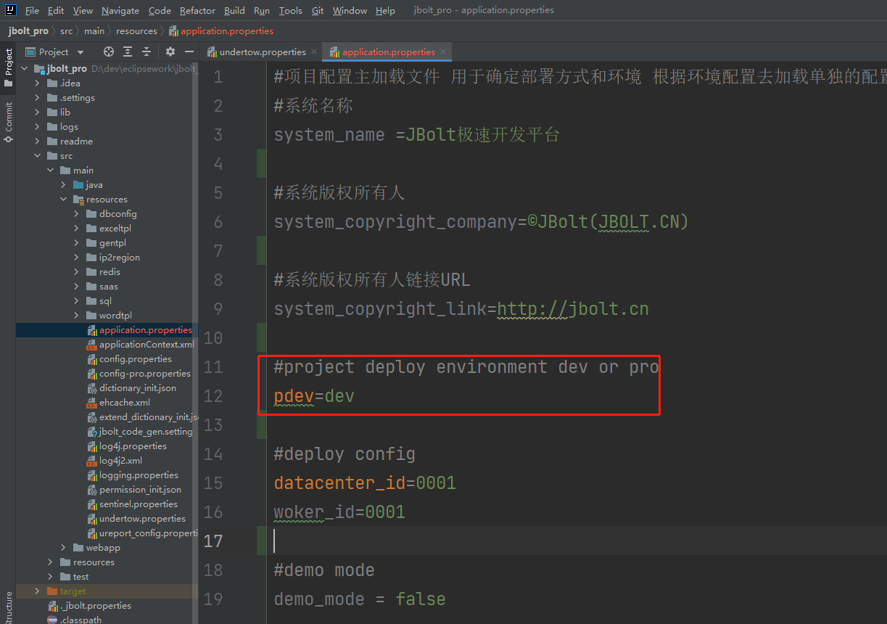
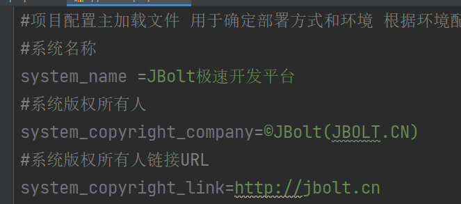

Undertow服务器启动后会调用配置文件加载，第一个加载的配置文件就是application.properties

# 一、系统名称 版权默认值

首次启动会启动后写入到全局配置参数里对应的SYSTEM_NAME的配置中

# 二、pdev
当前系统部署模式是开发模式还是生成模式，这个配置很关键，影响后续数据库数据源配置文件的读取。

# 三、demo_mode
demo_mode 是否在demo模式
这个配置影响删除操作，demo模式先 数据不能演出 演示系统专用配置

# 四、datacenter_id
datacenter_id是项目部署环境所在服务中心ID
woker_id 服务中心机器ID
