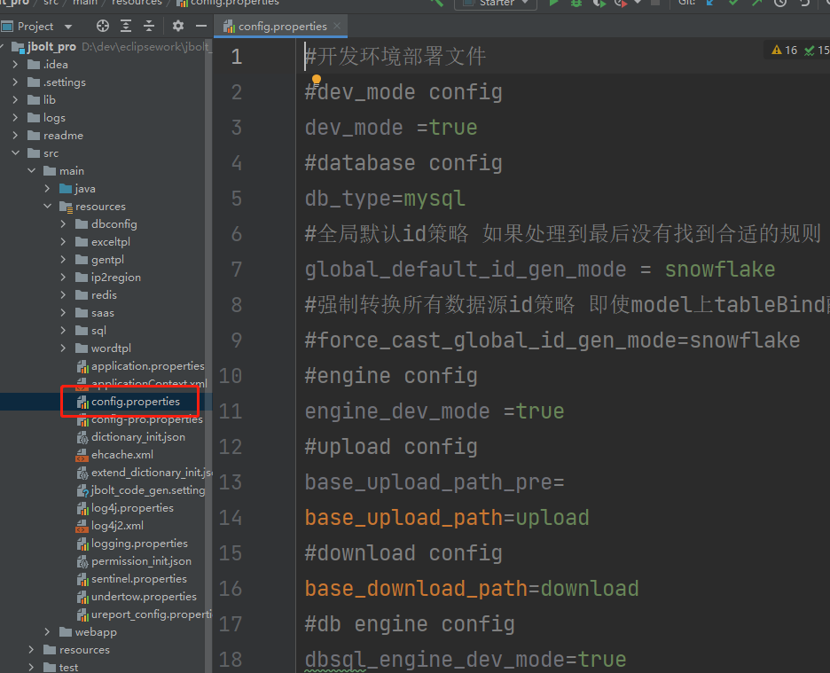
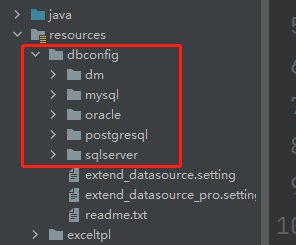
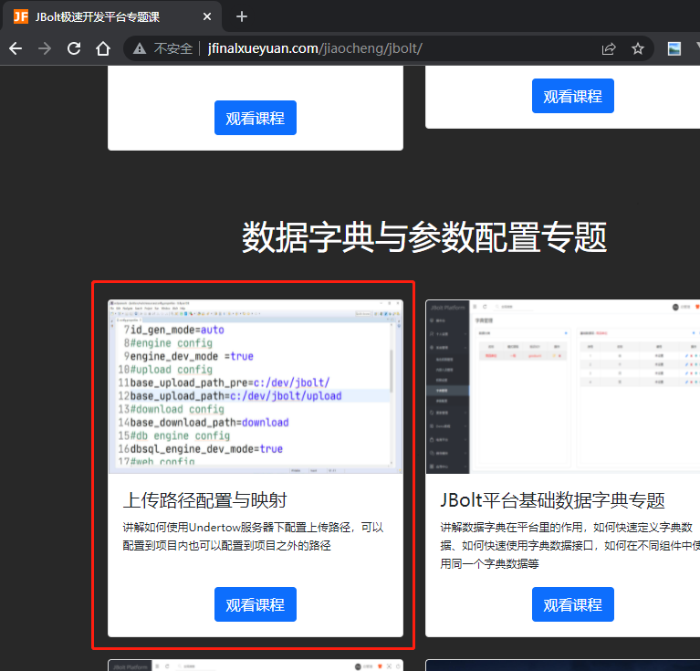
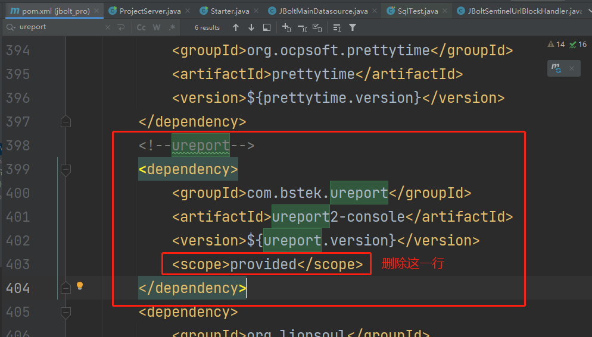
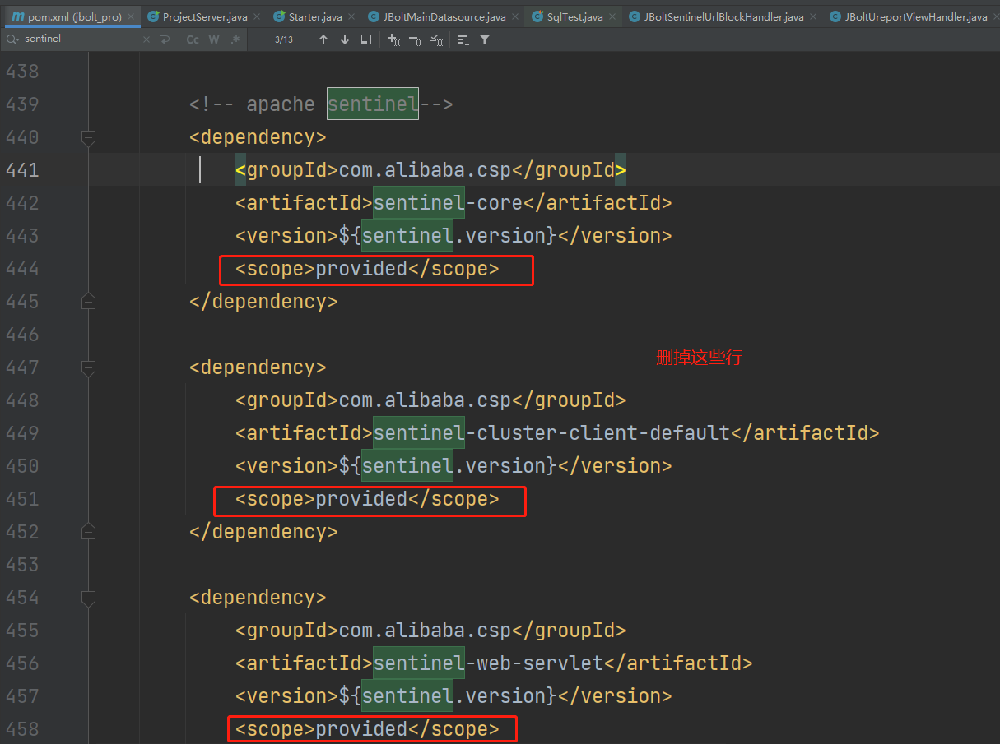
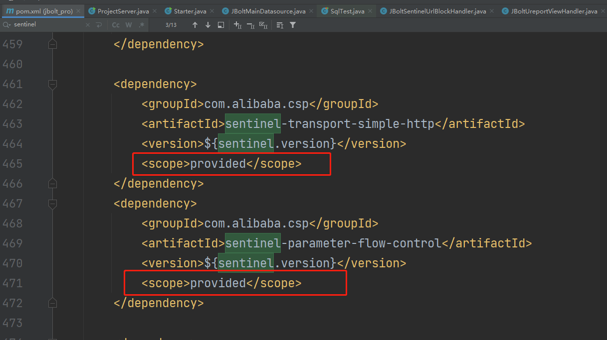

加载application.propertis后拿到了pdev的值。
根据这个值去获取具体要读取哪个核心主配置文件。

这个配置文件里配置哪些东西？
## 1、dev_mode 
当前是否是开发模式
## 2、db_type
主数据源类型默认mysql 这个比较重要 你的主数据源是什么类型 就写什么类型 可选值有：mysql oracle postgresql sqlserver 后面还会支持国产达梦之类数据库。
指定db_type之后，服务器启动加载数据库插件的时候会根据db_type去dbconfig里找对应类型数据库下的配置文件去加载和设置

## 3、global_default_id_gen_mode
全局默认id策略 如果处理到最后没有找到合适的规则 就用这个 默认 snowflake
## 4、engine_dev_mode
enjoy模板引擎开发模式 模板引擎的热加载 默认true 上线设置为false
## 5、base_upload_path_pre
设置默认上传路径前缀的 主要是为了将系统上传的文件 保存到系统磁盘的非项目目录下 转移出去 不与项目本身一起存放
## 6、base_upload_path
设置系统文件上传根目录 这个是在base_upload_path基础上写的目录 默认base_upload_path_pre为空
base_upload_path=upload 意思是上传到项目webapp路径下的upload目录里
如果base_upload_path_pre设置不为空 例如D:\jbolt\static\
base_upload_path设置为D:\jbolt\static\upload即可 这样文件上传到了D:\jbolt\static\upload 但是在项目里 通过资源映射 访问网络地址还是
/upload/xxx.jpg 就是因为jbolt前端自动处理了base_upload_path路径减去base_upload_path_pre这个前缀了。
具体有视频教程：
http://jfinalxueyuan.com/jiaocheng/jbolt/

## 7、need_always_https
如果站点开了ssl https 强制页面所有静态资源 路径全部使用https
如果想http和https共存 就不要开启

## 8、domain
站点的主域名 例如jbolt.cn、jfinalxueyuan.com

## 9、word_img_inner_domain
word文件导出时 用的配置图片的域名

## 10、editor_imghost
默认为空，就是富文本编辑器里使用的图片资源 默认都是相对本站的相对路径，但是如果是小程序 或者app里使用富文本编辑的内容，就需要全路径了
这里配置图片的全路径用域名host
例如：jbolt.cn

## 11、wechat_dev_mode
微信开发平台当前模式 是否开发模式
开发模式下jfinal微信会将消息交互 xml 输出到控制台

## 12、baidu_map_get_address_by_ip
是否开启使用百度地图API 根据登录用户IP获取到地理位置中文信息
登录日志里用到

## 13、baidu_map_ak 和 baidu_map_sk
百度API的AK SK配置

## 14、jbolt_websocket_enable
是否启用websocket 默认启用 因为系统里后端推送前端通知和待办需要这个

## 15、jbolt_ureport_enable
是否启用ureport报表设计器
默认不启用 因为这个东西基于spring 如果启用 还需要启动spring的外部服务
项目需要的启用 不需要的别启用
### 这里需要特殊注意：
如果开启了ureport 需要pom.xml里处理ureport的依赖scope 删掉改为默认

## 16、sentinel_enable
是否开启sentinel 限流熔断 开启这个需要部署sentinel Dashboard
### 这里需要特殊注意：
如果开启了sentinel 需要pom.xml里处理sentinel 的依赖scope 删掉改为默认

这个需要开的直接来问小木 现在还不是很完善

## 17、jbolt_cache_type
配置默认使用的缓存类型 可选ehcache caffeine redis
默认是ehcache 
### 这里需要特殊注意：
如果开启了caffeine或者redis需要pom.xml里处理caffeine redis的依赖 默认注释了 需要解开注释

## 18、jbolt_cache_name
配置cache名称 默认jbolt_cache 尽量不要改

