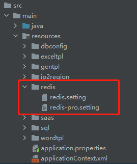

如果在config.properties中配置了jbolt_cache_type=redis
需要在redis文件夹下找到对应开发和上线后的配置文件 配置你的redis信息。



```
#redis 开发环境 配置文件 支持配置N个服务端 每个为一组

#默认-主服务端 名字不要修改
[jbolt_cache]
enable      = true
host        = 39.112.213.32
port        = 6379
password    = jbolt
timeout     = 2000
#database   = 0
#clientName = clientname

#扩展-电商服务端
[mall]
enable      = false
host        = 39.112.213.33
port        = 6379
password    = jbolt
timeout     = 2000
#database   = 0
#clientName = clientname
```

[缓存cachelName 默认 jbolt_cache]
enable       = true                             是否生效可用
host           = 39.112.213.32             IP
port           = 6379                            端口
password   = jbolt                            密码
timeout      = 2000                           超时时间
#database   = 0                                哪个database序号
#clientName = clientname              clientname配置