所有你的业务里存在主要操作一个模块Model类的，需要写Service的话，就要继承JBoltBaseService。
JBoltBaseService，强制绑定一个主model，这样在service业务处理中，单一职责，就是处理这个Model自身业务。
如果这个处理还需要用到了其他Model和表的处理，处理逻辑里应该调用其他Model的对应Service即可。
确定要保证service的单一职责，负责业务要注入所需的所有service去调用。

举例:SysNoticeService里 绑定的是SysNotice.java 这个model SysNotice.java绑定的是jb_sys_notice这个表。
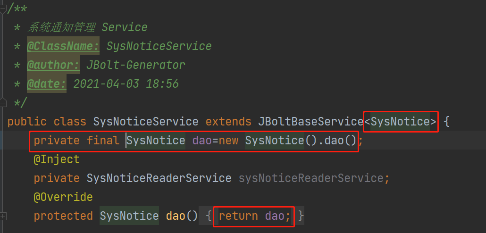

在SysNoticeService里的增删改查 都是针对SysNotice来的。

如果使用到了其他model的操作，就看SysNoticeService里注入的其他Service。

## 继承JBoltBaseService后需要处理的事情：
### 1、泛型绑定
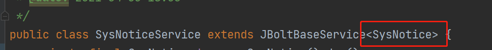
### 2、创建查询dao 与实现dao()方法
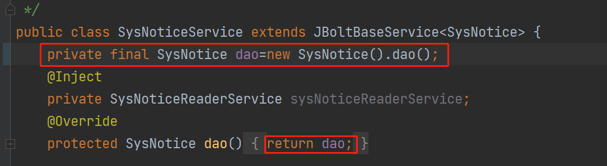
### 3、实现systemLogTargetType方法 
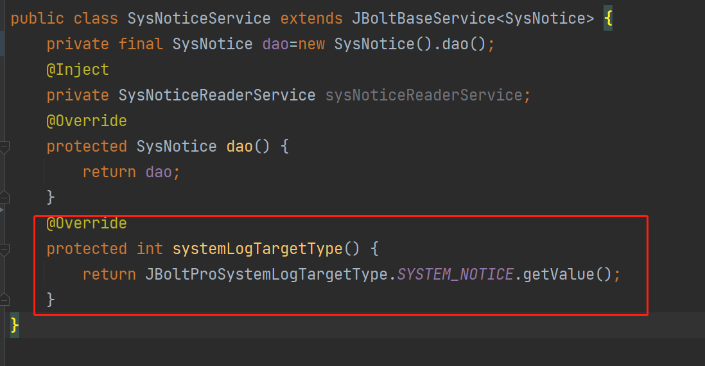

如果你的Model针对save update delete等操作需要记录systemLog 就需要指定一个有效的日志类型。
如果使用生成器生成的crud操作 基本都带着了 因为生成器里让你配置的。
如果是自己写的Service 就需要去到ProjectSystemLogTargetType.java中定义一个指定的日志类型，
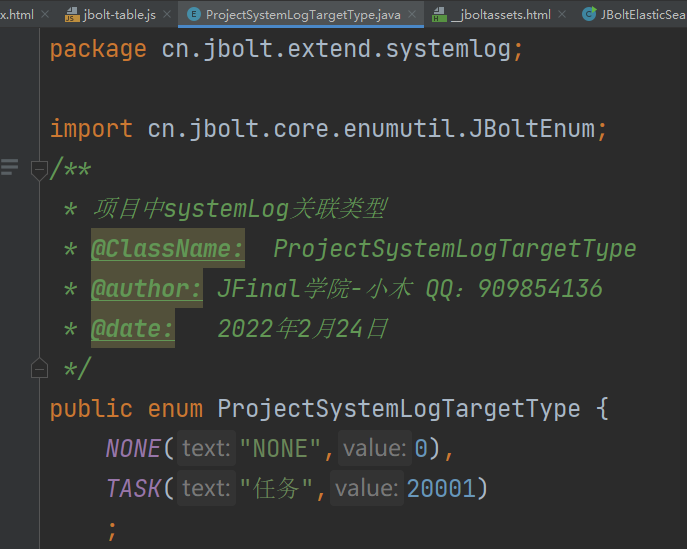

## JBoltBaseService里提供了大量内置方法，可以帮助开发者少些代码 快速开发数据库相关的操作。
### 1、数据查询（底层封装了sql模板）**适合简单快速小查询** 
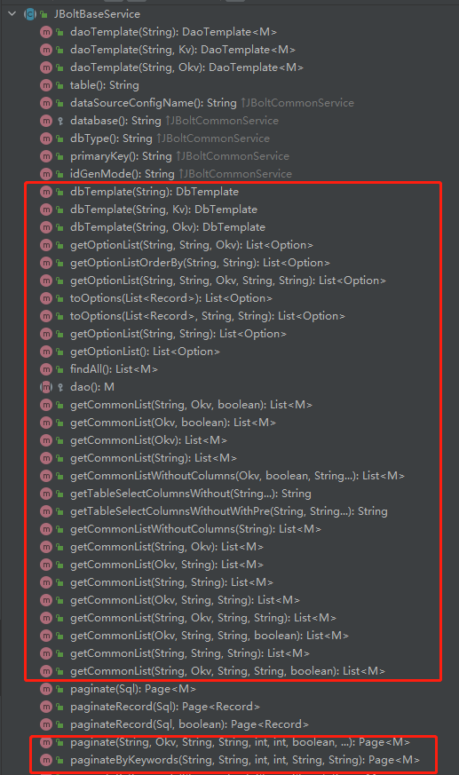
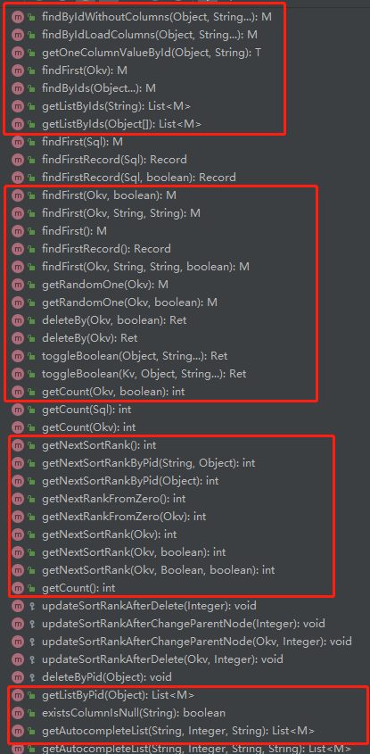
可以快速构建简单条件传入进去，进行查询，底层调用了sql模板拼接出sql执行。

**举例：**
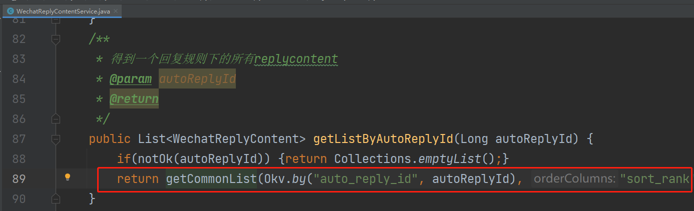
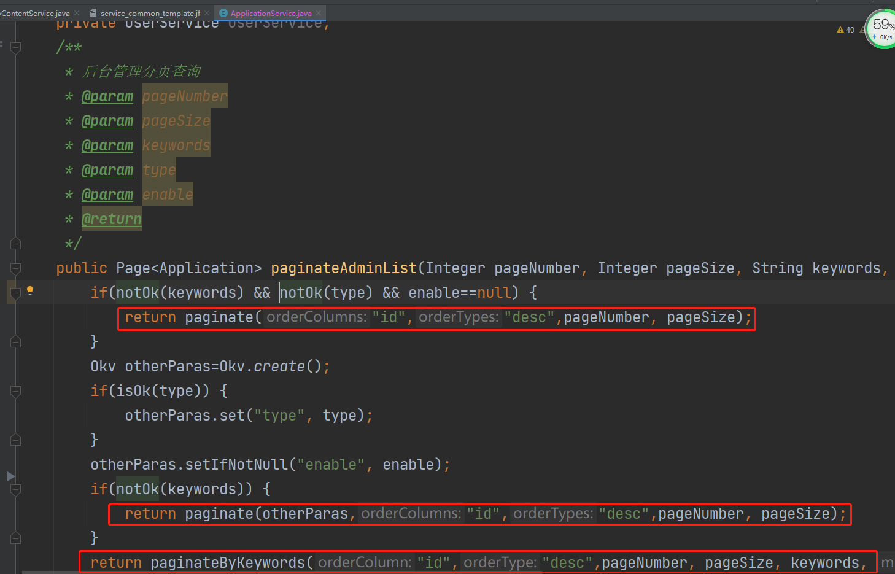

### 2、数据查询（Sql.java 工具类）适合比较复杂点的查询、简单查询也方便
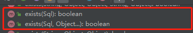
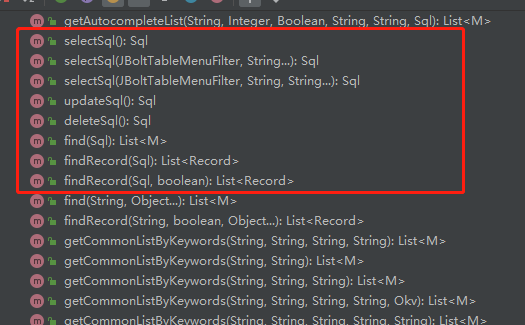
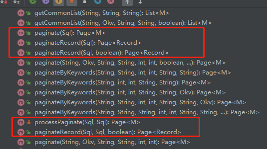

### 3、批量操作
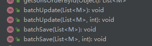
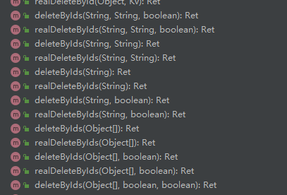
