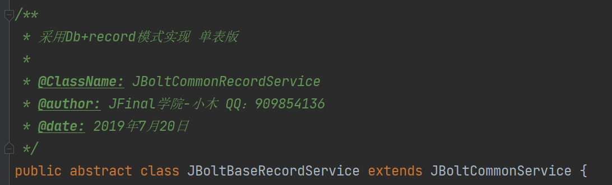

基于Db+Record模式封装的baseService层，可以帮助开发者，针对不生成model映射的数据库表和视图 进行绑定操作。



同样需要遵守Service层的单一职责原则。

继承后需要实现几个方法

```

	/**
     * 自定义表名
     * @return
     */
    @Override
    protected String getTableName() {
        return "test";
    }

    /**
     * 指定数据源配置名 如果返回null 则默认使用主数据源
     * @return
     */
    @Override
    protected String getDataSourceConfigName() {
        return null;
    }

    /**
     * 自定义主键名称 多个用逗号隔开 如果返回NUll 默认为id
     * @return
     */
    @Override
    protected String getPrimaryKey() {
        return null;
    }

    /**
     * 返回主键策略 如果返回null 默认使用数据源配置里的主键默认策略 如果配置文件没有配置 默认使用雪花ID
     * @return
     */
    @Override
    protected String getIdGenMode() {
        return null;
    }

    /**
     * 配置对应系统日志类型 在ProjectSystemLogTargetType中定义枚举
     * @return
     */
    @Override
    protected int systemLogTargetType() {
        return 0;
    }
```
其他使用方式和JBoltBaseService是一样的，只不过JBoltBaseService通过model操作 可以返回Model也可以record，
JBoltBaseRecordService只能操作record和返回record相关数据。

