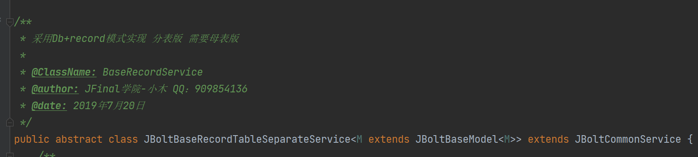
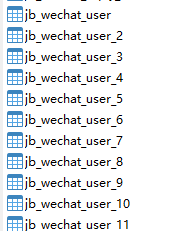
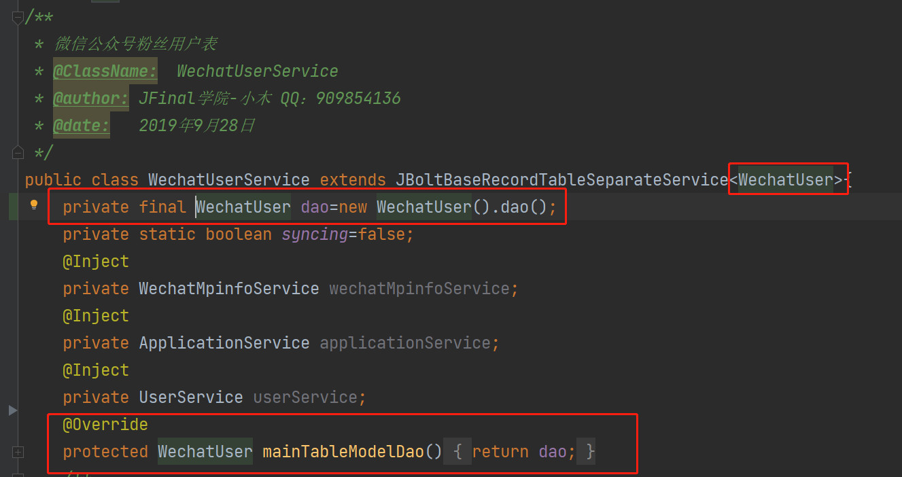

JBolt内置使用 模板Model+id后缀分表的处理service，结合model与record使用，可以操作同一个类型不同分表的数据。

例如JBolt中的微信公众平台多账号管理中，每个账号都用jb_wechat_user这个表作为母表模板，去生成了每个公众号自己的独立分表
jb_wechat_user_公众号的ID 这种格式。

可以参考WechatUserService；

## 这里有一个演示分表使用的service的演示教程：
https://www.bilibili.com/video/BV1Mu411R7pa?p=10
