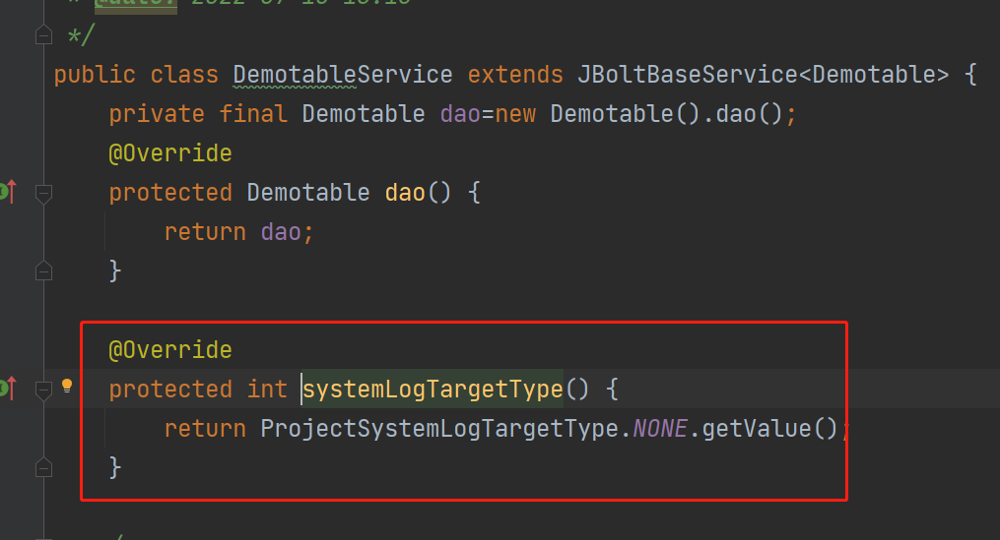
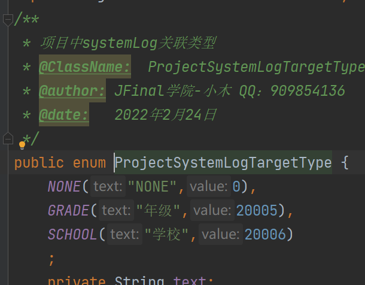

在Service中如果需要添加系统操作日志SytemLog

只需要调用内置方法 addSaveSystemLog addUpdateSystemLog等

### 那么，log日志的类型在哪里定义呢？

JBolt Pro中，你创建的Service 只要继承JBoltBaseService、JBoltBaseRecordService，就需要实现一个方法：systemLogTargetType

实现这个方法，返回一个自定义的日志类型值。

### 这个类型值在哪里自定义？
在这个类里：

cn.jbolt.extend.systemlog.ProjectSystemLogTargetType.java

按照固定格式枚举自定义就行了。

## 需要注意的是
 这里最好是从20000开始就行了 不会冲突。

一般也不需要你在这里写，基础模块crud生成的时候，这个文件内容会自动生成的。
