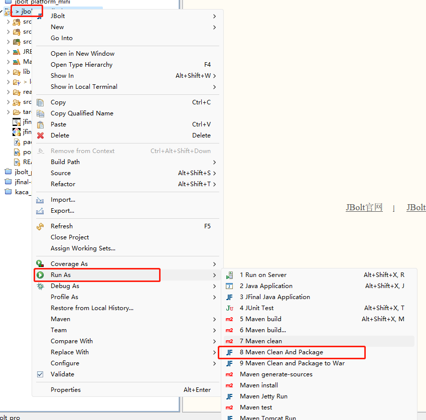
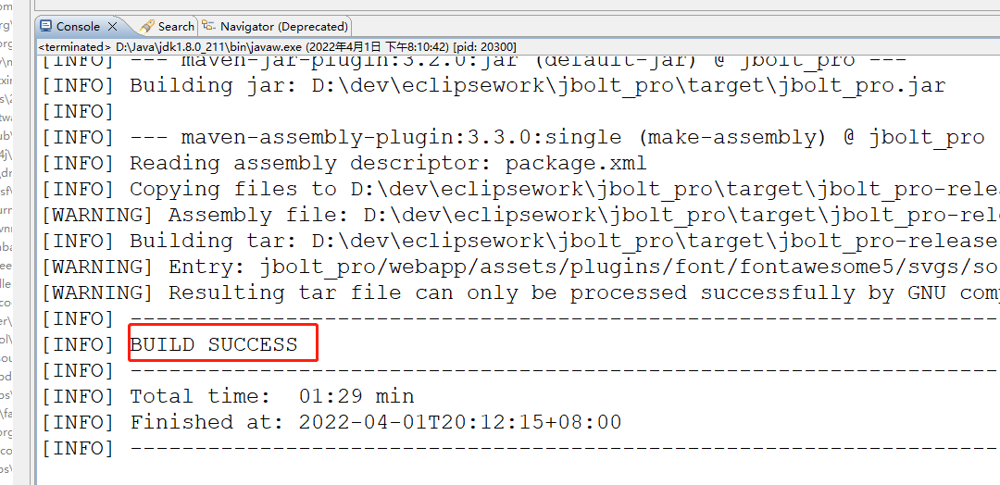
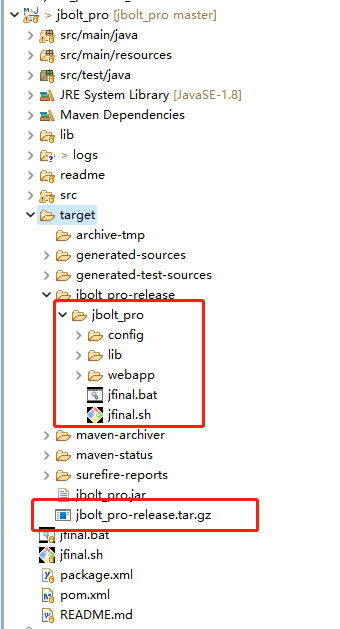
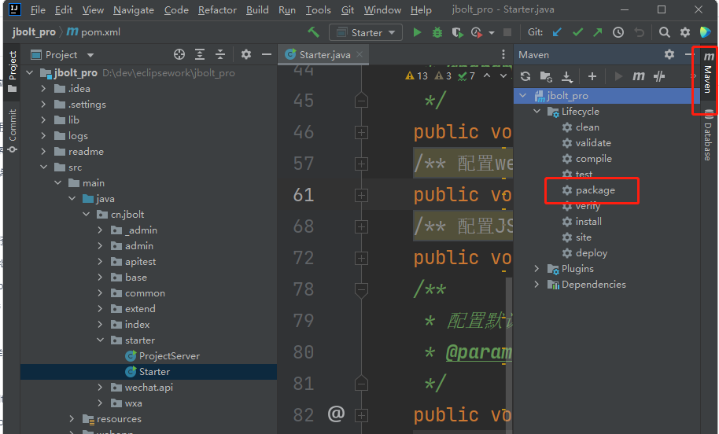
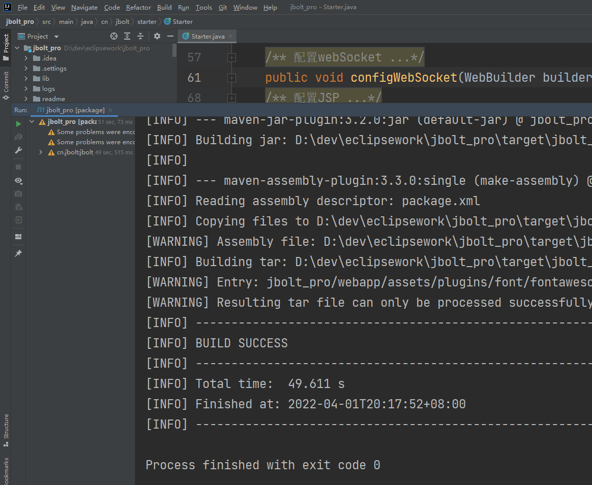
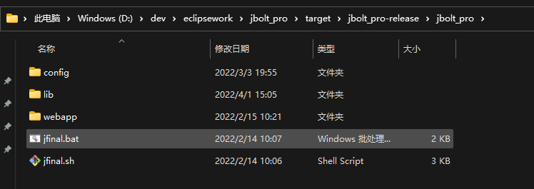
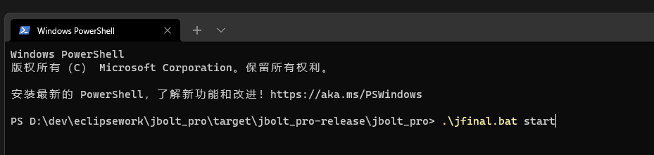
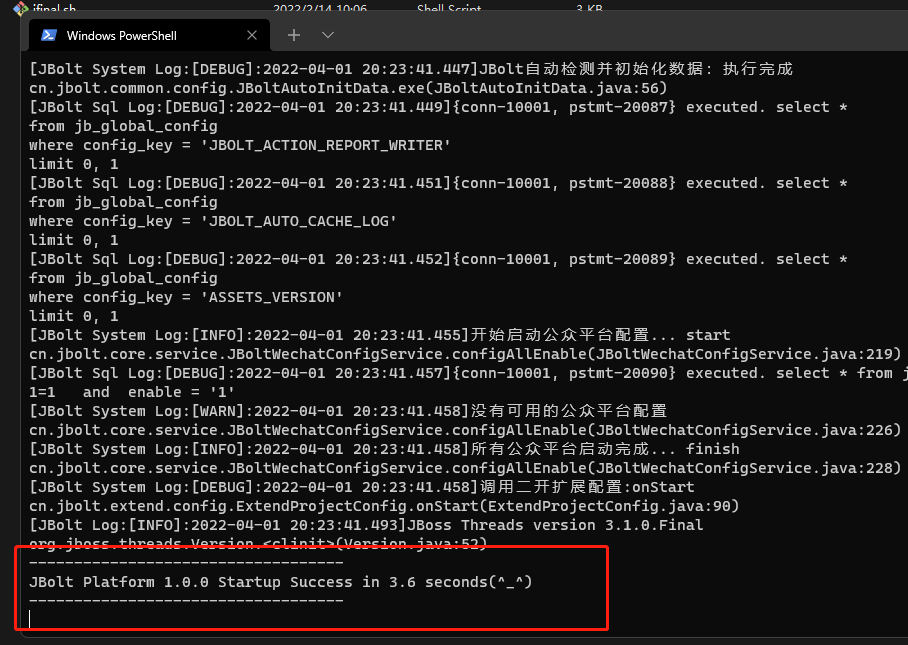
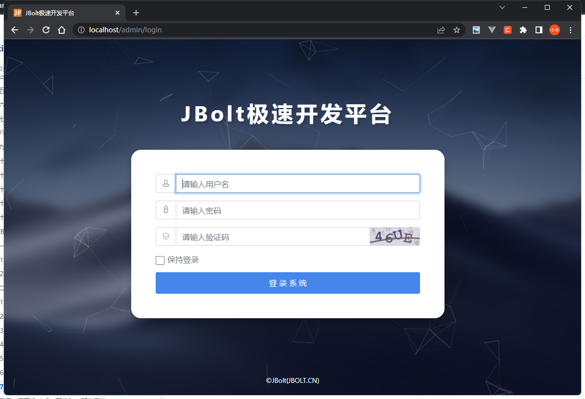

JBolt平台标准Maven工程，打包发布使用的也是maven.
## 1、在Eclipse中打包发布
eclipse里你可以安装JBolt插件 实现一键打包功能，详情请看：
http://jbolt.cn
下载插件与使用教程都有。

项目上右键选择runas 找到打包的菜单，如图所示。
就可以完成一键打包了，

看到这里就打包成功了，打包输出的文件在target目录下：

一个是打包前的目录和文件
一个是打包后的压缩包，上传到linux上解压启动即可。

## 2、Idea中找到maven 运行打包即可

## 3、本机运行 脚本启动

这是打包生成的目录结构：

window上执行jfinal.bat脚本
linux mac上使用jfinal.sh

##  执行脚本输入：
window : ./jfinal.bat start  ./jfinal.bat stop ./jfinal.bat restart
其他 ：./jfinal.sh start   ./jfinal.sh stop ./jfinal.sh restart

启动成功：

访问测试：

