**Controller** 在JFinal MVC架构下，是用来承担接收用户请求（request）、响应（response）返回服务器数据、信息和UI的职责。

### JFinal controller层的文档 需要提前学习：
https://jfinal.com/doc/3-1

# 一、Controller里有什么
### 一个普通后台管理业务Controller的基本组成部分
1、继承JBoltBaseController
2、配置路由
3、权限注解 权限校验
4、业务注入
5、参数获取
6、业务调用与返回
7、render响应

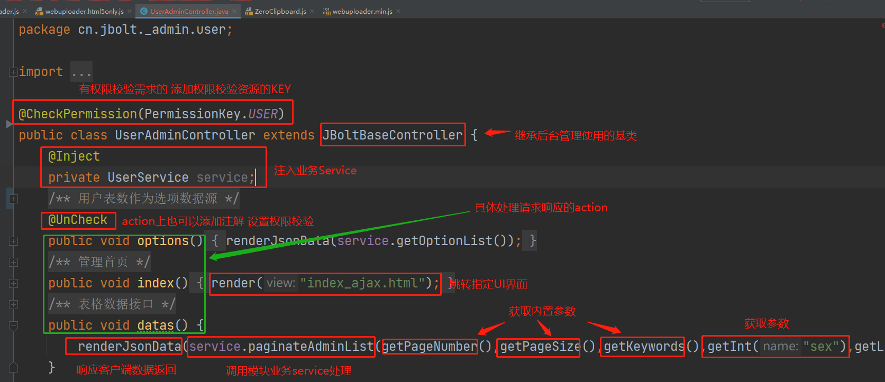

# 二、 这个Controller怎么能够访问到？
没有添加@path注解的 需要自己配置Routes路由映射 具体配置在
ProjectConfig中：
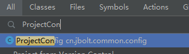
找到路由配置configRoutes
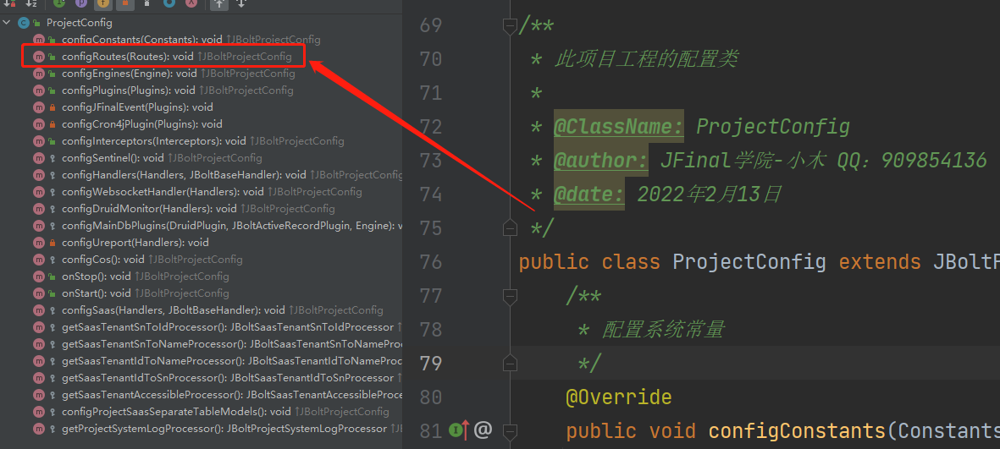
需要独立创建自己的routes类或者直接在这里me.add添加自己的controller映射
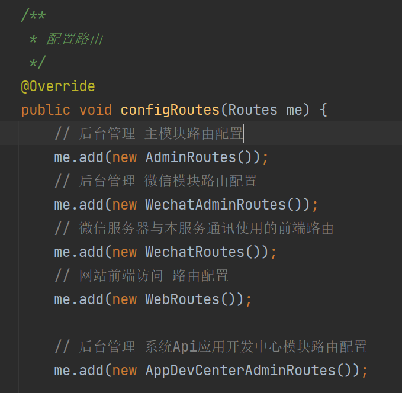

具体怎么写路由配置，这个是JFinal的基础知识，参考JFinal的文档即可：
https://jfinal.com/doc/2-3

### 这里需要注意的就是，每一个controller，执行一些action 匹配一组业务处理，可能对应了很多UI界面 html
### 这些Html存放在这个controller对应配置的viewPath中。
例如：
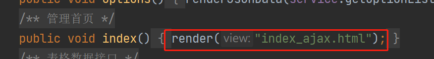

这个render("xxx.html")
文件存在放这个controller对应的viewPath里

### 系统默认的主view层根目录设置在：webapp/_view下
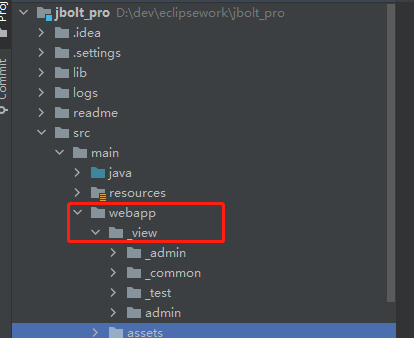

controller对应的viewPath在这个基础上增加自己的配置了：
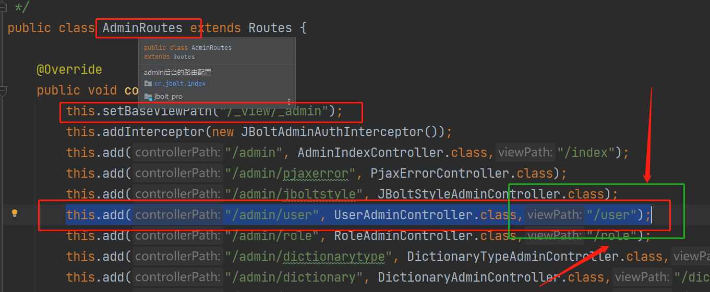
先设置了这个路由类的基础viewpath放在了/_view/_admin
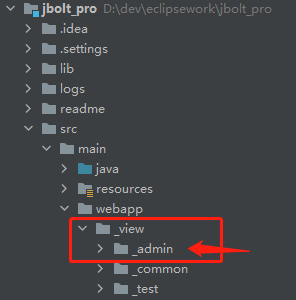
这里viewPath设置到了基于baseViewPath目录 下的/user目录中
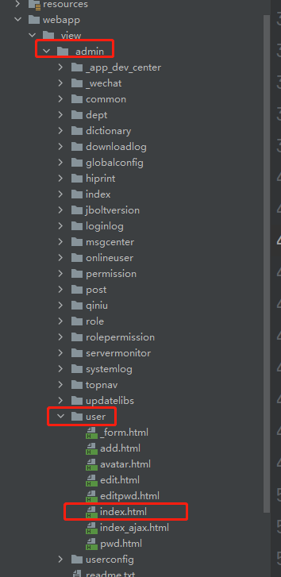

这样，访问请求跳转到你定义的controller的action之后，render("index.html")
就去这个controller早就配置好的路由导航到指定位置了。

# 三、这样有点麻烦呀 有没有更省事儿的方式？
当然有，JFinal最近更新的新版里加入了Controller层注解@Path()可以在Controller上直接自己定义路由设置，而不用在一个地方集中配置routes类了。
这样好处就是可以在代码生成controller的时候直接生成可访问的路径和viewPath配置 启动就可用了。

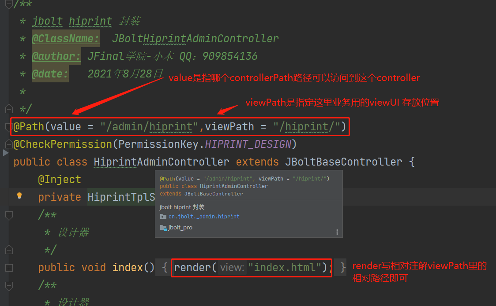

这里需要注意的是：@Path中的viewPath是依赖配置扫描的baseViewPath的

只做上面的配置，你是访问不到这个Controller的，需要将controller所在的package包配置给扫描器：

因为这里他属于admin后台的内容，又因为之前开发的模块提前创建了Routes类，就在这里配置了：
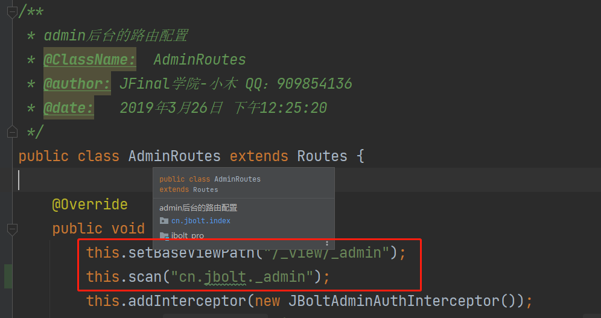

## 如果是新开的项目和模块，不想放在adminRoutes里怎么办？
那就需要在ProjectConfig的configRoutes里去配置这个扫描package了
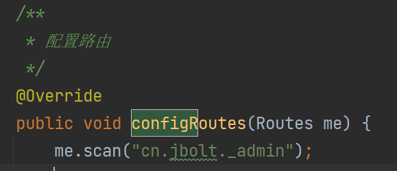

这样就没有了baseViewpath配置 就需要在Controller上自己指定全路径viewPath
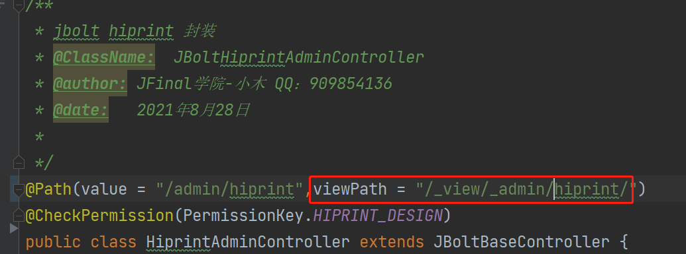
这样才能找到index.html的位置。

# 四、如果要给controller设置拦截器呢？
### 1、就单独给这一个controller设置专门拦截器
直接加就行了
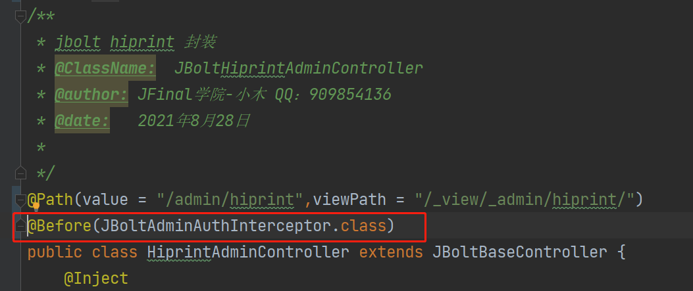
### 2、如果这个模块好几个controller 都用同一个拦截器呢？
指定扫描的包 和给这个报下的controller 加上拦截器
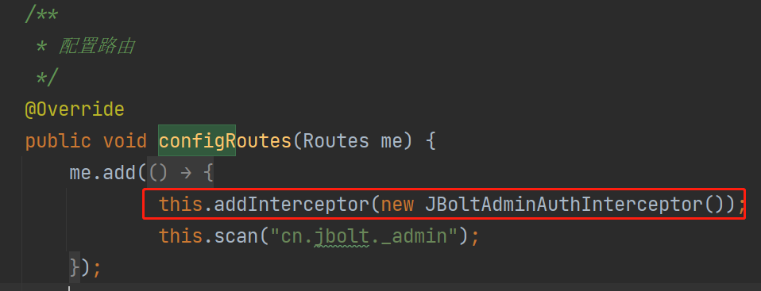

