## **JBoltCommonController**是JBolt controller层的基础封装了，有JBoltBaseController和JBoltApiBaseController两个实现子类

# 一、提供了什么？
## 1、便捷的参数获取
支持JFinal所有自身初级的参数获取方式，详情看JFinal文档即可
https://jfinal.com/doc/3-4
### 另外：
JBoltBaseController还提供了更多参数获取方式：
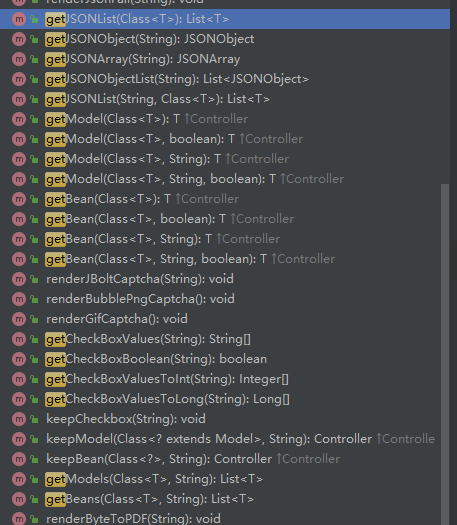

开发的时候根据需求轻松获取到前端提交的数据，支持各种方式和类型
get、post
rawData application/json uploadFile
Url挂的参数
header里带的参数
等等

GetJsonxxx系列 可以轻松获取到JSON参数数据，并且可以转为自己需要的各种数据类型。

## 2、action参数注入方式与万能参数获取器
参数注入 JFinal原生就支持 具体文档看这里
https://jfinal.com/doc/3-3

#### 那这里我们主要讲啥呢？
讲一讲JBolt内置万能参数获取器的注入方式。
不注入的时候万能转换器也能用
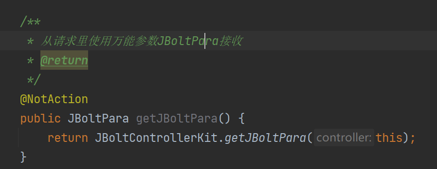

### 在底层封装了getJBoltPara方法
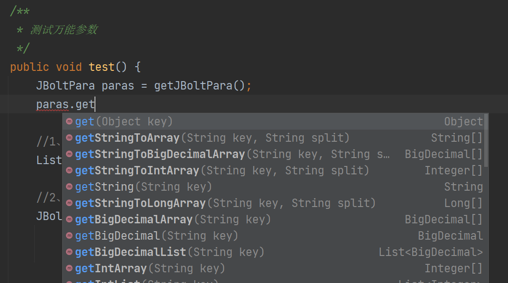

### 直接注入也是没有问题的：
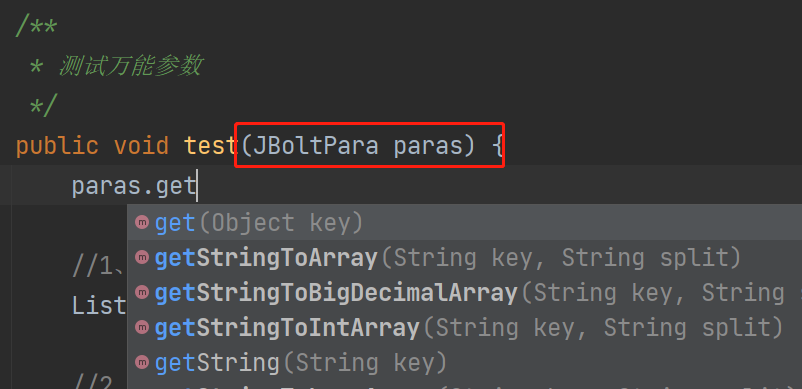

## 3、参数拿到之后你得校验合法性 有效性
JFinal提供了validator验证器 官方文档有，这里不讲了
这里讲一下JBolt里推荐使用的万能参数有效性校验器
isOk(param) 验证有效性 自动识别参数类型
notOk(param) 验证无效性 自动识别参数类型
hasNotOk(params)验证是否存在无效参数
hasOk()验证是否存在有效参数
isExcel(file) 验证文件是不是excel
isImage(file) 验证文件是不是图片
等等吧
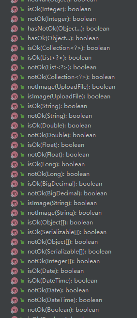

### 咋用
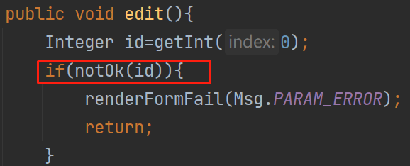
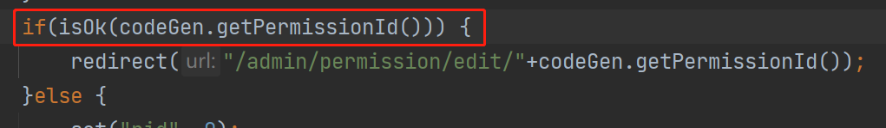
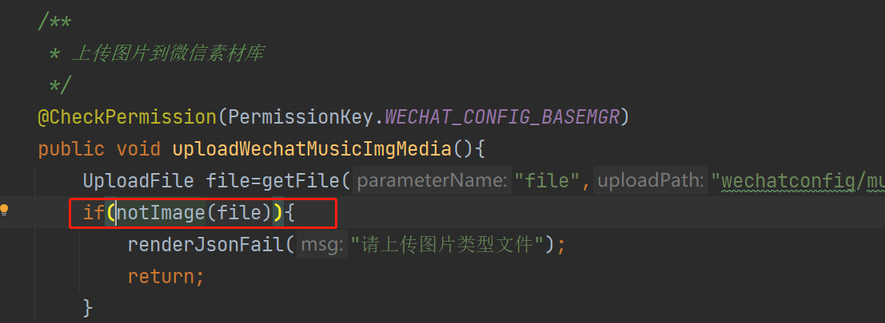
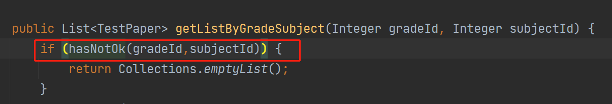

在Controller service里都可以直接使用的

## 3、各种情况的render
响应客户端请求无非就是下载文件、返回数据、跳转网页等
在JFinal中有这方面的基础介绍：
https://jfinal.com/doc/3-7

### JBolt里提供了更多render
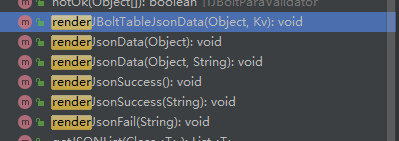
可以render各种json数据

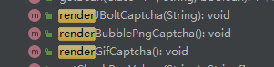
可以render几种验证码图片

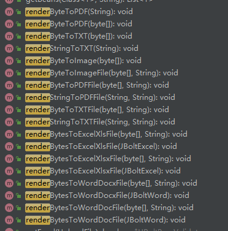
可以render各种bytes数据流 pdf excel 图片bytes都可以

