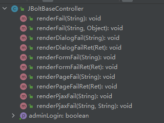

JBoltBaseController 继承了JBoltComonController 又针对后端服务写Controller的场景 增加了很多常用renderxxx；

这里特别注意的是renderFail()这个方法
不管前端是请求页面直接请求、dilog iframe加载 pjax请求
还是请求json数据 等 如果出现错误信息需要响应给前端
调用renderFail就行了 jbolt会自动识别请求类型，自动返回对应类型数据。