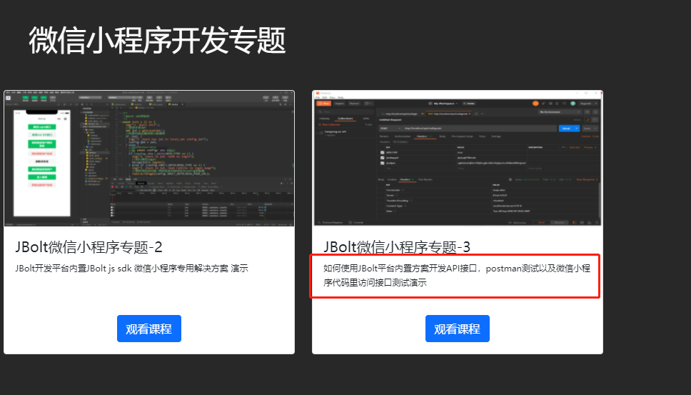
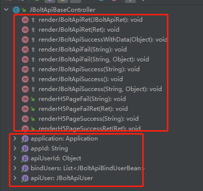

JBoltApiBaseController是专门为app 小程序 公众号等前端客户端写接口提供的基础类
所以写的外部接口都要继承JBoltApiBaseController
JBoltApiBaseConroller与JBoltBaseController 都集成了JBoltCommonController类
拥有与JBoltBaseController一样的基础能力，不一样的是专门针对接口和应用中心开发的一些东西。

具体的写法和使用有教程演示
http://jfinalxueyuan.com/jiaocheng/jbolt/

演示了如何写接口。

# JBoltApiBaseController 特殊封装了一些 东西

提供了移动端 接口开发常用的一些render
还有获取客户端绑定的用户信息、应用中心api信息等