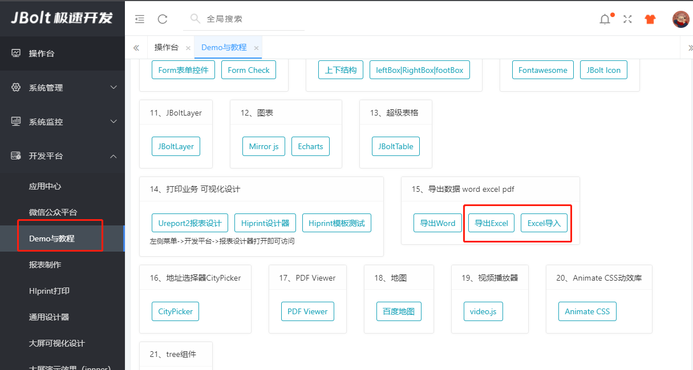
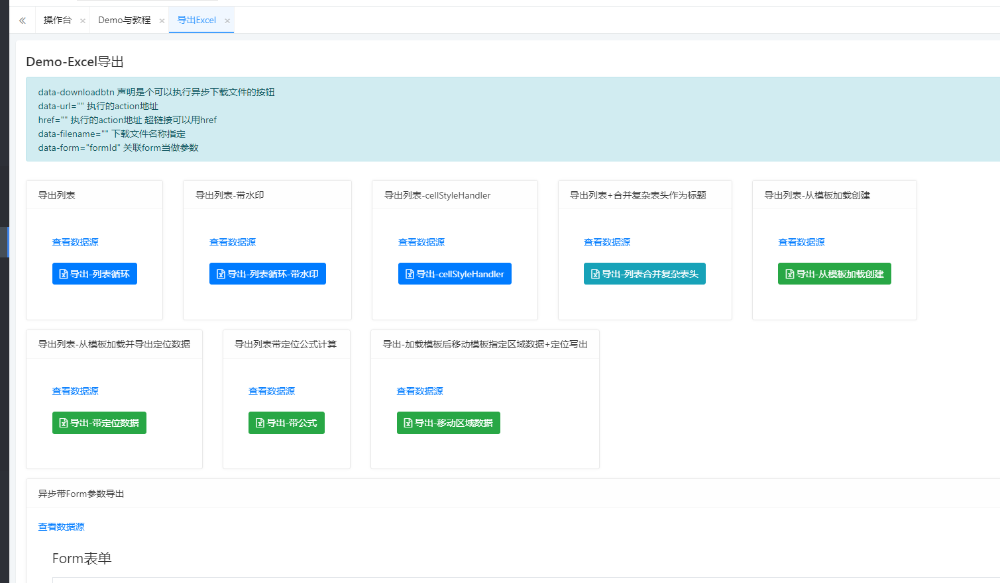

JBolt里封装了JBoltExcel和JBoltExcelUtil 用来将数据导出为Excel 傻瓜式操作，支持各种形式导出，简单易上手，不说了看视频：
http://jfinalxueyuan.com/jiaocheng/jbolt/

### 相关的Demo教程也很多
### 在ExcelDemoController中 pro中未携带demo案例源码，请下载仓库jbolt_plateform_3运行查看

