JBolt平台中开发公众号和小程序都是基于内置公众平台模块，支持多账号管理开发模式。

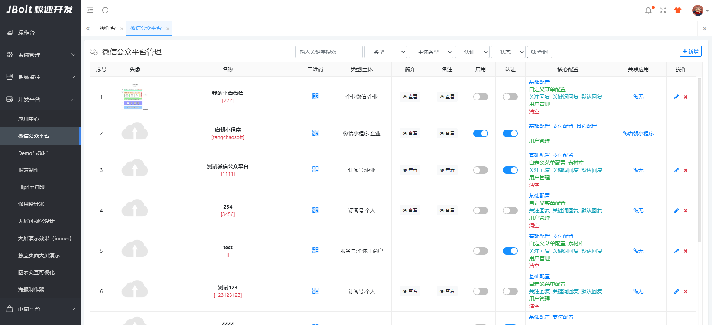

每个要开发的公众号 都需要配置基础配置信息：
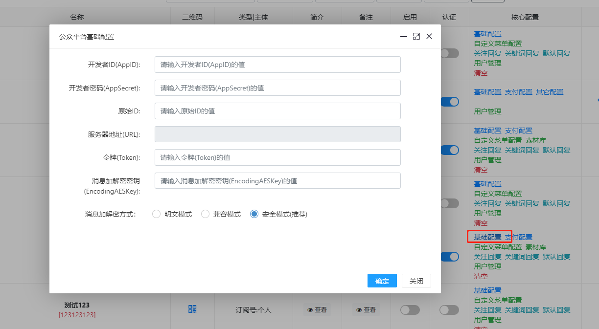

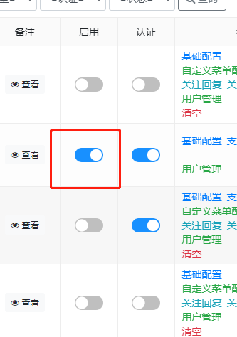
配置完成后，还要点击启用和绑定对应的应用开发中心的应用，才可以完成接口开发对接的第一步。

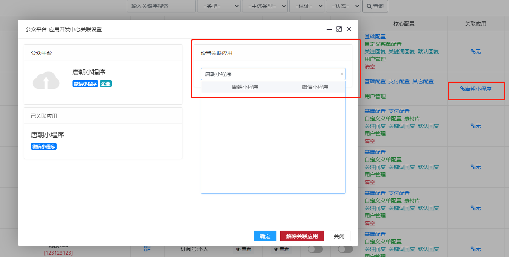

### 详细配置过程可以看视频教程 最后两章：
http://jfinalxueyuan.com/jiaocheng/jbolt/

# 一、用户粉丝信息查看与管理
每个账号对应自己独立的用户粉丝表，用来存放关注此公众号或者在此小程序里的用户基础信息。
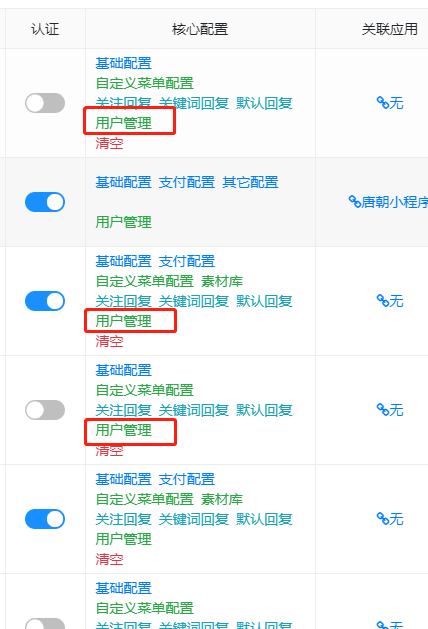

## jb_wechat_user表 是模板母表，用来定义数据结构 
其他jb_wechat_user_xxx 是每个公众号 小程序创建时根据母表动态创建出来的对应分表，每个公众号 每个小程序都有自己独立的分表，互不影响。
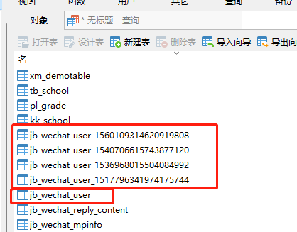

jb_wechat_user_xxx   这里的xxx是微信公众号的mpId你创建出来公众号的表里的id字段 jb_wechat_mpinfo表

## 分表怎么访问？
WechatUserService封装了针对每个公众号小程序 分表crud的方法，直接调用service方法即可。
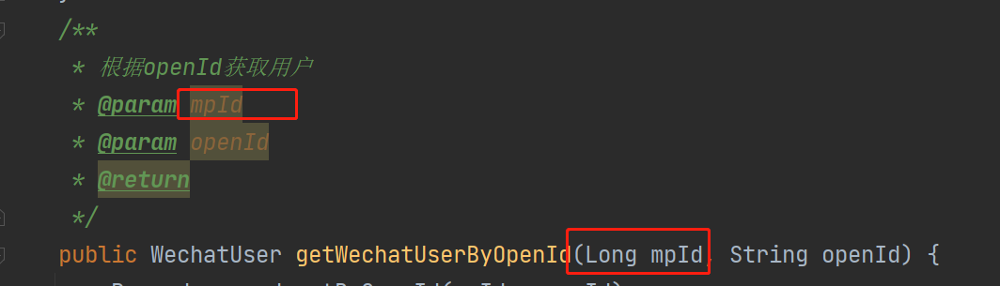

## mpId是什么
每个创建出来的公众号 小程序 都有自己ID 就是mpId 数据在jb_wechat_mpinfo表里 

## 公众号菜单怎么管理维护？
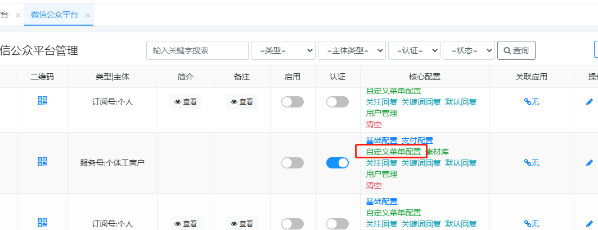
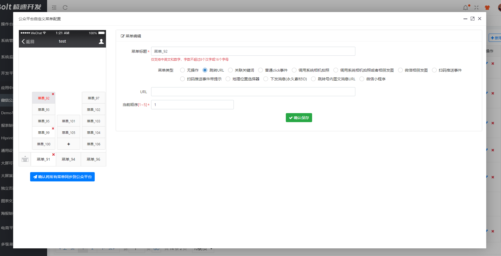
可视化操作维护菜单。

## 公众号被动回复各种配置
关注后返回消息配置、关键词回复、默认回复都在这里配置
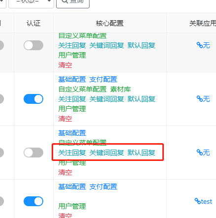

## 公众号授权登录 demo
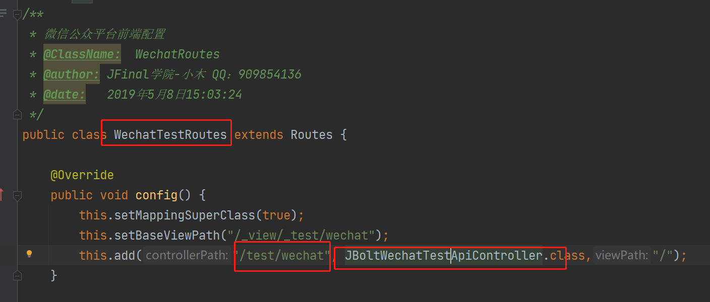
这里是内置测试 demo 打开微信开发者工具 
输入地址：http://ip:port/test/wechat即可访问到

## 公众号各种事件 菜单事件处理在哪里？
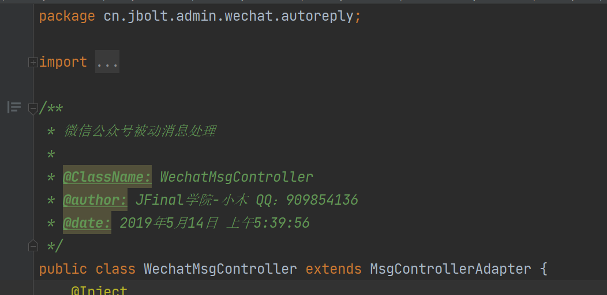
关注、取消关注、扫码、菜单事件的处理逻辑都在这里

