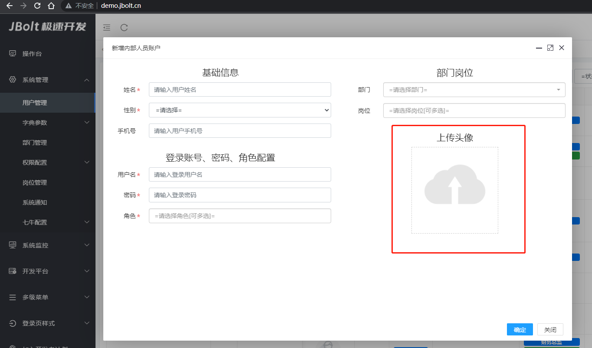

单图上传的场景就有很多了，系统里经常会用到上传头像，上传一个封面图的需求。

例如：jbolt平台里用户管理中的头像上传



点击，选择单张图片，上传后返回图片地址，直接保存到指定隐藏域即可。
此图片是异步ajax上传。

### 一、前端怎么写

```
<div class="j_img_uploder" 
	data-url="admin/user/uploadAvatar" 
	data-value="#realImage(user.avatar??)"  
	data-handler="uploadFile"  
	data-hidden-input="userAvatarInput"  
	data-area="200,200" 
	data-maxsize="2048">
</div>
```


属性 | 取值案例 | 默认值 | 属性说明
:----------- | :-----------: | :-----------: | :-----------
 class       |     j_img_uploder|     空|      声明class 即可声明这是一个单图上传组件
data-url       |     admin/user/uploadAvatar|     空|      指定图片上传地址，需要自己提供一个action地址接收图片数据 如果指定上传七牛uploadFileToQiniu 就不需要设置url
data-area | 200,200|100,100|指定图片上传组件的显示区域尺寸 默认100px 单位PX
data-maxsize|2048|2048| 指定组件限制图片最大size 默认2048KB  单位KB
data-handler|uploadFile|空|指定选中图片后的处理器 必须指定 可选内置值 uploadFile uploadFileToQiniu
data-value|"#realImage(user.avatar??)"  |空|在修改界面上 指定已经选中的图片数据的值是什么 
data-hidden-input|userAvatarInput|空|指定图片上传后返回的可访问地址存到哪个隐藏域里
data-upload-success-handler|uploadSuccessHandlerxxx|空|指定上传成功后额外处理的handler事件回调
data-upload-fail-handler|uploadFailHandlerxxx|空|指定上传异常后额外处理的handler事件回调
data-remove-confirm | true |false|是否显示确认删除消息

###  data-upload-success-handler 怎么写

```
function uploadSuccessHandler(uploader,type,fileInput,res){
	alert(JSON.stringify(res))
}
```
uploader:upload组件自身obj
type:类型  img、file 
fileInput 具体上传组件的input
res 异步上传返回json结果


###  data-upload-fail-handler 怎么写

```
function uploadFailHandler(uploader,type,fileInput,res){
	alert(JSON.stringify(res))
}
```
uploader:upload组件自身obj
type:类型  img、file 
fileInput 具体上传组件的input
res 异步上传返回json结果


### 二、后端怎么写

```
/**
	 * 上传头像
	 */
	public void uploadAvatar(){
                //指定上传路径
		String uploadPath=JBoltUploadFolder.todayFolder(JBoltUploadFolder.USER_AVATAR);
                //接收图片数据文件
		UploadFile file=getFile("file",uploadPath);
		if(notImage(file)){
			renderJsonFail("请上传图片类型文件");
			return;
		}
                //调用jboltFileService中的图片保存方法 返回jboltFile对象的localUrl 可网络访问地址
		renderJson(jboltFileService.saveImageFile(file,uploadPath));
	}
```
