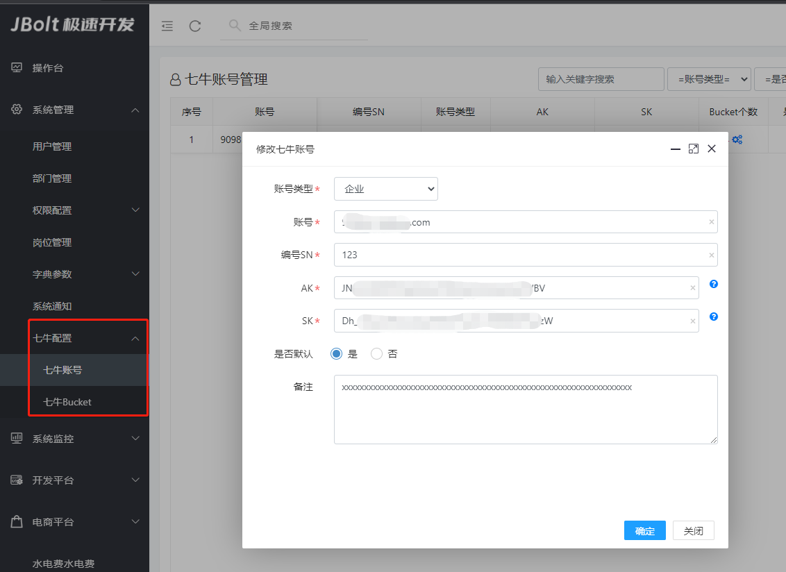
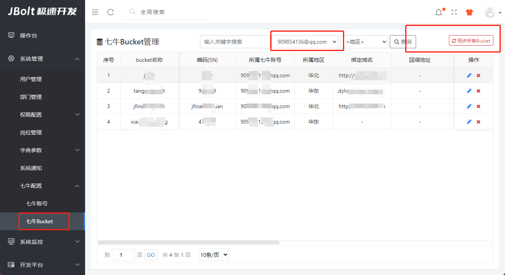
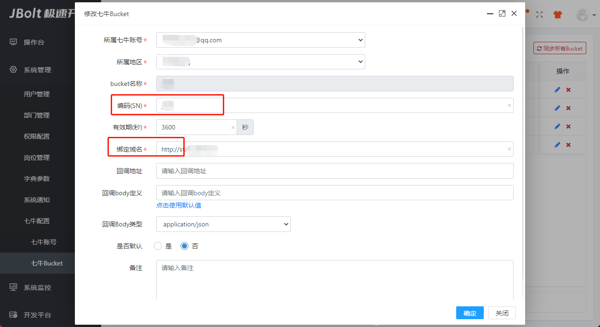

#### 图片上传到七牛很简单，只需要指定上传到哪个七牛空间就行了，剩下的JBolt都是自动化处理了。
### 一、七牛账号配置

把自己的七牛账号信息配置上。
然后配置每个账号的BUcket空间
### 二、同步账号的所有Bucket到系统内


### 编辑bucket


### bucket的sn必须唯一 ， 组件上用的就是这个sn 唯一指定你要传到哪里。
### 域名自己修改必须保证有http或者https开头。


### 三、上面都干完了 就可以在上传组件上配置了

```
<div class="j_img_uploder"
	### 配置上传到七牛
	data-handler="uploadFileToQiniu"
	### 配置上传到哪个Bucket
	data-bucket-sn="jbolt"
	### 配置上传七牛的key
	data-file-key="user/avatar/[date]/[dateTime]/____/[randomId]/[filename]"
	data-upload-success-handler="uploadHandler"  
	data-value="#realImage(imgUploadDemo??)"  
	data-hidden-input="imgUploadDemo"  
	data-area="400,400"
	data-maxsize="2000">
</div>
```
属性 | 取值案例 | 默认值 | 属性说明
:----------- | :-----------: | :-----------: | :-----------
data-handler|uploadFileToQiniu|空|指定选中图片后的处理器 必须指定 可选内置值 uploadFile uploadFileToQiniu 上传七牛就必须uploadFileToQiniu
data-bucket-sn|jbolt|空|指定图片上传到哪个bucket里 用SN代指
data-file-key|user/avatar/|空|指定上传图片的key 可以理解为文件路径 文件名规则 


### data-file-key 可用变量：
[date]   当前日期 20220309
[dateTime] 当前日期时间 20220309121212
[randomId] 随机ID串
[filename] 上传文件实际名称 xxx.jpg
