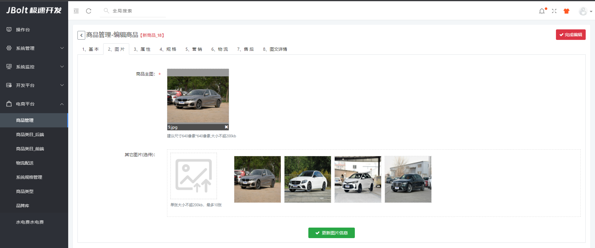
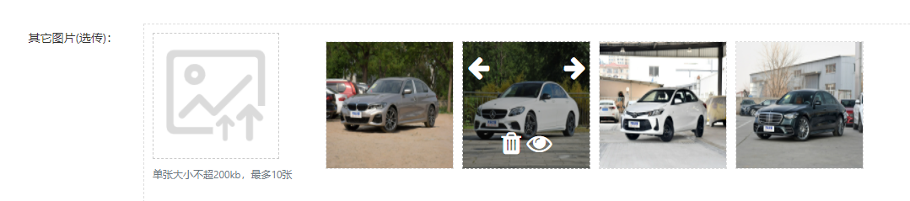
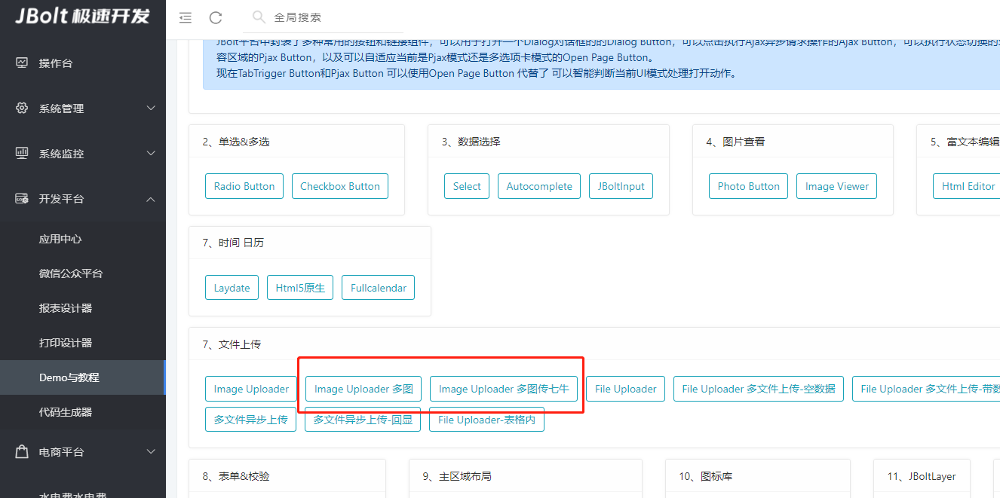
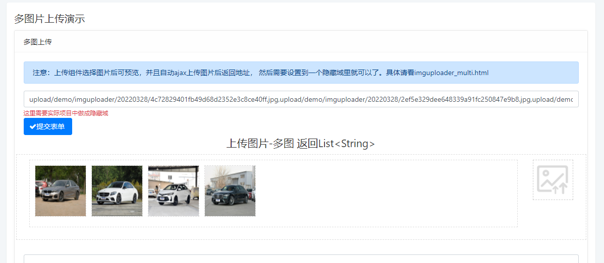

#### 多图上传，应用场景很多，例如做电商系统，商品产品管理 需要上传商品图片就是多图上传的典型场景。





点击左侧图片上传大按钮，打开选择多图上传，上传后，右侧列表显示预览图，可以调整位置，可以大图预览，可以删除图片。

#### 在demo中有详细demo案例：





## 代码：

```
<!--图片使用隐藏域-->
<input type="hidden" class="form-control" id="extraImagesInput"   name="goods.extraImages" value="#(goods.extraImages??)" />
<!--图片组件 表单区域-->
<div class="form-group row">
	<label class="col-form-label col-sm-2 text-right">多图上传：</label>
	<div class="col">
		<div class="j_upload_imgbox_multi">
		<div class="row">
        			<div class="col-sm-auto">
        				<div class="j_img_uploder" 
                                        ###上传地址
        				data-url="admin/mall/goods/uploadImage/#(goods.id??)" 
                                        ###上传限制个数
        				data-limit="10" 
                                        ###是否多图上传 
        				data-multi="true"
                                        ###多图上传专用handler
        				data-handler="uploadMultipleFile" 
                                        ###上传图片后预览显示和操作的imgbox区域ID
        				data-imgbox="goodsExtraImagebox" 
                                        ###提交数据用的隐藏域ID
        				data-hidden-input="extraImagesInput" 
                                        ###上传组件显示区域大小尺寸 
        				data-area="150,150" 
                                        ###上传限制每个图片的数据大小 默认200K 单位KB
        				data-maxsize="2048">
                                    </div>
        				<small  class="form-text text-muted text-ceter">单张大小不超200kb，最多10张</small>
        			    </div>
        			    <div class="col pr-3">
        			    <ul id="goodsExtraImagebox" class="j_imgbox" data-remove-confirm="true" data-imgstyle="width:150px;height:150px;"></ul>
        			</div>
			</div>
			</div>
		</div>
	</div>
```

## 注意：imgbox的UL上 data-remove-confirm="true" 是点击删除按钮，是否弹出确认后再删除

