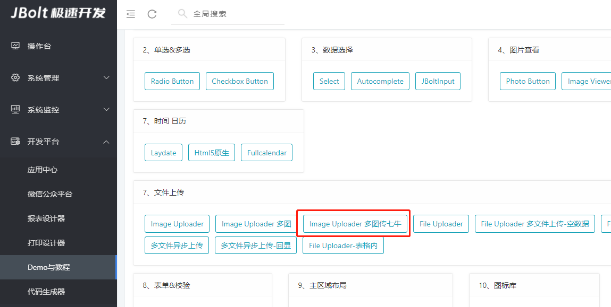

多图上传同样支持轻松配置七牛，配置方式与单图上传配置方式一致。
点击查看七牛上传配置：
https://jfinalxueyuan.coding.net/p/jbolt_platform/wiki/91

## 多图上传关键配置：

```
<div class="j_img_uploder"
	data-multi="true" 
        ### 声明选中文件执行传七牛
	data-handler="uploadMultipleFileToQiniu"    
        ### 声明传到jbolt这个bucket上  
	data-bucket-sn="jbolt"                 
        ### 声明上传到七牛的文件名格式 也就是qiniu.upload里的key      
	data-file-key="test/file/[date]_[randomId]/[filename]"   
	data-imgbox="imgbox"
	data-upload-success-handler="uploadHandler" 
	data-url="/demo/imguploader/uploadImages" 
	data-hiddeninput="imgUploadDemo"
	data-area="80,80"
	data-maxsize="2000"></div>
```

## 特别注意：
### 单图上传七牛：
data-handler="uploadFileToQiniu"   

### 多图上传七牛：
data-handler="uploadMultipleFileToQiniu"   


