在JBolt极速开发平台中有完整的前后端websocket解决方案：
已经有成员公司完美应用到IOT和智能家居类项目中了。JBolt平台自身消息通知也是依赖核心JBoltWebsocket的方案。

### 目前已经实现并提供功能：
1. 配置文件开关用于控制平台是否开启websocket方案支持
2. 前端发送文本消息到后端
3. 后端推送文本消息给前端
4. 前端发送command指令给后端 并监听返回-处理handler
5. 后端接收前端command指令并处理handler
6. 后端主动推送command给前端
7. 前端页面声明式监听后端推送的指定command 并执行handler处理
8. 前端command与handler指令配置js文件 方便扩展快速二开前端
9. 后端提供command handler处理机制 方便扩展快速二开后端
10. 断线重连
11. 心跳检测

### 一、开启JBoltWebsocket方案
找到config.properties 或者config-pro.properties配置文件 找到最下方：
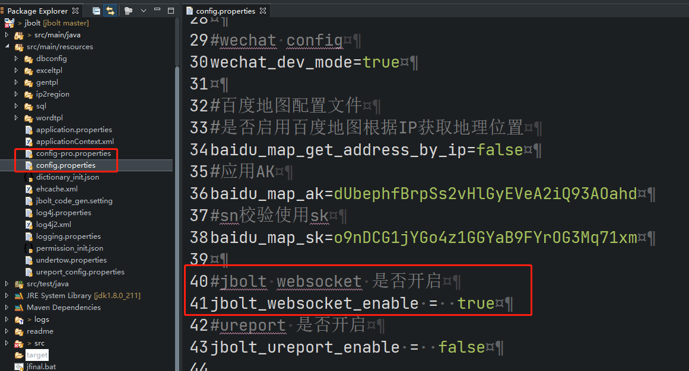


```
jbolt_websocket_enable =  true
```

这个配置项 默认是true，平台已经开启这个websocket方案，因为本身平台通知功能在用这个，如果关闭了，那么系统进去首页右上角的系统通知查询是否存在未读就改成ajax轮询方式了。

**墙裂 建议开启 jbolt_websocket_enable ！**

### 二、后端
启用方案之后，平台JBoltStarter.java中启动会初始化配置websocket相关内容
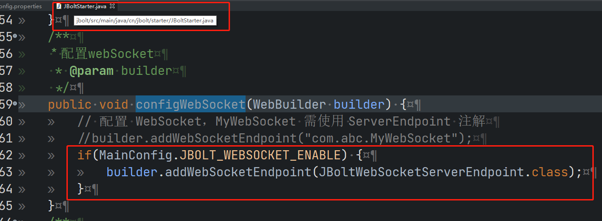

服务端接收客户端连接，请求，指令，处理 都是在这里进行，包含各种处理handler的初始化
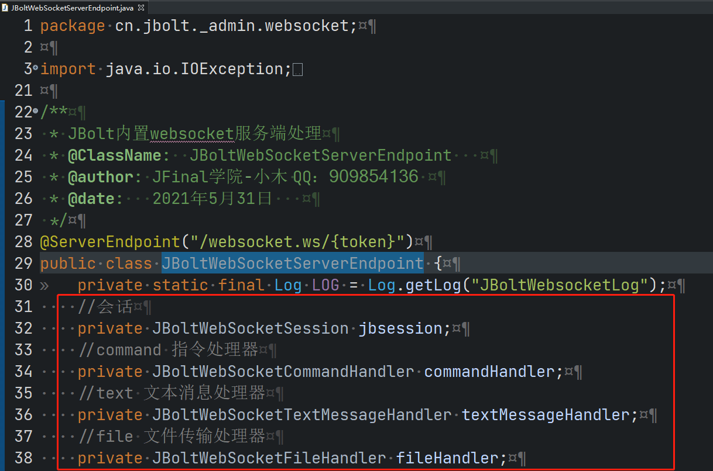
#### 1、JBoltWebSocketSession
每个客户端连接上来 都会创建一个新的会话session - JBoltWebSocketSession
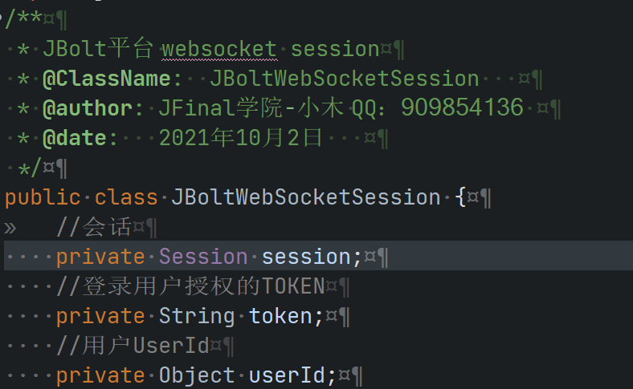
JBoltWebSocketSession中包含会话session、用户userId、用户登录后持有的token，这个token就是作为整个websocket服务器端持有的所有客户端连接Map的key
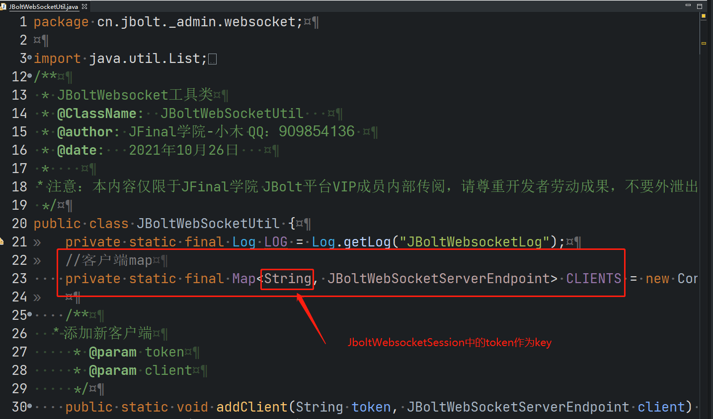
#### 2、JBoltWebSocketCommandHandler与JBoltWebSocketCommand

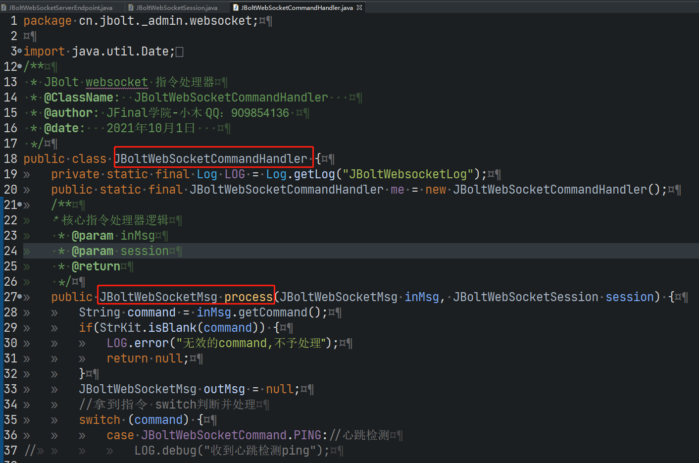
JBoltWebSocketCommandHandler是JBolt平台核心处理客户端请求指令的处理器，
在这里JBoltWebSocketCommand中定义JBolt内置指令
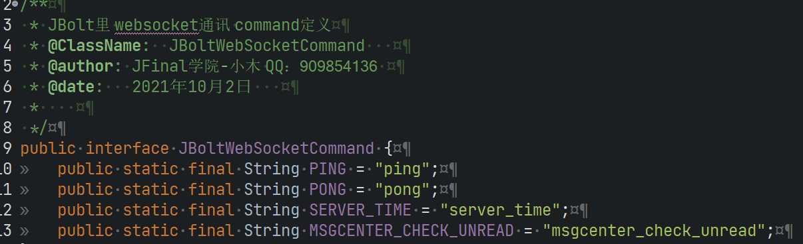

拿到JBolt平台去二开的时候，不能修改这里的东西 ，这里是JBolt官方维护的，二开需要到这里扩展：

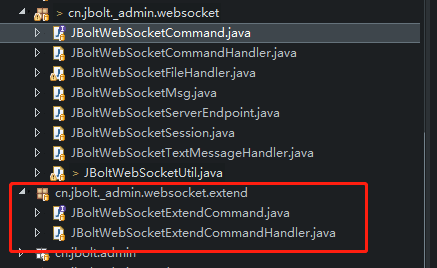
再扩展包里可以定制自己的command和handler

#### 3、JBoltWebSocketTextMessageHandler JBoltWebSocketFileHandler
这两个留给开发者二开直接用的

#### 4、JBoltWebsocketUtil
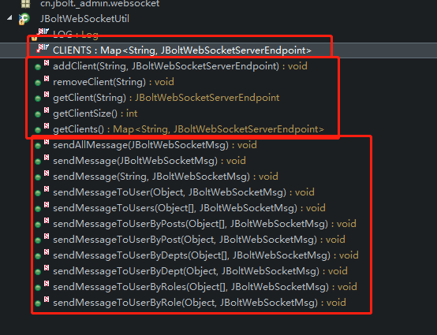
工具类，主要维护了一个CLIENTS MAP 还有对CLIENTS的操作 CRUD
对客户端进行消息推送 也是使用这个工具类：
#### 5、JBoltWebSocketMsg
所有服务器端要发送的调用SendMessage里的数据 都是这个JBoltWebSocketMsg
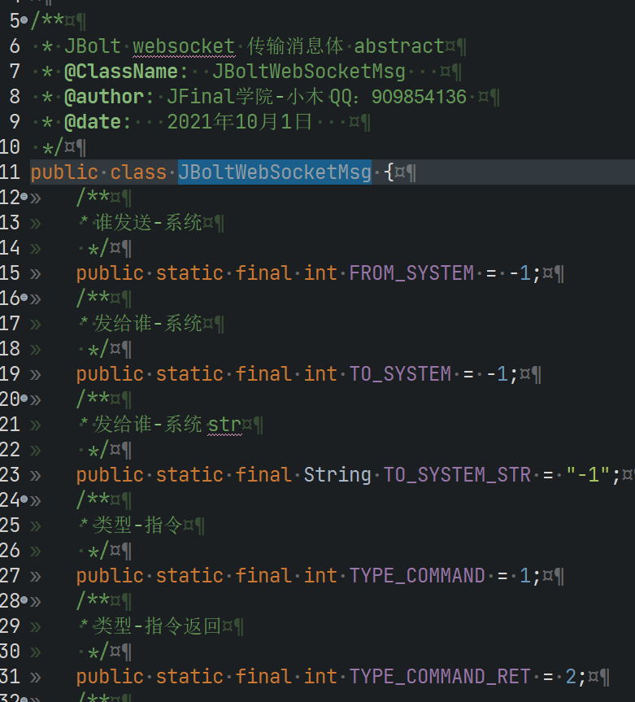

### 三、前端
配置文件里启用访问之后，在系统启动后访问前端主页后，页面会初始化客户端websocket，与后端通讯建立长连接通道。

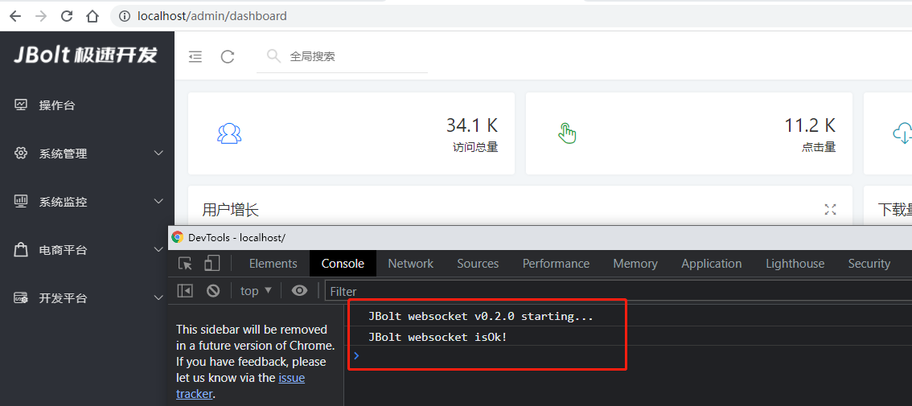

浏览器console中会有日志输出，看到这两行，说明JBOltWebsocket通道建立成功，可以放心玩耍！

当你切换回Eclipse或者IDEA的话，你会看到日志输出：
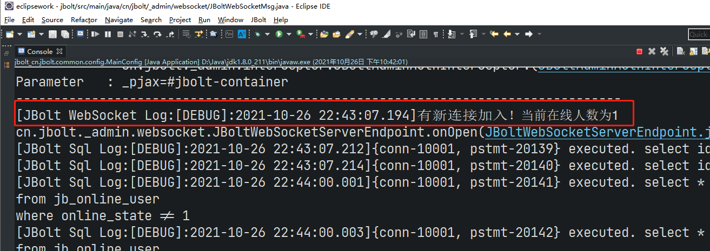

#### 1、js文件位置
JBoltWebsocket的前端js 都放在assets/js/jbolt_websocket包下
extend是二开扩展指令和文本处理的包

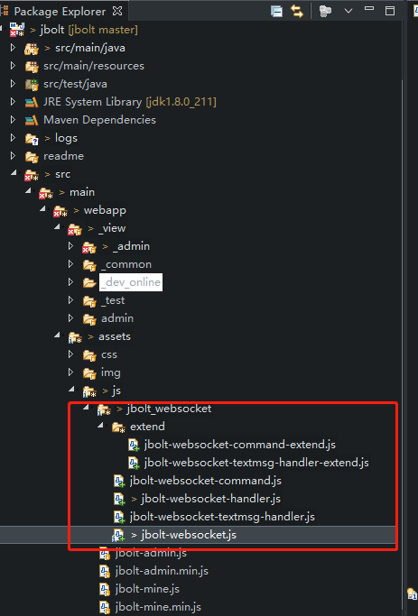

#### 2、command与handler
一个command对应一个handler处理器
用于接收服务器推送过来的command 找到对应的定义handler 执行处理器就可以了。
定义方式比较简单
先看JBolt官方维护的指令处理js：jbolt-websocket-command.js

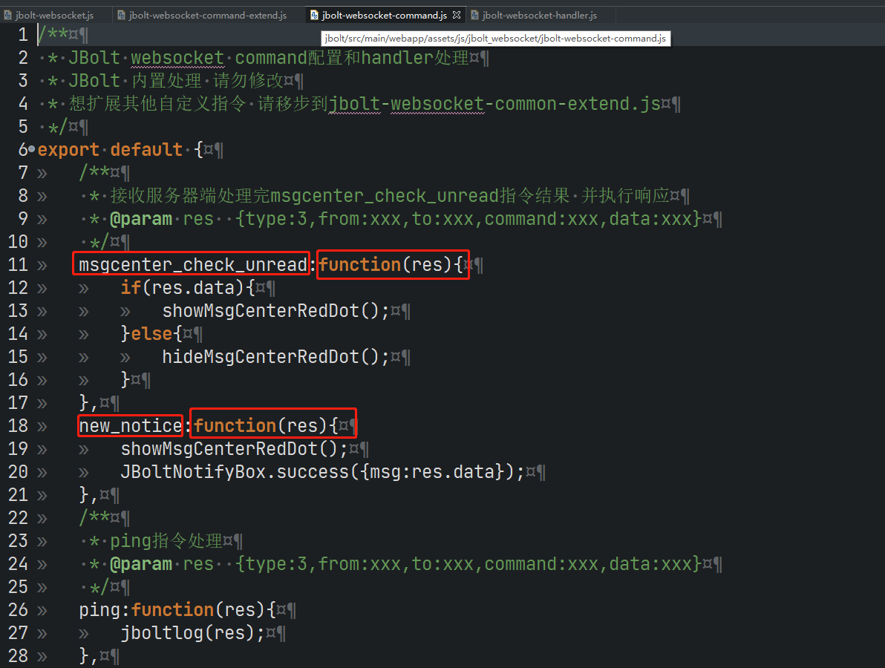

定义方式很简单：command:function(res){ 处理自己的handler}

需要扩展指令 就要在这个扩展指令文件中进行二开扩展 写法与jbolt-websocket-command.js一致
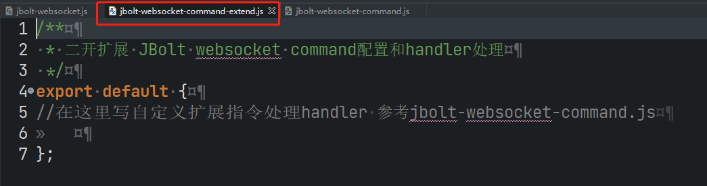

#### 3、在不同页面进行command的订阅和监听声明
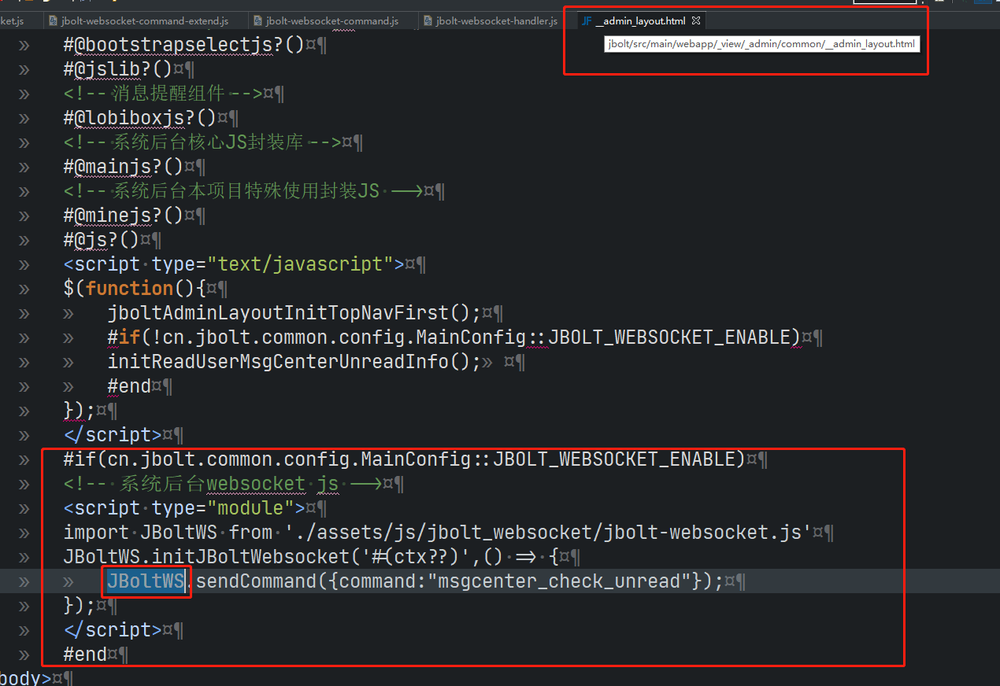
在JBolt平台核心主layout文件中 判断了系统开启了websocket 就引入JBoltWebsocket框架进行初始化调用。
最后在所有加载的UI-html界面中 都可以直接使用这个实例对象:
**JBoltWS**
JBoltWS 可以发送指令sendCommand 也可以发送文本信息到服务器端：

来看一下它的定义：
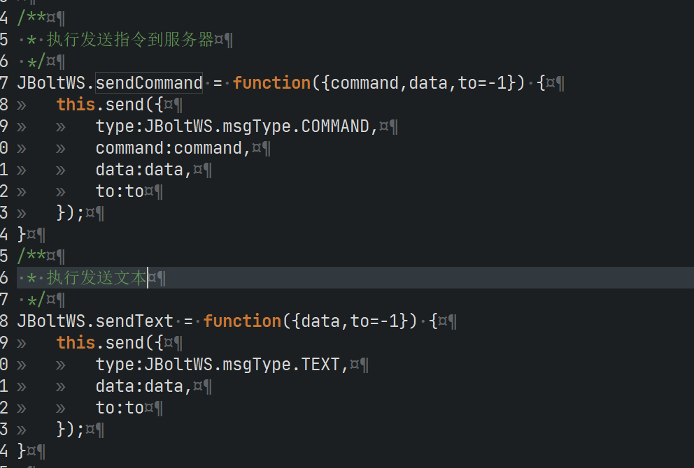

#### 那么如何在需要的界面打开的时候才去订阅指定的command呢？

在JBolt里每一个加载的UI区块或者html 如果需要在加载完成后进行指定command的订阅，就需要加载的内容里带着这个：
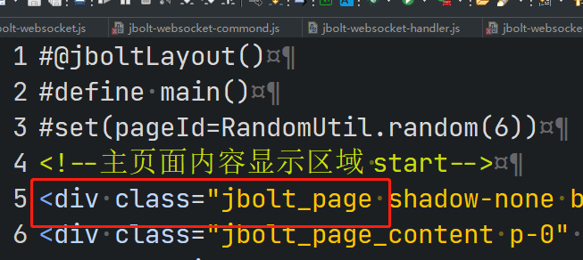

jbolt_page上可以增加data-init-handler属性来定义这个页面被加载完成后要执行的代码回调函数：
data-init-handler = “xxxPageInitHandler”
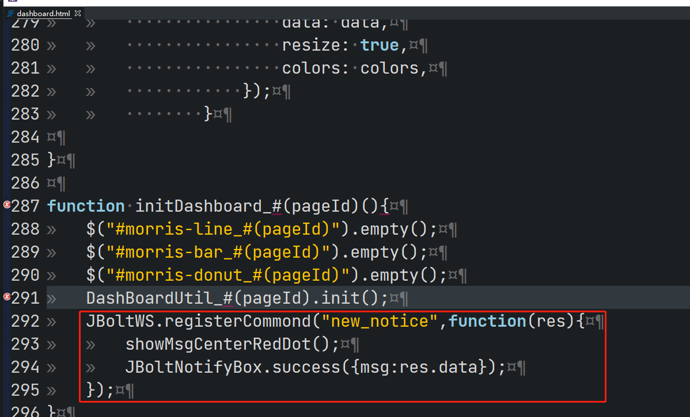
具体在handler里我们就可以写自己的逻辑了，这里我们执行一个监听注册 注册指定的command：

那么，注册后的handler处理内容就表示，当我这个界面被加载后，监听指定command 服务器推送了之后，jboltWebsocket内部机制运转发现有一个界面里注册了这个command还提供了handler实现。
那么，就去调用执行对应的handler。

#### 注意，主要使用jbolt_page的data-init-handler 去注册的command 都需要在jbolt_page上声明关闭当前打开的Ui或者被其他UI替换 移除的时候，要执行command的注销。
注册和注销是一对出现的：
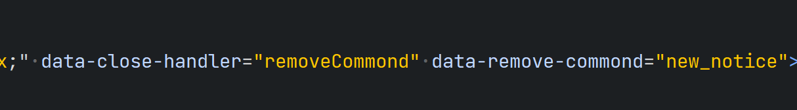
data-close-handler="removeCommand"
data-remove-command="new_notice"
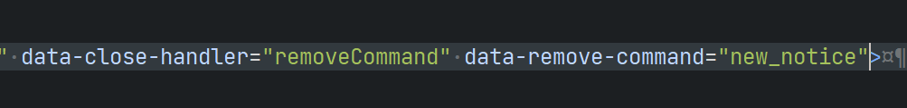


### 四、Nginx 配置

https://jfinal.com/share/2471

### 五、视频教程

https://www.bilibili.com/video/BV1fX4y1S7Yi/


