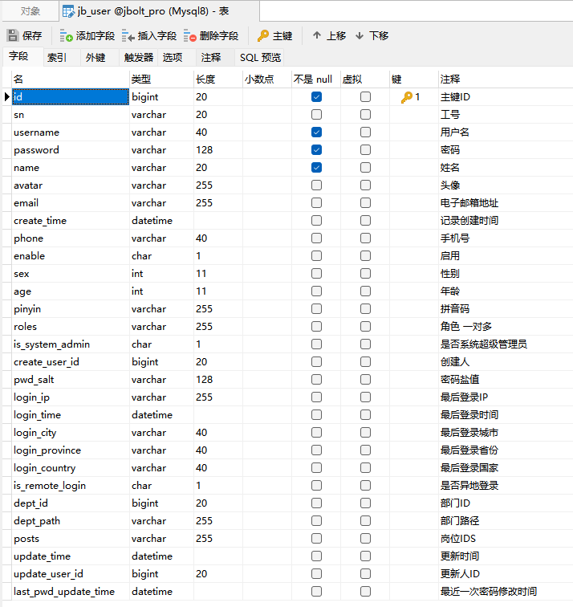
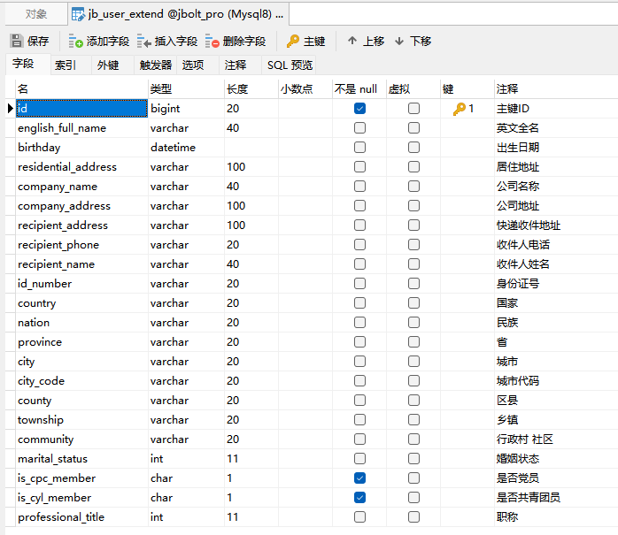
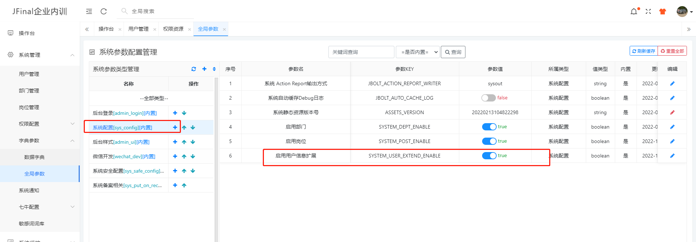
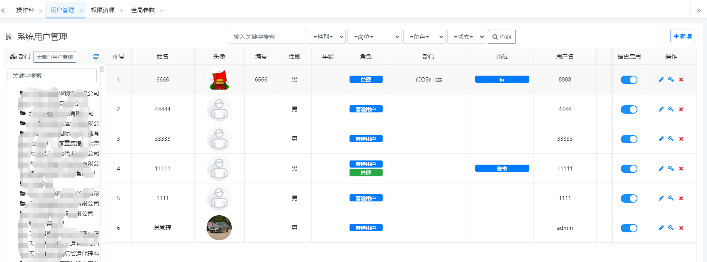
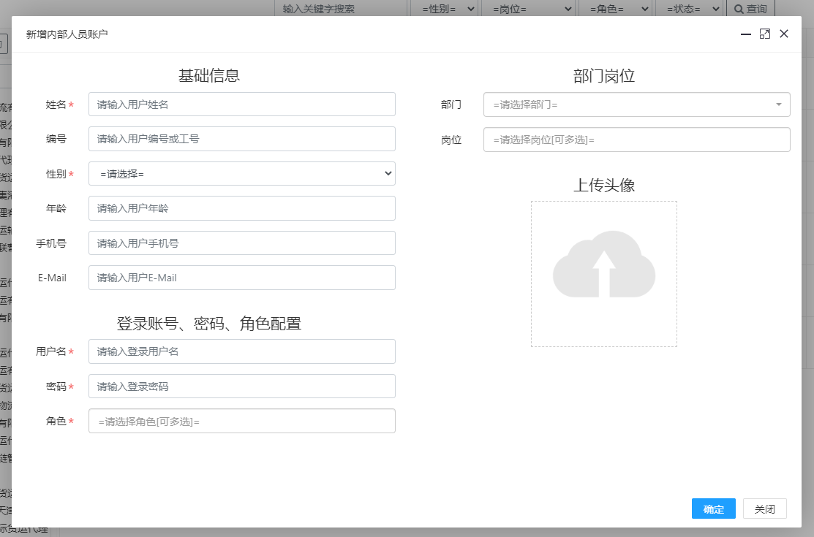
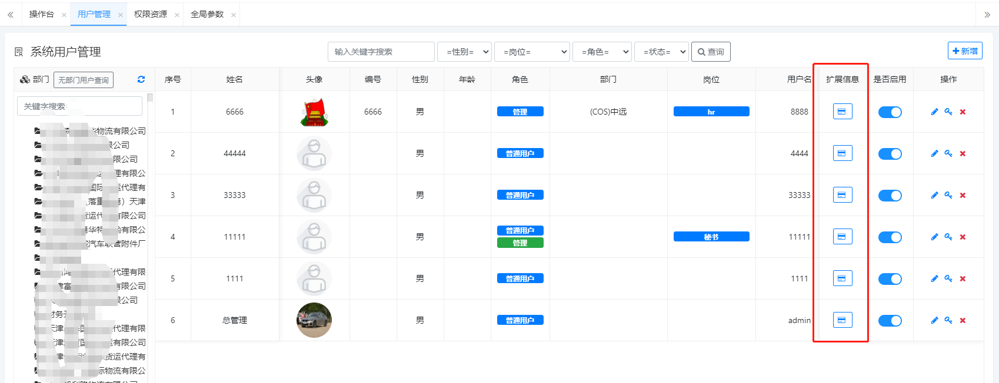
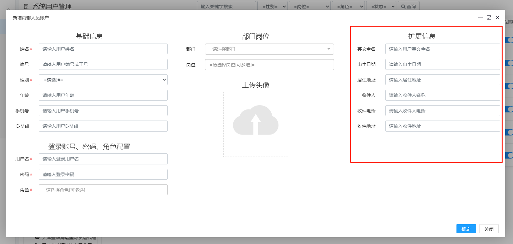
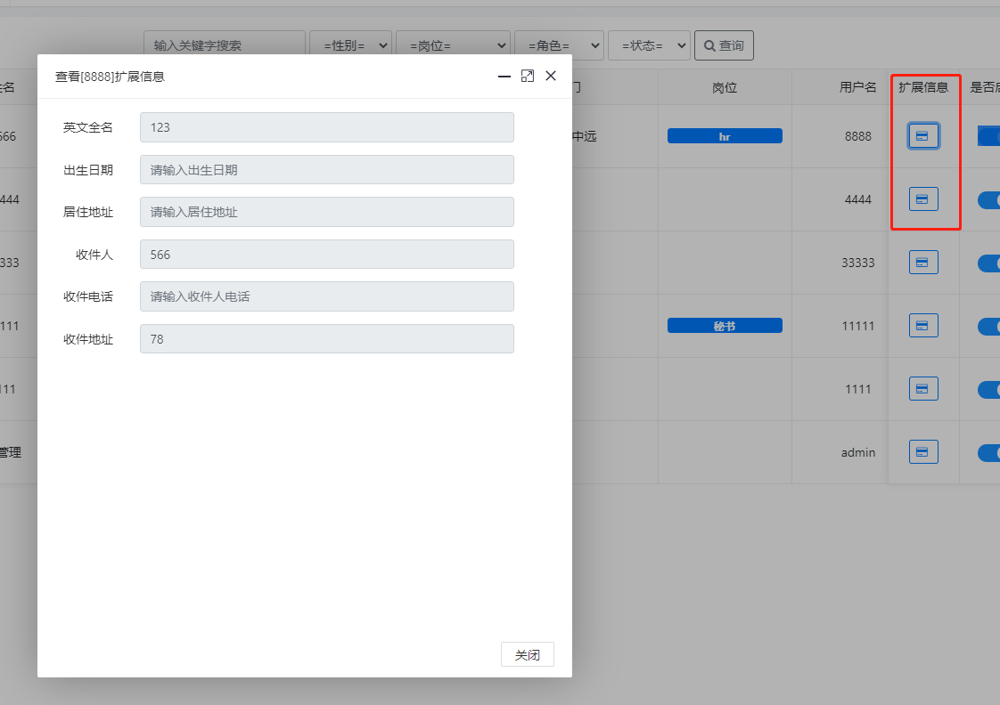

# JBolt平台中用户表是jb_user
Controller:UserAdminController
Service:UserService
jb_user主要保存了和系统登录相关的字段，没有过多设计其他字段，这样导致大家在使用二开的时候，很难去扩展用户属性。

# 扩展用户信息：
JBolt中加入了jb_user_extend这个扩展信息表，用于二开扩展增加自己实际项目中需要的其他字段。

这里jb_user_extend中的ID主键与jb_user中的主键保持一致，保证了一个系统登录用户拥有一个扩展数据。

# 如何扩展
项目中如果需要扩展用户字段信息，直接在jb_user_extend表中增加即可。
增加字段后执行Model生成器 重新生成jb_user_extend表的对应Model和baseModel即可。

# 这个表加了自动缓存

JBoltUserExtendCache.java 可以扩展处理这个表相关的缓存。

# 看一下这个模块扩展的效果

JBolt平台里有全局参数配置选项，选择是否开启支持用户信息扩展功能。

### 如果没开启是这样的：

### 如果开启了是这样的：

### 具体扩展信息表单的UI界面是user_extend_form.html 可以自行扩展