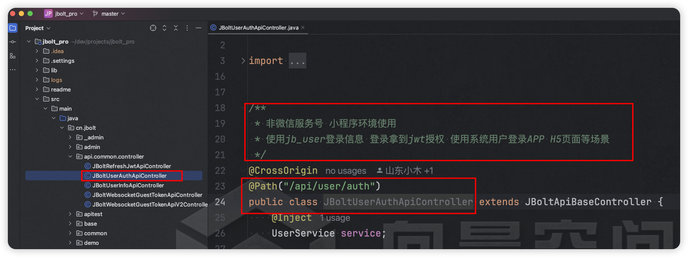
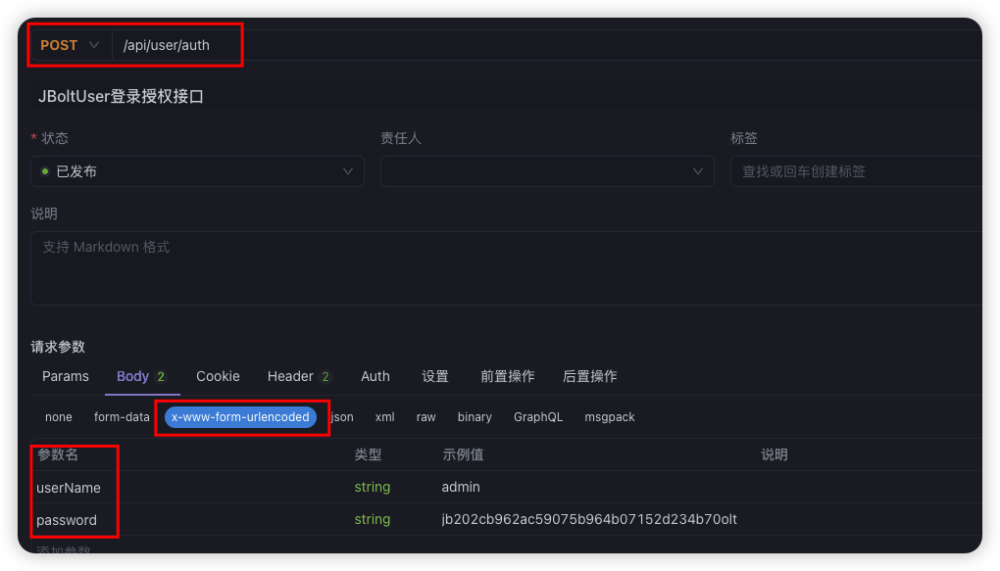
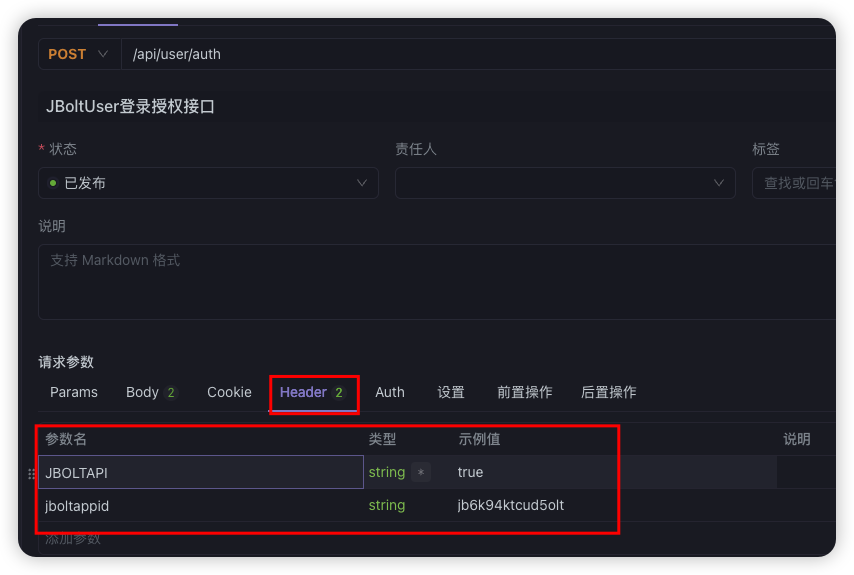
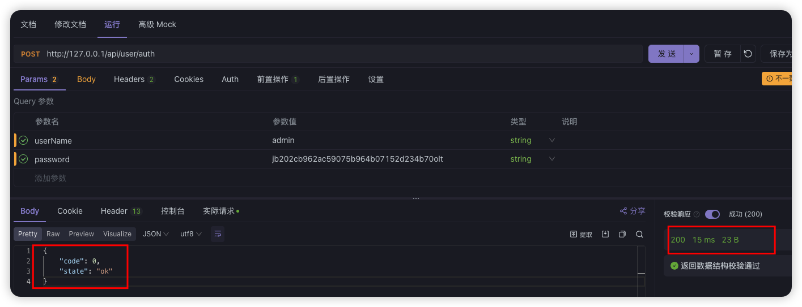
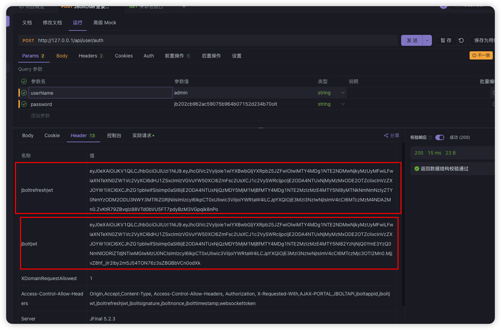

## 如上图所示：
任意前端客户端都可以使用jb_user用户账号密码，获取JWT信息，授权登录。

## 接口地址：
http://localhost/api/user/auth

## ApiFox测试

设置好Headers和post参数
特别说明 参数password是需要在客户端完成一个运算加密：

## password = “任意随机两个字符” + 明文密码的MD5运算值 + “任意随机三个字符”

测试成功！

拿到了JWT：

拿到这两个数据 自己前端客户端保存好，下次请求带着调用接口即可！

