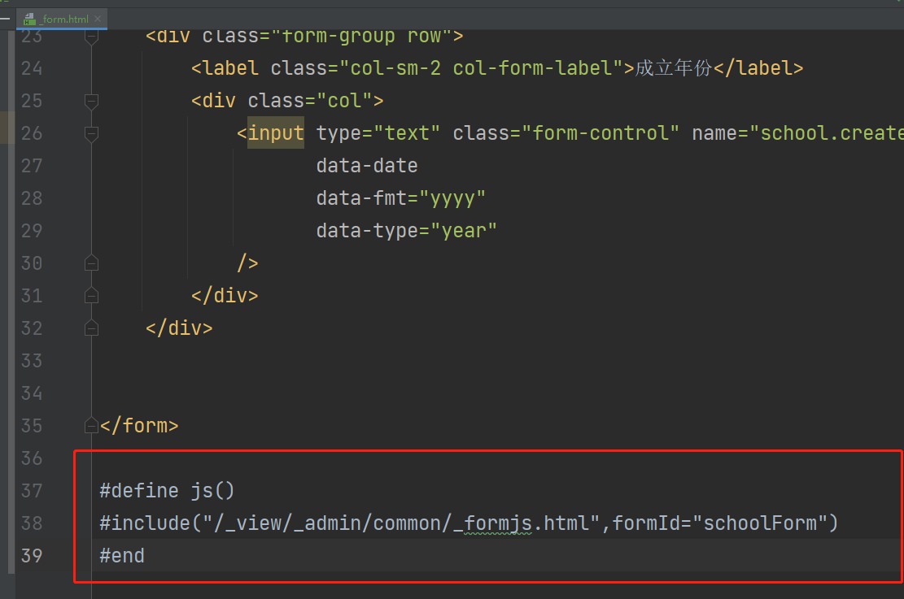
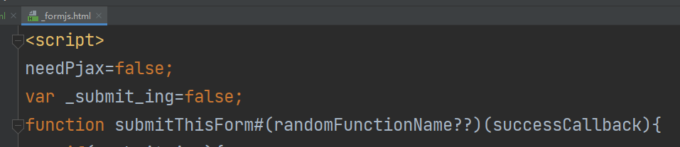

dialog中的form，不管是代码生成的还是自己去写，都需要默认#include一个提交js的模板进来：

#define js()
#include("/_view/_admin/common/_formjs.html",formId="schoolForm")
#end

### _formjs.html

这个里面封装了默认的form表单提交逻辑
点击Dialog上的确定按钮，调用的就是这里的 submitThisForm方法

所以 如果自己想接管这个提交，不想使用JBolt默认方案，就不要inlude这个默认实现，自己在form.html里创建出来自己的 
function submitThisForm(callback){
//写自己的实现即可
}

这样就可以自己接管实现form提交了。 callback是jbolt架构内置的自动赋值的，你如果想自己控制提交后关闭dialog刷新表格 ，就直接自己处理，直接调用callback()就是调用的默认处理。

## 如果你需要拦截提交前做点什么事情：
引入默认实现后在你的form.html里定义
function beforeFormSubmit(){
return true;//true是继续 false是中断
}

## 如果你需要拦截提交后做点什么事情：
引入默认实现后在你的form.html里定义
function afterFormSubmit(ret){

}

