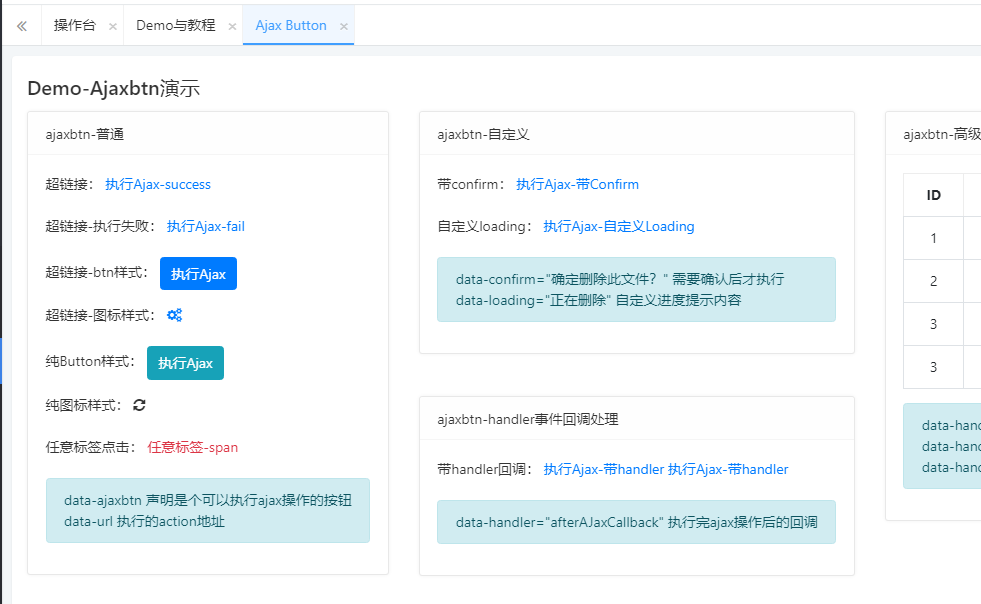

见名知意，可以发起ajax请求和处理回调的按钮。

属性名 | 案例值 | 默认值 | 说明
| :----------- : | :-----------: | :-----------:| 
data-ajaxbtn | 无 | 无 | 声明按钮是一个触发弹出ajax请求的按钮
data-url | “admin/school/dele/”1 |  无 | 指定接口地址
data-confirm | "确认删除此学校 | 无 | 设置点击按钮弹出的确认信息
data-loading | "执行中..." | 无 | 设置执行ajax时 loading显示信息
data-handler | "" | 无 | 执行ajax后的回调处理