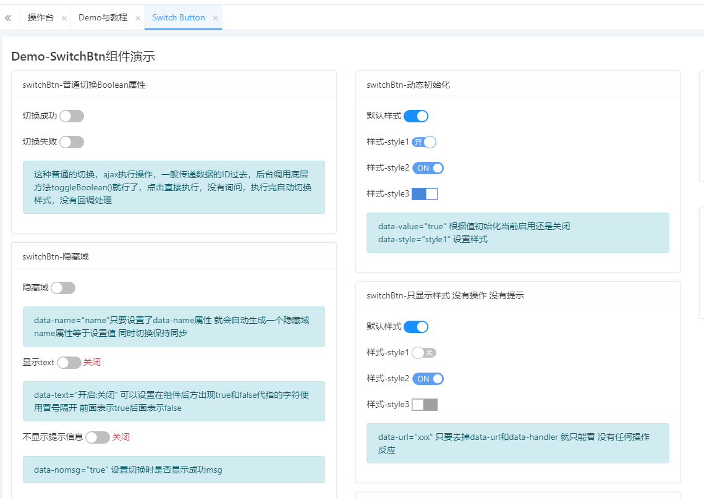

一个可以切换状态的按钮，多用于Boolean值的切换。


```

```

data-switchbtn  声明这是一个switch 切换按钮
data-confirm     指明点击执行具体操作前的询问内容
data-value         组件初始状态值 以及最后获取值
data-url             执行ajax 切换字段属性值操作的URL接口地址
data-handler     切换成功后的回调处理 refreshJBoltTable是系统内置handler 用于在表格中的按钮 点击 切换属性后刷新表格数据

data-handler的定义：


```
data-handler = "myswitchhandler"
function myswitchhandler(ele){
	LayerMsgBox.alert("handler调用，组件切换后的值为："+ele.data("value"),1);
}
```


