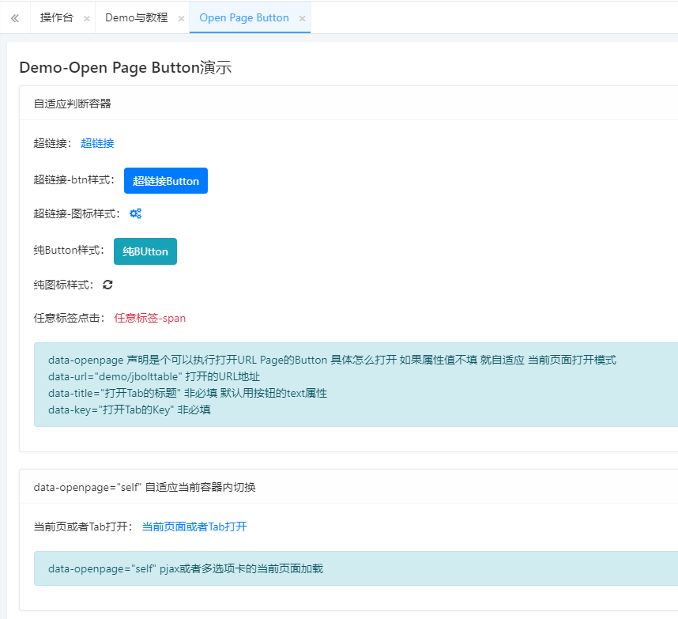

见名知意，一个可以打开UI界面的按钮。
这里的openpage 是一个集大成者，一个按钮 可以打开JBolt平台里所有可以打开的类型：
Dialog、JBoltLayer、Pjax、Pjax-iframe、选项卡、ajaxPortal、blank等。

data-openpage 声明是个可以执行打开URL Page的Button 具体怎么打开 如果属性值不填 就自适应 当前页面打开模式
data-url="demo/jbolttable" 打开的URL地址
data-title="打开Tab的标题" 非必填 默认用按钮的text属性
data-key="打开Tab的Key" 非必填

其他的属性就根据你openpage声明的来了

如果你声明的是dialog 那么你其他属性就可以按照Dialogbtn的属性去写，如果是jboltlayer 就可以按照JBoltLayer组件的button去写。