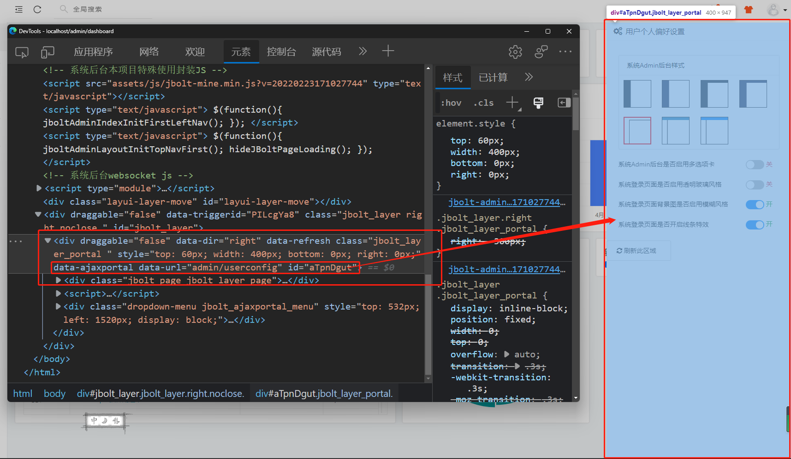
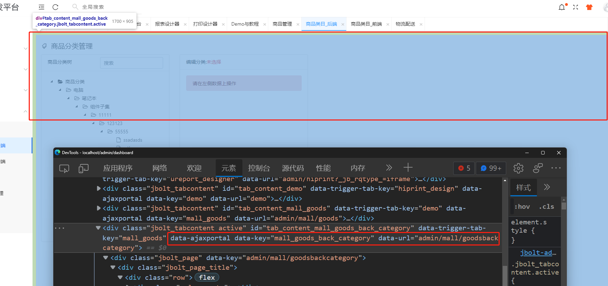

JBolt中有一个隐藏的组件叫AjaxPortal，几乎所有无刷新的 非json通讯的区域 都用到了它，比如JBoltLayer组件中加载内容的方式，开启 多选项卡模式中，每个选项卡内容加载页面的方式。
底层都是基于AjaxPortal组件。

# 一、定义与使用


```
<div id="xxxPortal" data-ajaxportal data-url="一个自定义action地址 action最后要render('xxx.html')的方式返回html片段"></div>
```

看几个例子：


所有额JBoltlayer 默认都是基于ajaxportal去异步打开加载html。



所有选项卡 默认加载方式也是ajaxPortal

#  二、js驱动刷新这个ajaxPortal

ajaxPortal必须给定唯一ID，
那么，就可以使用js去调用刷新了。

```
AjaxPortalUtil.refresh(portal);
```

# 三、js驱动ajaxPortal区域data-url切换新地址

```
AjaxPortalUtil.go(portal,url);
```