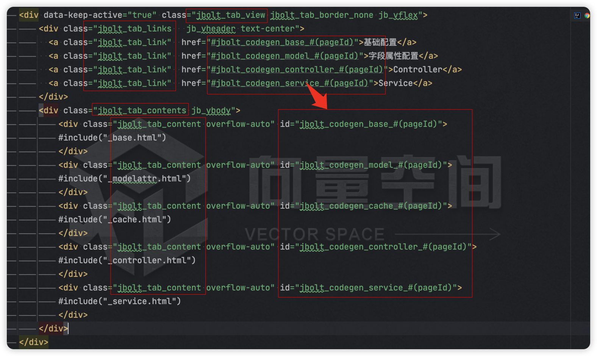

```
<div data-keep-active="true" class="jbolt_tab_view jbolt_tab_border_none jb_vflex">
			<div class="jbolt_tab_links   jb_vheader text-center">
			  <a class="jbolt_tab_link"  href="#jbolt_codegen_base_#(pageId)">基础配置</a>
			  <a class="jbolt_tab_link"  href="#jbolt_codegen_model_#(pageId)">字段属性配置</a>
			  <a class="jbolt_tab_link"  href="#jbolt_codegen_controller_#(pageId)">Controller</a>
			  <a class="jbolt_tab_link"  href="#jbolt_codegen_service_#(pageId)">Service</a>
			</div>
			<div class="jbolt_tab_contents jb_vbody">
				<div class="jbolt_tab_content overflow-auto" id="jbolt_codegen_base_#(pageId)">
				具体内容
				</div>
				<div class="jbolt_tab_content overflow-auto" id="jbolt_codegen_model_#(pageId)">
				具体内容
				</div>
				<div class="jbolt_tab_content overflow-auto" id="jbolt_codegen_controller_#(pageId)">
				具体内容
				</div>
				<div class="jbolt_tab_content overflow-auto" id="jbolt_codegen_service_#(pageId)">
				具体内容
				</div>
			</div>
		</div>
```
