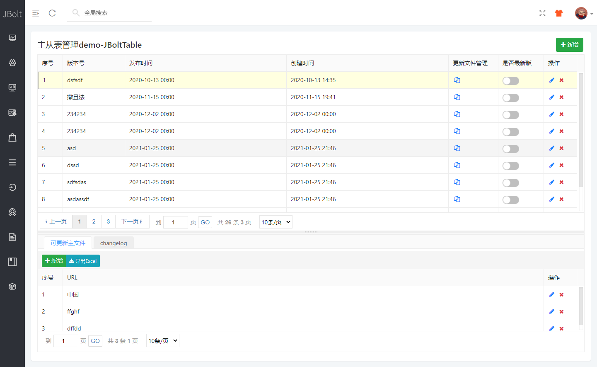
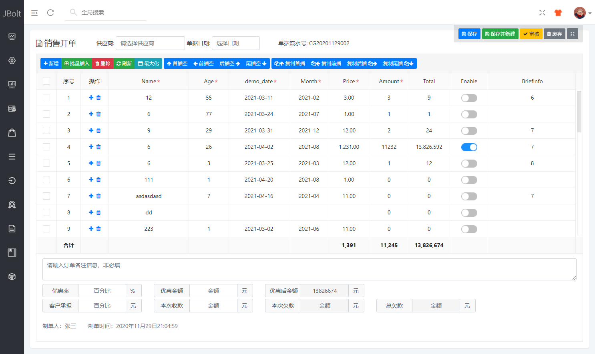

### 父子表在很多有订单类项目和多表上下级管理的模块里用到。

举例：如下图 主表在上 子表在下，中间有分割去和操作条，默认上6下4分割大小，可以按照自己需要百分比和定高。
这个在Demo里样例：

这个还是传统的dialog模式打开表单增加和修改数据，还有一种主子表是订单类操作UI，在ERP，进销存、财务系统、订单类的UI里常用到。

这是一个可编辑表格制作的加订单数据的界面：

表格作为订单详情表的数据库录入，其他上面和下面的作为订单自身信息的录入设置。
