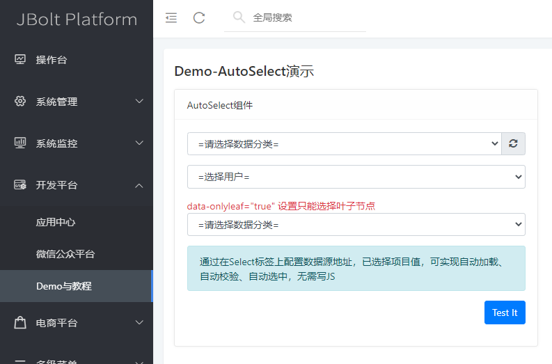
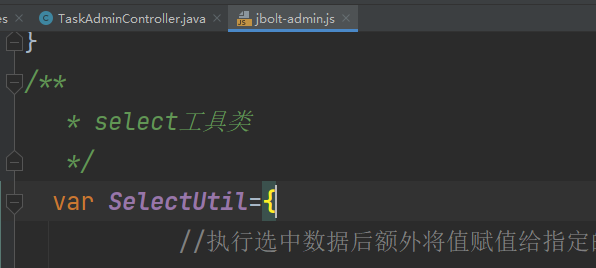

在数据表单和查询表单里经常使用的select组件，原生HTML里的select组件，没有数据源和自动化的能力，需要你后端准备数据发送的页面 ，页面html标签里借助动态模板语言去循环遍历拼接HTML，最后完成渲染。

在JBolt平台里，针对Select组件做了全面的升级封装：
主要特性：

1、异步JSON数据源接口，自动加载数据
2、自动识别json数组里 数据对象带有下列属性的数据：[id,name],[id,title],[id,text],[text,value]等
3、只要有表示选中option值和选中数据文本的属性，都可以识别并显示渲染 需要通过data-value-attr和data-text-attr去指定
4、自动绑定data-handler change的时候自动调用handler处理事件。
5、setValueTo 选中数据后自动将选中数据的value值赋值给其他组件元素
6、设置样式为原生|bootstrap|select2
7、右侧携带刷新按钮 点击可以触发重新加载
8、右侧携带新增按钮 select里没有的数据 可以添加后刷新
9、可以设置只能选择叶子节点
10、可设置单选 多选
11、轻松实现多级联动 1联动1 1联动N
12、表单校验规则设置 自动校验
13、每个选项显示的文本可以是一个字段值 也可以联接多个字段值 还可以设置连接符
14、可在可编辑表格中适配使用


属性| 取值举例 | 默认值|说明
:-----------: | :-----------: | :-----------: | :-----------: 
 data-autoload       |  空 |    空 |   声明select是一个自动化组件 自动加载数据源
 data-url       |  admin/user/options |   空 |   设置json数据源加载地址
data-select-type | select|select|设置select的样式 默认普通select 可选值：select、 select2、bootstrap
data-text | =请选择=|空|设置选择里的首各提示选项的显示文本 可以不设置
data-value| ""|空|设置选择里的首个提示选项的值 可以不设置
data-refresh|true|false|设置是否显示右侧的刷新按钮 默认false
data-select|1|空|设置选中选项对应值
data-onlyleaf|true|false|设置是否只能选择叶子节点 如果数据源是树结构的话
data-text-attr|text|text|设置数据源里哪个或者哪些字段的组合用于选项显示的文本 默认不设置 自动找text、name、title这样的属性
data-value-attr|value|value|设置数据源数据里哪个属性作为选项选中的值 默认不设置 自动找 value、id这样的属性
data-delimiter|-||设置文本显示多个属性时用什么字符隔开
data-rule|select|空|设置表单校验规则
data-tips|||显式设置校验不通过的提示信息 默认可不填
data-setvalueto|inputId|空|设置选择数据后 主动将值传递给指定的组件 默认不填
data-settextto|inputId|空|设置选择数据后 主动将选中的文本传递给指定的组件 默认不填
data-sync-ele|inputId|空|设置选择数据后 可以将数据同步给指定组件 多个逗号隔开
data-linkage|true|false|设置是否是多级联动
data-sonid|sonSelectId|空|设置子联动组件Id 多个可用逗号隔开
data-srcurl|url|空|如果组件是子联动组件 设置自己的原始URL地址 会在被父组件联动时 合并url去访问
data-handler|xxxHandler|空|设置选择数据后调用的回调函数  看下方案例：

```
function processL4Handler(select){
	LayerMsgBox.success("processL4Handler："+select.val(),1000)
}
```


## SelectUtil
 Jbolt-admin.js里提供了关于Select的操作工具类：


比如需要js调用select触发刷新：
SelectUtil.refresh(select)


