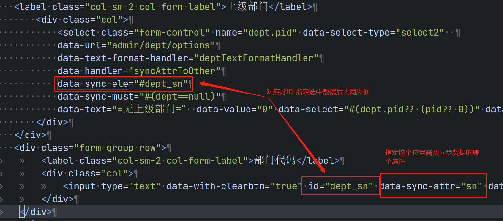
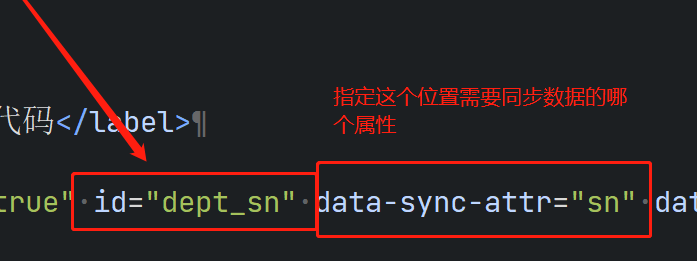

select有属性data-sync-ele="#inputId" 可以实现这个功能；

具体看代码：

data-sync-ele="#inputId" 去指定select选中数据后要去同步执行哪些组件的数据赋值同步工作
如果选择一条数据需要使用选中数据的说个字段属性去分别更新多个组件
data-sync-ele="#inputId1,#inputId2" 使用逗号隔开就行了

上面是定义了要同步更新哪些组件，那么这些组件具体需要使用你选中数据的什么哪个属性去赋值呢？
这个就需要在具体要同步更新的组件上声明一下了：

data-sync-attr="属性名称"
