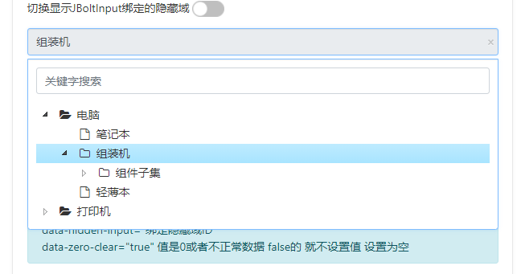
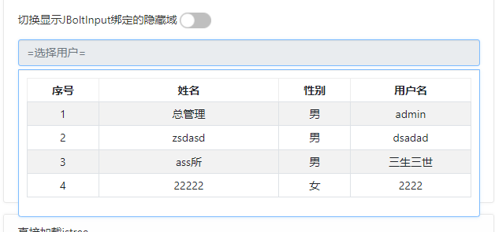
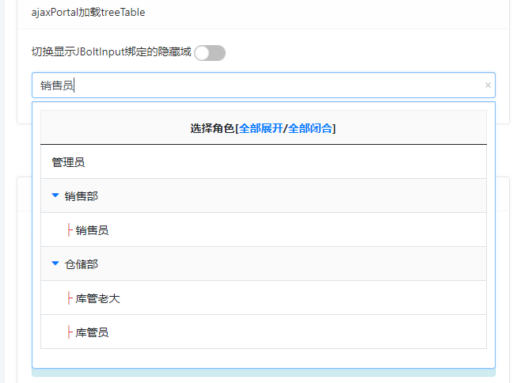
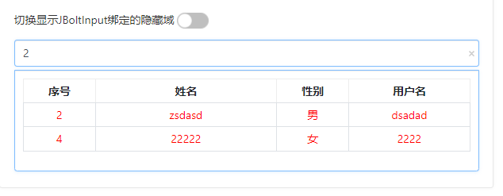
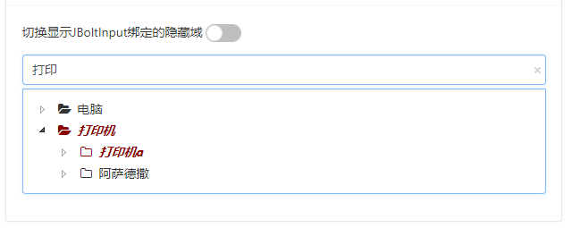

JBoltInput组件是JBolt平台里特殊封装的一个组件，前端显示一个输入框，点击可以异步加载一个UI，这个UI是自定义的样式，任意你喜欢的样式都可以，可以是表格，可以是列表，可以是jstree，可以是treetable，可以是表单，可以是等等






还可以输入检索：



主要特性：

1、通过ajaxPortal模式加载任意UI作为数据选项使用
2、通过data-content-id指定静态html显示加载
3、可以是jstree，可以是table，可以是树表，可以是表单等等
4、可以用在可编辑表格单元格里
5、支持前端快速关键词高亮检索
6、支持选中数据后赋值给其他组件和隐藏域


```
<input type="text" id="demo_bcategoryName" autocomplete="off" name="bcategoryName" value="#(bcategoryName??)" class="form-control"  placeholder="=选择分类=" 
	data-jboltinput 
	data-rule="required"
	data-zero-clear="true"
	data-content-id="goodsBackCategoryTree_demo" 
	data-hidden-input="demoCategoryId"  
	data-width="300"/>
```

```
<input type="text" id="demo_roleName" autocomplete="off" name="roleName" value="#(roleName??)" class="form-control"  placeholder="=选择角色=" 
	data-jboltinput
	data-width="300"
	data-refresh="true"
	data-filter-handler="filterTable"
	data-load-type="ajaxportal"
	data-url="demo/jboltinput/roleTreeTable"
	data-hidden-input="demoHidden_roleId" />
```


属性| 取值举例 | 默认值|说明
:--------------------------: | :-----------: | :-----------: | :-----------: 
 data-jboltinput      |  空 |    空 |   声明这个input是一个jboltinput
data-load-type  | html/ajaxportal/jstree| html|声明组件加载选项的方式 默认html 需要配合data-content-id指定加载内容的ID
data-width     |  300 |   空 |   设置弹出组件的宽度 默认与input长度一致
data-rule|required|空|声明表单校验规则 具体看demo与教程里的表单校验规则
data-url |demo/jboltinput/roleTreeTable |空|设置组件加载数据或者ajaxportal的地址 依赖data-load-type
data-filter-handler | filterTable/filterTree|空|设置组件输入框输入关键词检索处理器 可以是表格的 也可以是jstree的 其他的需要自己实现
data-refresh| true|true|设置使用ajaxportal加载的时候 设置是否有右键刷新菜单 默认有
data-hidden-input|demoHidden_roleId|空|设置选中数据后除了填充input自身 还需要填充到一个隐藏域里具体选中的value值 input只显示text值 多个可以使用逗号隔开


