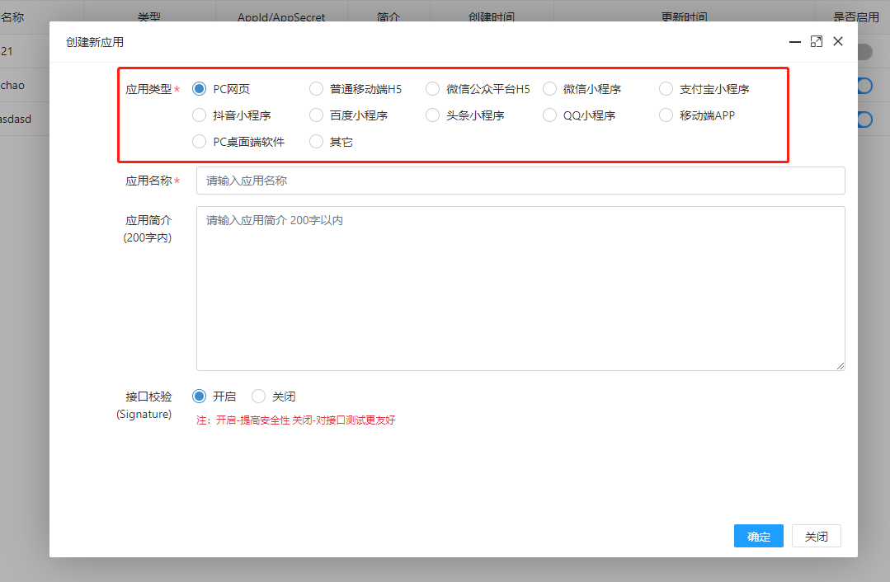
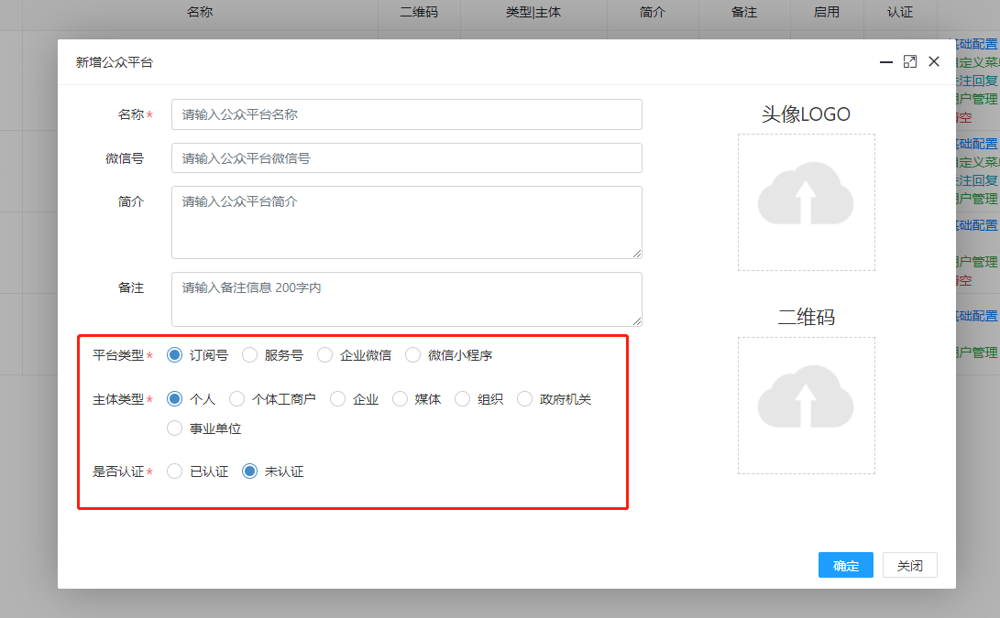
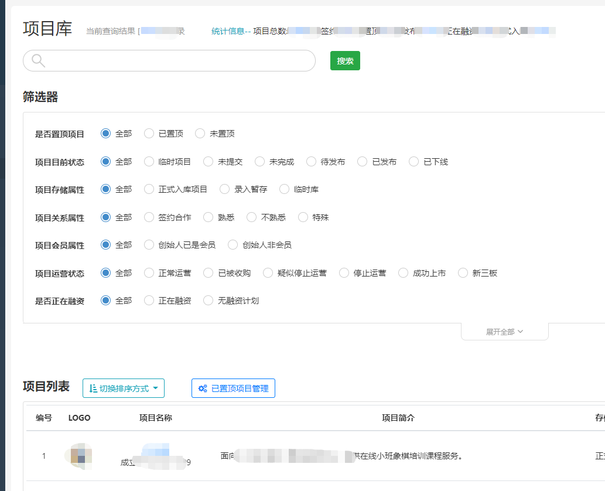
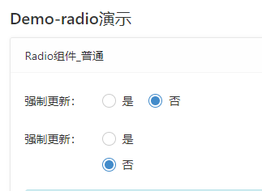
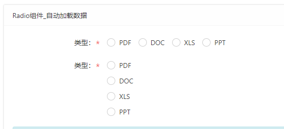
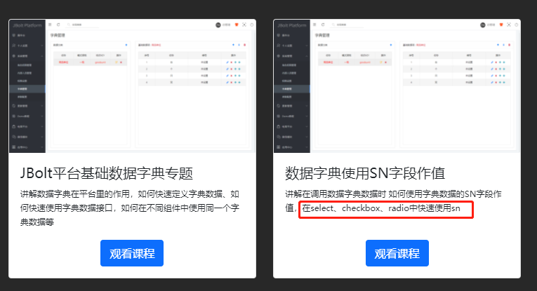
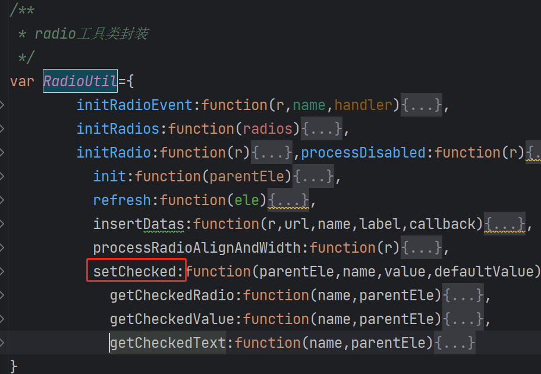

radio组件是单选组件，常用在数据表单和表格第一列里用来选择数据，也可以是查询表单。




再来看一个查询表单的例子：


在JBolt中 radio组件与select组件和checkbox组件的用法基本一致，都是可以静态或者动态加入数据，自动绑定事件处理，只能分析数据源识别等。

**先来看一个静态的：**



代码：

```
<div class="form-group row" data-radio  data-rule="radio"  data-value="#(must??)"  data-name="must"  data-default="false">
    	<label class="col-auto col-form-label" >强制更新：</label>
    	<div class="col"  style="padding-top: 1px;">
    		<div class="radio radio-primary  radio-inline">
    			<input  id="rtrue" type="radio" name="must"   value="true"/>
			<label for="rtrue">是</label>
    		</div>
    		<div class="radio radio-primary  radio-inline">
    			<input  id="rfalse" type="radio" name="must"   value="false"/>
    			<label for="rfalse">否</label>
    		</div>
    	</div>
</div>
```

**转为动态的：**


代码：

```
 <div class="form-group row"  data-radio  data-rule="radio"  data-value="#(fileType??)" data-name="fileType" data-default="" data-url="demo/dictionary?key=filetype" data-label="类型：" data-width="col-3,col-9" data-inline="true">
</div>
```

**动态的数据源哪里来的？**
可以从系统字典中加载，也可以自己提供后端接口返回json数据，有一定的格式要求。
具体格式要求字典使用相关内容，请参考视频教程：
http://jfinalxueyuan.com/jiaocheng/jbolt/




属性| 取值举例 | 默认值|说明
:-----------: | :-----------: | :-----------: | :-----------: 
 data-radio       |  空 |    空 |   声明是一个智能radio组件
 data-url       |  demo/dictionary?key=filetype |   空 |   设置json数据源加载地址
data-value|1|空|设置选中选项对应值
data-text-attr|text|text|设置数据源里哪个或者哪些字段的组合用于选项显示的文本 默认不设置 自动找text、name、title这样的属性 多个用逗号
data-value-attr|value|value|设置数据源数据里哪个属性作为选项选中的值 默认不设置 自动找 value、id这样的属性
data-delimiter|-||设置文本显示多个属性时用什么字符隔开
data-rule|radio|空|设置表单校验规则
data-tips|||显式设置校验不通过的提示信息 默认可不填
data-default|1|空|设置默认选中值
data-disabled|||设置属性后 转为disabled模式
data-label|标签名|空|设置组件渲染后的label名称
data-inline|true|false|设置是否横向排列
data-align-left|true|false|设置是否左对齐
data-text-format-handler|xxxhandler|空|设置动态数据加载后渲染时 text显示文本的格式化 具体见下方案例
data-handler|radioHandler|空|设置选择数据后调用的回调函数  看下方案例：

**data-text-format-handler 案例：**

```
function textFormatHandler(itemJsonData){
	return itemJsonData.id+"_"+itemJsonData.name;
}
```

**data-handler案例：**

```
function radioHandler(radio,value){
	console.log(radio)
	console.log(value)
}
```

## 想要使用JS 动态设置data-radio组件的选中item 怎么做？
使用RadioUtil提供的工具方法即可：setChecked

RadioUtil.setChecked(parentEle,name,value,defaultValue);
