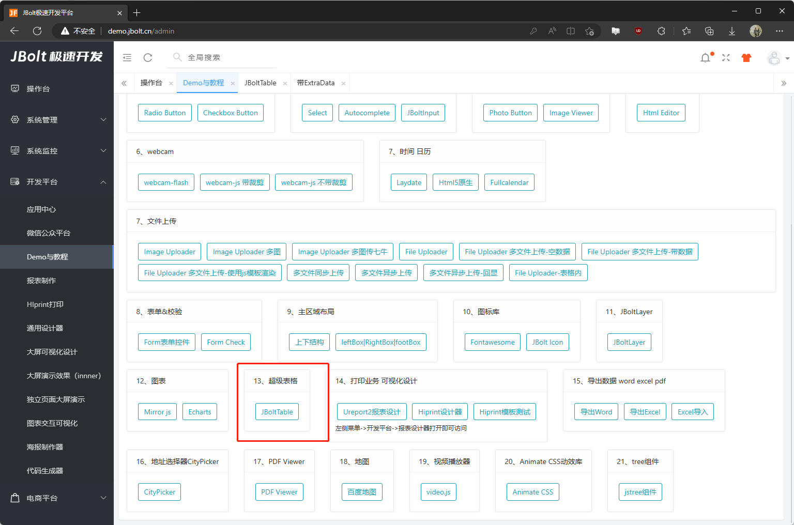
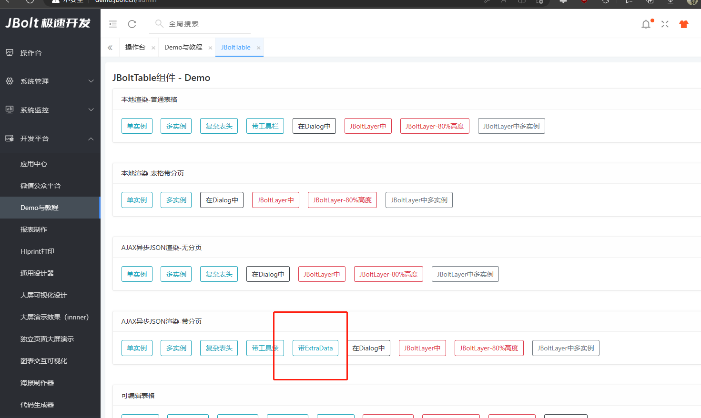
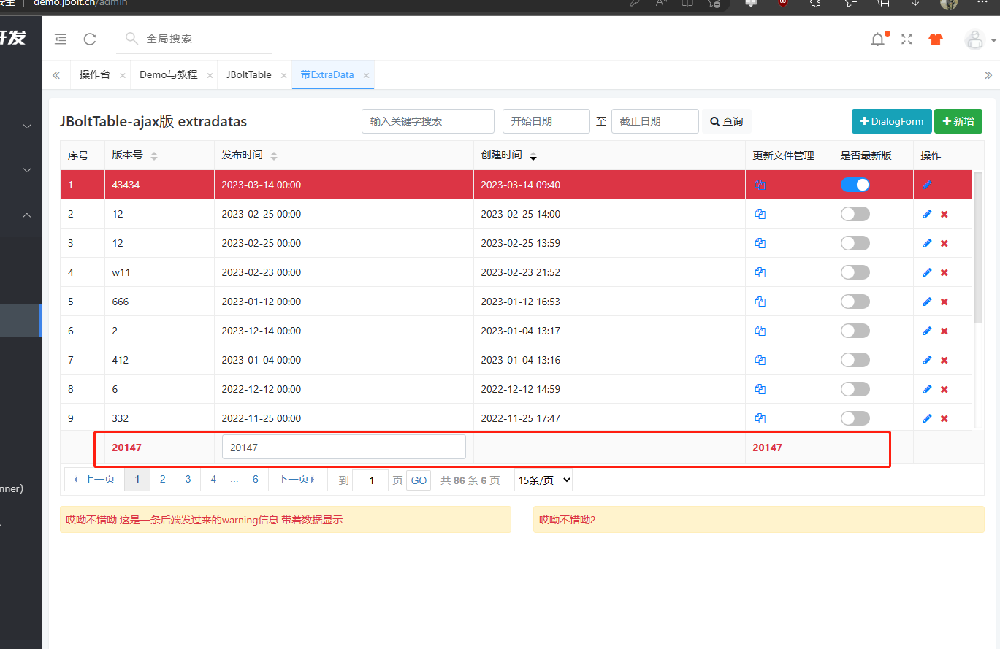
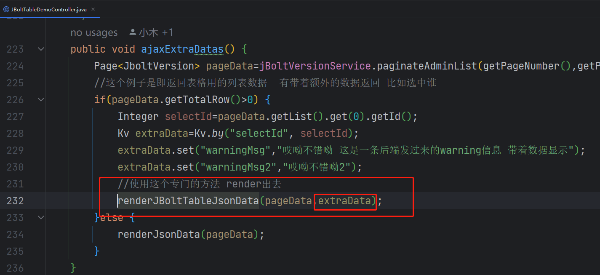
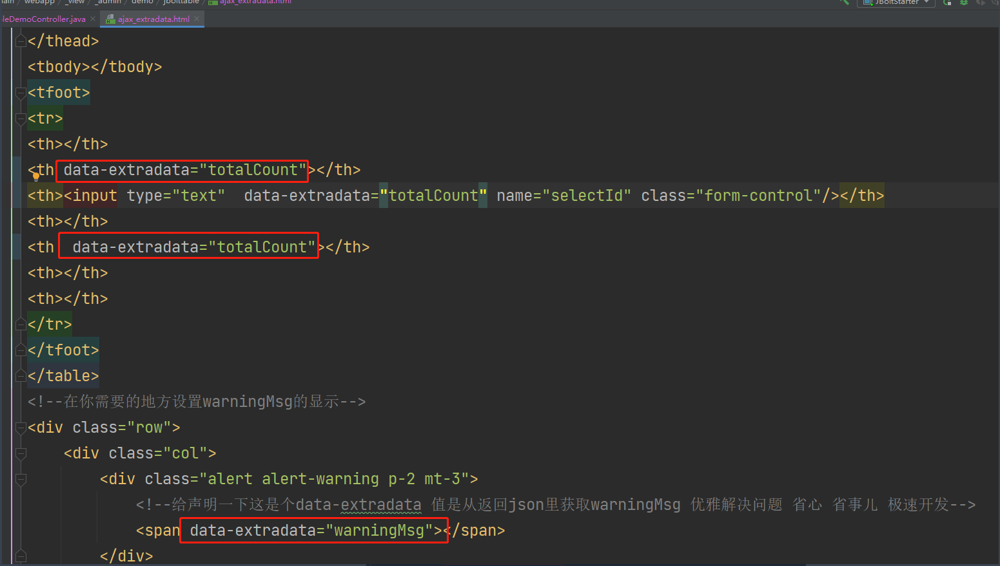

这个分可编辑表格没法前端计算 可以后端查询数据 然后查询统计结果后 都发送给前端就行了。
用到了表格的extraData原理
：
案例：

具体后端代码截图：

### 使用专用方法 发送数据即可：
renderJBoltTableJsonData(pageData,extraData)

## 然后前端怎么找我们的extraData?：

只要在html里 你定义data-extradata属性 属性值设置为你后端定义的key即可自动赋值。
